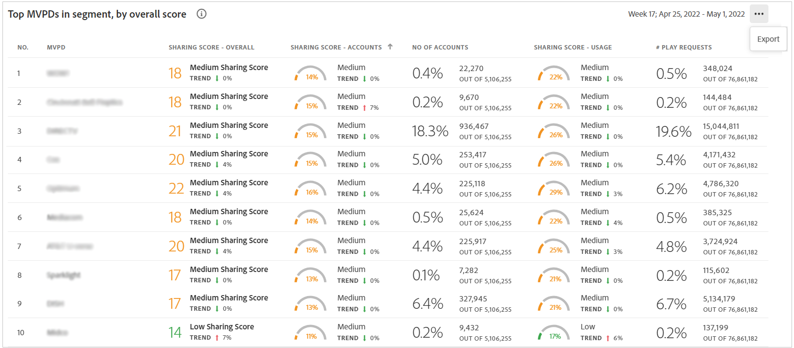
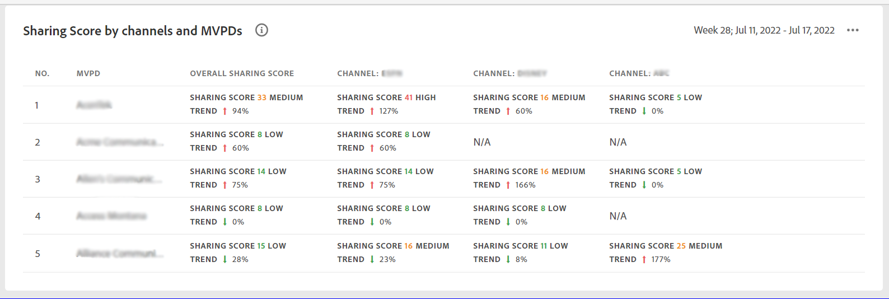

# Das Dashboard {#dashboard}

Das Dashboard fasst Daten in einer Sammlung von Diagrammen und Berichten zusammen und bietet so einen allgemeinen Überblick über den Umfang und die Auswirkungen der Kontofreigabe. Es bietet eine einzelne Seite, die die wichtigsten Berichte und Metriken aus Konto IQ enthält.

*Abbildung: Das Dashboard*

## Durchschnittliche Teilungsbewertung - aggregiert für das aktuelle Segment {#aggregated-sharing}

Das Bedienfeld &quot;Aggregierte Sharing-Bewertung&quot;bietet eine Zusammenfassung der Menge und Auswirkung der Freigabe in Bezug auf Konten und Streaming-Volumen.

Die Werte helfen Ihnen dabei, das Ausmaß der Weitergabe von Anmeldedaten durch Ihre Abonnenten zu verstehen und liefern so ein Maß für die Notwendigkeit, entsprechend zu handeln.

*Abbildung: Bedienfeld &quot;Durchschnittliche Teilungsbewertung&quot;- für das aktuelle Segment aggregiert*

Die folgenden drei Metriken sind Komponenten der durchschnittlichen Sharing-Bewertung.

### Teilungsebene {#sharing-level}

Der Freigabewert zeigt den Prozentsatz aller Abonnentenkonten (im definierten Segment) an, die während des ausgewählten Zeitraums freigegeben werden.

Ein Wert, der auf der Grundlage der durchschnittlichen Freigabewahrscheinlichkeit berechnet wird, die für jedes Konto in der Gruppe ausgewählter MVPDs berechnet wurde, das während des ausgewählten Zeitraums aus einem der ausgewählten Programmierkanäle gestreamt hat.

*Abbildung: Teilungsebene*

Der Trend -Indikator zeigt die prozentuale Änderung des Werts der Metrik im Vergleich zum vorherigen Zeitrahmen an.

### Nutzung durch freigegebene Konten {#usage-from-shared-accounts}

Diese Messung gibt an, welcher Anteil der Nutzung aller Abonnentenkonten aus den gemeinsam genutzten Konten für das definierte Segment und den definierten Zeitraum stammt. Die Messung markiert die Nutzungsbereiche (von gemeinsam genutzten Konten) im Maßstab von 0 bis 100 %. Diese Bereiche - Niedrig, Mittel, Hoch und Abnormal - basieren auf dem Branchendurchschnitt.

Sie können auch den Trend -Indikator sehen, der einen Anstieg oder Rückgang der Nutzung von freigegebenen Konten im Vergleich zum vorherigen Zeitraum darstellt.

*Abbildung: Nutzung durch freigegebene Konten*

### Gesamte Teilungsbewertung {#overall-sharing-score}

Die Gesamtbewertung für die Freigabe besteht aus Sharing-Werten wie &quot;Sharing Level&quot;und &quot;z Usage from shared accounts&quot;.

Sie bietet einen Wert, der die relativen Auswirkungen der Freigabe im Vergleich zur Branche widerspiegelt. Der Zweck ist ähnlich dem eines Kreditwerts und fasst die Situation mit einer einzelnen Zahl zusammen. Aber in diesem Fall gilt: Je höher die Zahl, desto größer ist der potenzielle Schaden.

*Abbildung: Gesamte Teilungsbewertung*

<!--### MVPDs in segment {#mvpd-in-segment}

It is a table of risk indices and accounts totals for the top MVPDs ranked by overall usage or account sharing.

-->

### Gesamtwert der branchenweiten Freigabe für MVPDs {#top-mvpds}

Diese Tabelle bietet einen vergleichenden Überblick über die verschiedenen aggregierten Sharing-Werte für die MVPDs im Segment.

>[!NOTE]
>
>In dieser Tabelle werden die gesamten Branchendaten zu Vergleichszwecken verwendet, nicht aber die Daten, die von diesen MVPDs im Segment dargestellt werden.

*Abbildung: Top-MVPDs im Segment nach Gesamtwert*

### Teilungsbewertung nach Kanälen und MVPDs {#sharin-score-by-channels-and-mvpds}

Diese Tabelle bietet einen vergleichenden Überblick über die Freigabe von Werten der ausgewählten Kanäle für die MVPDs im aktuellen Segment.

*Abbildung: Teilen von Bewertungen nach Kanälen und MVPDs*

### Wahrscheinlichkeit der Kontofreigabe {#accounts-sharing-probability}

Dieses Diagramm teilt in Bereiche mit Wahrscheinlichkeitsquintilien von sehr niedrig (0-20%) bis sehr hoch (80=100%) auf.

>[!NOTE]
>
>Das Balkendiagramm verwendet eine logarithmische Skala.

*Abbildung: Anzahl und Prozentsatz der Abonnentenkonten in verschiedenen Wahrscheinlichkeitsbereichen für die Freigabe*

### Anzahl der Konten und Nutzung nach Freigabe der Wahrscheinlichkeitsstufe {#number-of-accounts-usage-sharing-probability}

Dieses Bedienfeld bietet eine tabellarische Ansicht von Konten, die in Bereiche mit Wahrscheinlichkeitsquintilien von sehr geringer (0-20%) bis sehr hoher (80=100%) aufgeteilt sind, wobei die zugehörige Verwendung jedes Quintils aus freigegebenen Konten erfolgt.

*Abbildung: Anzahl der Konten, Trends und Verwendungen, die in verschiedene Wahrscheinlichkeitsbereiche fallen*

