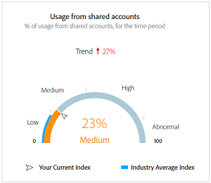

# Das Dashboard {#dashboard}

Das Dashboard fasst Daten in einer Sammlung von Diagrammen und Berichten zusammen und bietet so einen allgemeinen Überblick über den Umfang und die Auswirkungen der Kontofreigabe. Es bietet eine einzelne Seite, die die wichtigsten Berichte und Metriken aus Konto IQ enthält.

+++Programmer- Dashboard

Abbildung: Dashboard für Programmierer

+++

+++MVPD-Dashboard

Das Dashboard für MVPD-Benutzer unterscheidet sich geringfügig von dem der Programmierer-Benutzer.

Abbildung: Dashboard für MVPD-Benutzer

+++

## Durchschnittliche Teilungsbewertung - aggregiert für das aktuelle Segment {#aggregated-sharing}

Das Bedienfeld &quot;Aggregierte Sharing-Bewertung&quot;bietet eine Zusammenfassung der Menge und Auswirkung der Freigabe in Bezug auf Konten und Streaming-Volumen.

Die Werte helfen Ihnen dabei, das Ausmaß der Weitergabe von Anmeldedaten durch Ihre Abonnenten zu verstehen und liefern so ein Maß für die Notwendigkeit, entsprechend zu handeln.

*Abbildung: Bedienfeld für die durchschnittliche Teilungsbewertung - aggregiert für das aktuelle Segment*

Die folgenden drei Metriken sind Komponenten der durchschnittlichen Sharing-Bewertung.

### Freigabestufe {#sharing-level}

Der Freigabewert zeigt den Prozentsatz aller Abonnentenkonten (im definierten Segment) an, die während des ausgewählten Zeitraums freigegeben werden.

Ein Wert, der auf der Grundlage der durchschnittlichen Freigabewahrscheinlichkeit berechnet wird, die für jedes Konto in der Gruppe ausgewählter MVPDs berechnet wurde, das während des ausgewählten Zeitraums aus einem der ausgewählten Programmierkanäle gestreamt hat.

*Abbildung: Freigabestufe*

Der Trend -Indikator zeigt die prozentuale Änderung des Werts der Metrik im Vergleich zum vorherigen Zeitrahmen an.

### Nutzung durch freigegebene Konten {#usage-from-shared-accounts}

Diese Messung gibt an, welcher Anteil der Nutzung aller Abonnentenkonten aus den gemeinsam genutzten Konten für das definierte Segment und den definierten Zeitraum stammt. Die Messung markiert die Nutzungsbereiche (von gemeinsam genutzten Konten) im Maßstab von 0 bis 100 %. Diese Bereiche - Niedrig, Mittel, Hoch und Abnormal - basieren auf dem Branchendurchschnitt.

Sie können auch den Trend -Indikator sehen, der einen Anstieg oder Rückgang der Nutzung von freigegebenen Konten im Vergleich zum vorherigen Zeitraum darstellt.

*Abbildung: Nutzung über freigegebene Konten*

### Gesamte Teilungsbewertung {#overall-sharing-score}

Die Gesamtbewertung für die Freigabe besteht aus Sharing-Werten wie &quot;Sharing Level&quot;und &quot;z Usage from shared accounts&quot;.

Sie bietet einen Wert, der die relativen Auswirkungen der Freigabe im Vergleich zur Branche widerspiegelt. Der Zweck ist ähnlich dem eines Kreditwerts, bei dem die Situation mit einer einzelnen Zahl zusammengefasst wird. Aber in diesem Fall gilt: Je höher die Zahl ist, desto größer ist der potenzielle Schaden.

*Abbildung: Gesamte Teilungsbewertung*

<!--### MVPDs in segment {#mvpd-in-segment}

It is a table of risk indices and accounts totals for the top MVPDs ranked by overall usage or account sharing.

-->

## Gesamtwert der branchenweiten Freigabe für MVPDs {#top-mvpds}

Diese Tabelle bietet einen vergleichenden Überblick über die verschiedenen aggregierten Sharing-Werte für die MVPDs im Segment.

>[!NOTE]
>
>In dieser Tabelle werden die gesamten Branchendaten zu Vergleichszwecken verwendet, nicht aber die Daten, die von diesen MVPDs im Segment dargestellt werden.

*Abbildung: Top-MVPDs im Segment nach Gesamtwert*

## Teilungsbewertung nach Kanälen und MVPDs {#sharin-score-by-channels-and-mvpds}

Diese Tabelle bietet einen vergleichenden Überblick über die Freigabe von Werten der ausgewählten Kanäle für die MVPDs im aktuellen Segment.

*Abbildung: Teilen von Werten nach Kanälen und MVPDs*

## Wahrscheinlichkeit der Kontofreigabe {#accounts-sharing-probability}

Dieses Diagramm teilt in Bereiche mit Wahrscheinlichkeitsquintilien von sehr niedrig (0-20%) bis sehr hoch (80=100%) auf.

>[!NOTE]
>
>Das Balkendiagramm verwendet eine logarithmische Skala.

*Abbildung: Anzahl und Prozentsatz der Teilnehmerkonten in verschiedenen Wahrscheinlichkeitsbereichen für die Freigabe*

## Anzahl der Konten und Nutzung nach Freigabe der Wahrscheinlichkeitsstufe {#number-of-accounts-usage-sharing-probability}

Dieses Bedienfeld bietet eine tabellarische Ansicht von Konten, die in Bereiche mit Wahrscheinlichkeitsquintilien aufgeteilt sind, die von sehr niedrig (0-20 %) bis sehr hoch (80-100 %) mit der zugehörigen Nutzung der einzelnen Quintile aus freigegebenen Konten reichen.

*Abbildung: Anzahl der Konten, Trends und Verwendungen mit unterschiedlichen Wahrscheinlichkeitsbereichen*

<!--
+++Dashboard for programmers

*Figure: The dashboard*

>>>>>>> 7ab48cf61552febab21a5d5c05586e0aefe8ce17
## Average sharing score - aggregated for the current segment {#aggregated-sharing}

The Aggregated Sharing Score panel provides a top line readout summarizing the quantity and impact of sharing in terms of accounts and streaming volume.

The values help you understand the magnitude of credential sharing by your subscribers, hence providing a measure of the need to act upon it.

*Figure: Average sharing score panel - aggregated for the current segment*

The following three metrics are components of the Average Sharing Score.

### Sharing level {#sharing-level}

The sharing level gauge shows the percentage of all your subscriber accounts (in the defined segment) that are shared, during the selected time frame.  

A value calculated based on an average of the sharing probability computed for every account for the selected MVPD(s) that has streamed from a one of the selected programmer channels during the selected time frame.

*Figure: Sharing level*

The Trend indicator shows the percentage change in the value of the metric in from the previous time frame.

### Usage from shared accounts {#usage-from-shared-accounts}

This gauge indicates what percent of the usage of all the subscriber accounts is from the shared accounts for the defined segment and time period. The gauge marks the ranges of usage (from shared accounts) on the scale of 0 to 100%. These ranges (named Low, Medium, High, and Abnormal) are based on the industry average.

You can also see the Trend indicator, which depicts a rise or fall in the usage from shared accounts as compared to the previous time frame.

*Figure: Usage from shared accounts*

### Overall sharing score {#overall-sharing-score}

Overall sharing score is composite of sharing scores including "Sharing level" and "Usage from shared accounts".

It provides a value meant to reflect the relative impact of sharing when compared to the industry. Its purpose is similar to that of a credit score, summarizing the situation with a single number. But in this case, the higher the number the greater the potential harm.

*Figure: Overall sharing score*

## Industrywide overall sharing scores {#mvpd-in-segment}

+++Programmer- MVPDs in segment

This table provides a comparative view of the different Aggregated Sharing Scores for the MVPDs in the segment.

*Figure: Panel showing top MVPDs in a segment*

>[!NOTE]
>
>This table uses overall industry data for comparative purposes, not the data represented by those MVPDs in the segment.

+++

+++MVPD- Programmers in segment

This table provides a comparative view of the different Aggregated Sharing Scores for the programmers in the segment.

*Figure: Panel showing top programmers in a segment*

+++

## Sharing score by channels and MVPDs {#sharin-score-by-channels-and-mvpds}

+++Programmer- MVPDs in segment

This table provides a comparative view of sharing scores of the selected channels for the MVPDs in the current segment.

*Figure: Sharing scores by channels and MVPDs*

>[!NOTE]
>
>**Sharing score by channels and MVPDs** panel is available only for programmer login.

+++

## Accounts sharing probability distribution{#accounts-sharing-probab-dist}

This panel partitions accounts into ranges of sharing probability quintiles from very low (0-20%) to very high (80-100%).

Pie chart shows the proportions (in term of percentages) of user accounts in various sharing probability ranges. Whereas, column chart shows the absolute numbers of accounts in different probability ranges.

>[!NOTE]
>
>The column chart uses a logarithmic scale.

*Figure: Percentages and number of subscriber accounts in different sharing probability ranges*

### Accounts over threshold in current segment {#acc-over-threshold-in-segment}

You can select a level of sharing probability, out of the following to view number and percentage of accounts above it:

* Over very low (0%-20%) probability

* Over low (20%-40%) probability

* Over moderate (40%-60%) probability

* Over high (60%-80%) probability

## Number of accounts and usage by sharing probability level {#number-of-accounts-usage-sharing-probability}

This panel provides tabular view of  accounts partitioned into ranges of sharing probability quintiles from very low (0-20%) to very high (80-100%) with each quintile's associated usage from shared accounts.

*Figure: Number of accounts, trends, and usages falling in various probability ranges*

-->