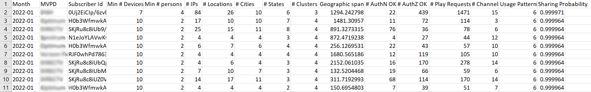

# Exportieren von Informationen zu Konten mit hoher Sharing-Punktzahl {#export-account-info-high-score}

Konto IQ bietet Ihnen die Möglichkeit, Details zur Kontofreigabe für Top-1000-Abonnentenkonten basierend auf ihren [Freigabewahrscheinlichkeiten](/help/AccountIQ/product-concepts.md#account-sharing-probability-def). Die Daten in der exportierten CSV-Datei werden in der absteigenden Reihenfolge der Freigabewahrscheinlichkeiten der Abonnentenkonten - der ausgewählten MVPDs in der [Segment](/help/AccountIQ/product-concepts.md#segment-def)für [angegebener Zeitrahmen](/help/AccountIQ/product-concepts.md#time-frame-def).

Die Option zum Exportieren der Kontofreigabeinformationen finden Sie unter [Allgemeine Nutzungsberichte](/help/AccountIQ/general-usage-reports.md) und [Berichte zu freigegebenen Konten](/help/AccountIQ/shared-acc-reports.md) Seiten.

>[!NOTE]
>
>Die Zahlen in der heruntergeladenen CSV-Datei unterscheiden sich von den Seiten Allgemeine Nutzung und Gemeinsame Konten-Berichte . Dies liegt daran, dass die Seite Allgemeine Nutzungsberichte über zusätzliche Filter verfügt, mit denen die Programmierer Schwellenwerte für die Anzahl der Geräte, IPs und Postleitzahlen auswählen können. Daher basieren die aus den allgemeinen Nutzungsberichten exportierten Daten auf dem angewendeten zusätzlichen Schwellenwertfilter.

So exportieren Sie die Informationen zur Kontofreigabe:

1. Geben Sie in der Segmentauswahl ein Segment an. So wählen Sie ein Segment aus:

   1. Wählen Sie die gewünschten MVPDs aus **MVPDs im Segment** -Option.

   1. Wählen Sie die gewünschten Kanäle aus **Kanäle im Segment** -Option.

   1. Wählen Sie einen Zeitrahmen aus **Granularität und Zeitrahmen** -Option, um Berichte dazu anzuzeigen.

1. Wählen Sie die **Export der 1000 wichtigsten Konten** -Option, um die Kontoinformationen für 1000 Abonnenten mit der höchsten Freigabewahrscheinlichkeit zu exportieren.

Wenn Sie die Exportoption verwenden, werden die Statistiken für 1000 Konten mit den höchsten Teilungswahrscheinlichkeiten (für einen bestimmten Zeitraum) in den Ordner Downloads Ihres lokalen Computers heruntergeladen.

>[!NOTE]
>
>Die heruntergeladene CSV-Datei kann mit jeder Anwendung geöffnet werden, die eine CSV-Datei liest, z. B. Microsoft Excel.

*Abbildung: Exportierte freigegebene Kontodaten im CSV-Format*

## Spalten im exportierten Bericht {#columns-in-export}

**Woche/ Monat**

Die Woche oder der Monat, die bzw. den Sie auf der **Granularität und Zeitrahmen** in der Segmentauswahl, für die die Freigabestatistiken gesucht werden.

**MVPD**

Wenn Sie Programmierer sind, zeigt die Spalte an, zu welchem MVPD das Abonnentenkonto gehört.

**Abonnenten-ID**

Spezifisches Konto, über das wir in einer Reihe sprechen.

**Minimale Anzahl der Geräte**

Die tatsächliche Anzahl der Geräte (die Stream-Inhalte) ist mit ziemlicher Sicherheit größer als die Mindestanzahl der Geräte, die für ein bestimmtes Konto angegeben sind.

>[!NOTE]
>
>Die tatsächliche Anzahl der Geräte (diese Stream-Inhalte) ist mit Sicherheit größer als die Mindestanzahl der Geräte, die für ein bestimmtes Konto angegeben sind.

**Mindestanzahl von Personen**

Die absolute Mindestanzahl von Personen, die mit diesen Geräten aktive Streaming-Inhalte verwendet haben.

>[!NOTE]
>
>Die tatsächliche Anzahl der Personen (dieser Stream-Inhalt) ist fast sicher viel größer als die Mindestanzahl der Personen, die für ein bestimmtes Konto angegeben sind.

**Anzahl IPs**

Anzahl der IP-Adressen, von denen Inhalte gestreamt werden.

**# Standorte**

Anzahl der Speicherorte (basierend auf der Postleitzahl), von denen der Inhalt gestreamt wird.

**# Städte**

Anzahl der Städte, in denen das Streaming stattgefunden hat.

**# states**

Anzahl der Staaten, in denen das Streaming stattgefunden hat.

**# Cluster**

Die Anzahl der einzelnen [Cluster](/help/AccountIQ/product-concepts.md#cluster-def) wo Streaming stattgefunden hat.

**Geografische Reichweite (Meilen)**

Der maximale Abstand zwischen den Streaming-Speicherorten, die mit dem Konto verknüpft sind.

**# AuthN OK**

Die Häufigkeit, mit der sich die Benutzer während des Zeitraums mit diesem Konto angemeldet haben.

**# AuthZ OK**

Gibt an, wie oft ein MVPD einen Stream autorisiert oder Zugriff (auf Inhalte) auf dieses Konto gewährt hat.

>[!NOTE]
>
>Die **# AuthZ OK** ist mit dem **# Abspielanforderungen**; kleiner als die **# Abspielanforderungen** weil Adobe die Berechtigungen, die für MVPDs kommen, in der Regel 24 Stunden lang zwischenspeichert.

**# Abspielanforderungen**

Die tatsächliche Anzahl der Streams während des Zeitraums.

**Anzahl Kanäle**

Gesamtzahl der verschiedenen Kanäle, die das Konto im Zeitraum angesehen hat.

>[!NOTE]
>
>**Anzahl Kanäle** enthält die Kanäle, die nicht notwendigerweise zum angemeldeten Programmierer gehörten.
>
>Diese Nummer für das Konto wurde angezeigt, weil das Konto Ihren Kanal angesehen hat, aber während dieses Zeitraums auch auf andere Kanäle zugegriffen hat.

**Nutzungsmuster**

Die Zahlen in dieser Spalte sind Kennungen, die einem der 14 Muster zugeordnet sind, als die wir alle Benutzerkonten identifizieren.

*Tabelle: Nutzungsmuster-IDs in der exportierten CSV-Zuordnung mit Nutzungsmustern*

| ID | 1 | 2 | 3 | 4 | 5 und 8 | 6 | 7 | 9 | 10 und 11 | 12 | 13 | 14 |
|---|---|---|---|---|---|---|---|---|---|---|---|---|
| Nutzungsmuster | Regulärer Benutzer | Reisende oder Pendler | Großfamilie | Enge Familie und Freunde | Social-Gruppenfreigabe | Große Gruppe von Freunden | Gleichzeitiges Streaming | Community-Freigabe | Unsicheres Verhalten | Kleine Familie | Zweites Heim | Ungewöhnliche Nutzung |

{style=&quot;table-layout:auto&quot;}

**Freigabewahrscheinlichkeit**

Die Freigabewahrscheinlichkeit ist die Wahrscheinlichkeit, mit der das spezifische Konto seine Anmeldeinformationen teilt.

>[!NOTE]
>
> Die durchschnittliche Freigabewahrscheinlichkeit aller Konten (im ausgewählten Segment) wird zur Berechnung der [Freigabestufe](/help/AccountIQ/dashboard.md#sharing-level) des [Aggregierte Teilungsbewertung](/help/AccountIQ/dashboard.md#aggregated-sharing).
