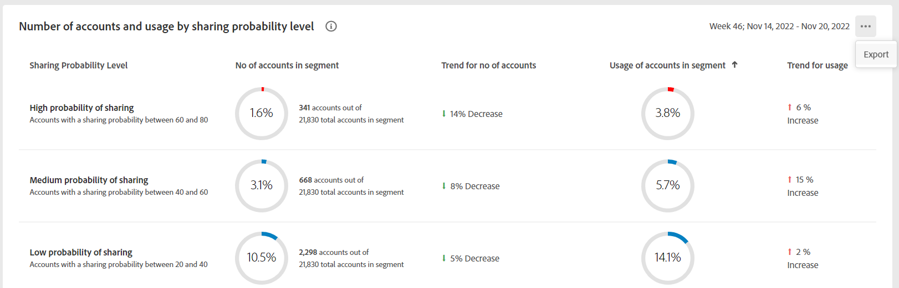
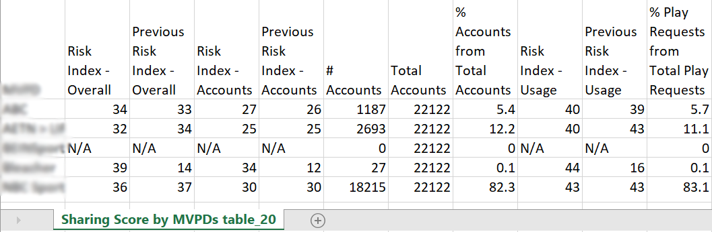

# Exportieren von Metriken für einen MVPD und ausgewählte Programmierer {#export-metric}

Das Dashboard in Konto IQ zeigt Tabellen und Diagramme für Statistiken zur Berechtigungsfreigabe der Abonnentenkonten im ausgewählten Segment an. Neben der Anzeige der Freigabemuster und -bewertungen können Sie auch die Kontoverwendungsmetriken und die Freigabe von Bewertungen für die Abonnenten der MVPDs und Kanäle im ausgewählten Segment aus diesen Tabellen exportieren.

So exportieren Sie Metriken für einen MVPD und ausgewählte Programmierer, sobald Sie als autorisierter MVPD-Benutzer angemeldet sind:

1. Definieren Sie ein gewünschtes Segment entsprechend den Schritten unter [Definieren von Segmenten und Auswählen von Zeitrahmen](/help/AccountIQ/howto-select-segment-timeframe.md) zur Bewertung von [Segment und Zeitrahmen](/help/AccountIQ/segments-timeframe.md) Bereich.

1. Navigieren Sie zu einem der folgenden Bereiche:

   * Programmierer im Segment
      

   * Anzahl der Konten und Nutzung nach Freigabe der Wahrscheinlichkeitsstufe

      

1. Auswählen **Export** in der rechten oberen Ecke des Bedienfelds verfügbar.

Die Daten werden im CSV-Format exportiert und die Datei wird lokal auf Ihr Gerät heruntergeladen. Sie können den gewünschten CSV-Viewer und -Editor verwenden, um die exportierten Berichte zu öffnen.

* Programmierer im Segment

   

* Anzahl der Konten und Nutzung nach Freigabe der Wahrscheinlichkeitsstufe

   
