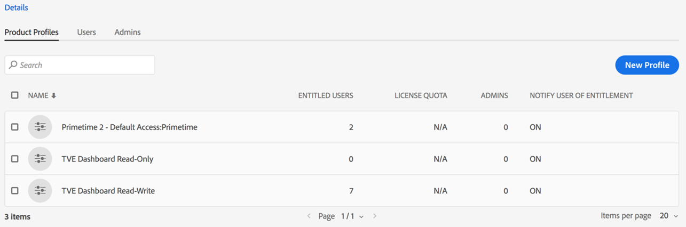

# Einstieg in Account IQ und Erste Schritte {#onboard}

Konto IQ ist eine gehostete Webanwendung. Um dieses Analysetool als D2C-Streaming-Anbieter, -Programmierer oder -Distributor (MVPD) zu verwenden und die Freigabe von Anmeldedaten zu verhindern, müssen Sie Ihre Organisation in Adobe Experience Cloud-Organisationen integrieren und Unternehmensbenutzer zuweisen. **Primetime-Konto IQ** Profil auf [Adobe Admin Console](https://adminconsole.adobe.com/). Lesen Sie weiter, um zu erfahren, welche Voraussetzungen und Einzelheiten an Bord zu erbringen sind.

## Browservoraussetzungen {#browser-prerequisites}

Konto-IQ ist mit den neuesten Versionen der folgenden Browser kompatibel:

* Google Chrome
* Safari
* Mozilla Firefox

## Schritte zum Einstieg {#steps-to-onboard}

1. Registrierung Ihrer Organisation in **Adobe Experience Cloud** Ansprechpartner für Organisationen **Adobe** per E-Mail an tve-support@adobe.com.

1. Zuweisen von Organisationsbenutzern zu **TVE Dashboard - Lesen und Schreiben** oder **Zehn Dashboards schreibgeschützt** Profile in [Adobe Admin Console](https://adminconsole.adobe.com/).

   Die Admin-Benutzer in Ihrer Organisation können Benutzer erstellen und ihnen Zugriff auf das Konto-IQ-Dashboard und die Berichte gewähren. Um Benutzern von Organisationen Zugriff auf Konto-IQ zu gewähren, müssen Administratoren von Organisationen wie folgt vorgehen:

   1. Anmelden bei [Adobe Admin Console](https://adminconsole.adobe.com/).

      

   1. Auswählen **Adobe Primetime** von **Produkte und Dienstleistungen**.

   1. Von **Produktprofile**, wählen Sie entweder **TVE Dashboard - Lesen und Schreiben** oder **Zehn Dashboards schreibgeschützt** Profil.

      

      >[!NOTE]
      >
      >In naher Zukunft wird Primetime Account IQ vom TVE Dashboard getrennt.

   1. Hier können Sie Benutzergruppen erstellen oder vorhandene Gruppen auswählen, denen Benutzer hinzugefügt werden sollen.

      

   1. Auswählen **Benutzer hinzufügen** -Option zum Hinzufügen von Benutzern.

>[!IMPORTANT]
>
>Wenn Ihre Benutzer nicht auf das Konto-IQ-Dashboard zugreifen können, wenden Sie sich an den Support der Adobe, um sicherzustellen, dass die ID Ihres Unternehmens in Konto IQ auf die Whitelist gesetzt ist.

