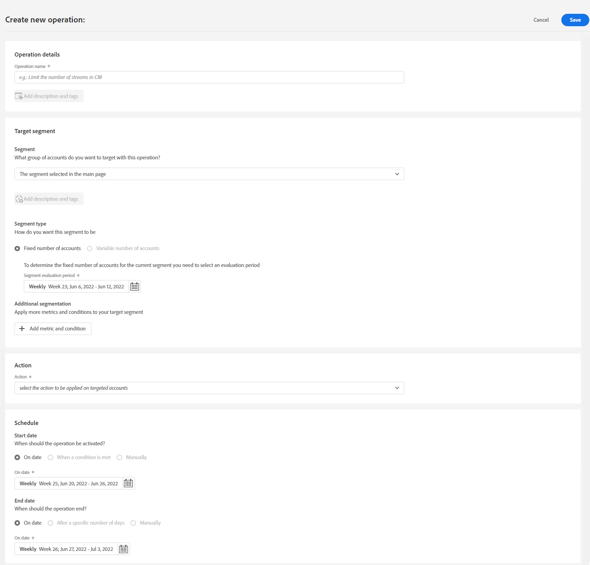
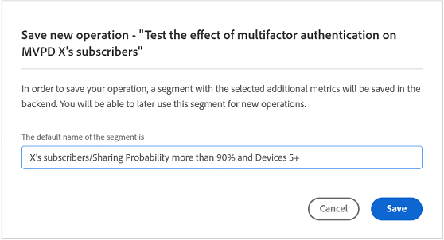

# Erstellen eines Vorgangs für ein Benutzersegment {#operation-to-track-segment}

Jede Berichtsseite in Konto-IQ verfügt über eine **Neuen Vorgang erstellen** -Option, mit der Sie Workflows erstellen können, um verschiedene (Massen-)Aktionen für Abonnentenkonten zu automatisieren (und zu vereinfachen); Definieren Sie Regeln, um ein Beispiel anzugeben, Aktionen zu definieren und die Auswirkungen dieser Aktionen aufzuzeichnen und zu analysieren. Auf der Seite, auf der Vorgänge erstellt werden sollen, können Sie das Beispiel von Benutzergruppen definieren, für die Vorgänge ausgeführt werden sollen, und die Ausführung des Vorgangs für ein künftiges Datum planen.

So erstellen Sie einen Vorgang:

1. Definieren Sie Ihr Segment (Kohorte) für die Analyse auf einer der Berichte- oder Dashboards-Seiten, indem Sie die Schritte unter [Definieren von Segmenten und Zeitrahmen](/help/AccountIQ/howto-select-segment-timeframe.md).

1. Auswählen **Neuen Vorgang erstellen** -Option auf allen Seiten der Berichte oder Dashboards verfügbar. Die **Neuen Vorgang erstellen** angezeigt.

   
   *Abbildung: Seite zum Erstellen eines neuen Vorgangs*

1. Im **Neuen Vorgang erstellen** Seite, füllen Sie die Details in den Formularfeldern für Folgendes aus:

   * [Vorgangsname](#operation-details) in den Betriebsdetails
   * Segment zum Ausführen des Vorgangs unter [Zielsegment](#segment) und das Segment mithilfe von [Weitere Segmentierung](#additional-segmentation)
   * [Segmenttyp](#segment-type) under [Zielsegment](#segment)
   * [Aktion](#action)
   * [Zeitplanaktivierung](#schedule)

1. [Speichern Sie den Vorgang](#save-operation).

## Vorgangsdetails {#operation-details}

+++Programmer- Operationsdetails

Benennen Sie den neuen Vorgang in **Vorgangsname** Feld unter &quot;Details der Operation&quot;. Beispiel: &quot;*Testen Sie die Wirkung der Multifaktorauthentifizierung auf die Abonnenten von MVPD X oder &quot;Begrenzen Sie die Anzahl der Streams in der Überwachung der Parallelität&quot; oder &quot;Beschränken Sie die Abonnenten von MVPD, die den Kanal &quot;N&quot;von 20+ Geräten anzeigen.*&quot;.

+++

+++MVPD- Betriebsdetails

Benennen Sie den neuen Vorgang in **Vorgangsname** Feld unter &quot;Details der Operation&quot;. Beispiel: &quot;*Testen Sie die Auswirkung der Multifaktorauthentifizierung auf die Viewer des Kanals N oder &quot;Begrenzen Sie die Anzahl der Streams in der Überwachung der Parallelität&quot; oder &quot;Begrenzen Sie die Abonnenten, die den Kanal &#39;N&#39; anzeigen, von 20+ Geräten.*&quot;.

+++

## Zielsegment {#segment}

+++Programmer- Target-Segment

Die **Segment** definiert hier die Benutzer, die von diesem Vorgang bedient werden; oder die Beispielgruppe für Ihren Vorgang. Das Standardsegment ist die **Segment** Sie haben mit [Segment- und Zeitrahmen-Bedienfeld](/help/AccountIQ/howto-select-segment-timeframe.md) auf der Hauptseite &quot;Berichte&quot;oder &quot;Dashboards&quot;in Schritt 1 oben beschrieben.

<!--* The first segment entry in the **Segment** section, by default, shows the **segment** you selected in the step 1.

* The **segment evaluation period** is the time period of analysis you selected in step 1 from **Granularity and Timeframe** option.

*Figure: Segment and timeframe selection on the main page*-->

Dieses Segment definiert die Abonnenten, die von dem zu erstellenden Vorgang betroffen sein werden. Beispielsweise kann Ihr ausgewähltes Segment *alle Abonnentenkonten von MVPD mit dem Namen &quot;C&quot;, die den Kanal &quot;N Sports&quot;anzeigen*.

+++

+++MVPD- Target-Segment

Die **Segment** definiert hier die Benutzer, die von diesem Vorgang bedient werden; oder die Beispielgruppe für Ihren Vorgang. Das Standardsegment ist die **Segment** Sie haben mit [Segment- und Zeitrahmen-Bedienfeld](/help/AccountIQ/howto-select-segment-timeframe.md) auf der Hauptseite &quot;Berichte&quot;oder &quot;Dashboards&quot;in Schritt 1 oben beschrieben.

<!--* The first segment entry in the **Segment** section, by default, shows the **segment** you selected in the step 1.

* The **segment evaluation period** is the time period of analysis you selected in step 1 from **Granularity and Timeframe** option.

*Figure: Segment and timeframe selection on the main page*-->

Dieses Segment definiert Ihre Abonnenten (die Betrachter bestimmter Kanäle sind), die von dem erstellten Vorgang betroffen sein werden. Ihr (standardmäßiges) Segment umfasst beispielsweise *alle Abonnentenkonten, die den Kanal &quot;N Sport&quot;anzeigen*.
+++

### Weitere Segmentierung {#additional-segmentation}

Darüber hinaus können Sie Ihr Zielsegment verfeinern, indem Sie weitere Metriken hinzufügen. Sie können beispielsweise eine Freigabewahrscheinlichkeit von mehr als 90 % als eine andere Metrik hinzufügen. Nun lautet die Problembeschreibung *&quot;einen Vorgang für Abonnentenkonten von MVPD mit dem Namen &quot;C&quot;erstellen, die den Kanal &quot;N Sports&quot;anzeigen, bei dem die Freigabewahrscheinlichkeit größer als 90 % ist.&quot;*.

*Abbildung: Weitere Segmentierung*

Wenn Sie den Vorgang weiter verfeinern, indem Sie eine weitere Metrik für die Anzahl der Geräte hinzufügen, lautet die aktualisierte Problemanweisung *&quot;einen Vorgang für Abonnentenkonten von MVPD mit dem Namen &quot;C&quot;erstellen, die den Kanal &quot;N Sports&quot;anzeigen, deren Teilungswert über 90 liegt und mehr als 5 Geräte verwenden, um während des Auswertungszeitraums Inhalte anzuzeigen&quot;*.

*Abbildung: Verbessertes Beispielsegment mit Gesamtwert für die Freigabe und Anzahl der Gerätemetriken*

Dadurch wird die Benutzergruppe verfeinert. Indem Sie also weitere Metriken und Bedingungen hinzufügen, qualifizieren Sie das Segment weiter, um die Konten zu definieren, auf die reagiert werden soll.

### Segmenttyp {#segment-type}

Der Segmenttyp ist die Art und Weise, wie ein Segment während des gesamten Auswertungszeitraums des Vorgangs behandelt wird.

*Abbildung: Die Anzahl der Segmente, die mit dem Segmenttyp ausgeführt werden sollen, präzisieren*

<!--The segment type option allows you to further refine your segment based on the evaluation period (or time).

**Fixed number of accounts** 

When you select **Fixed number of accounts** segment type, then you need to specify an evaluation period as well.

By doing so, you are fixing the sample size for evaluation in terms of numbers. You are making Account IQ identify a specific set of users (that meet the criteria of defined evaluation period and segment metrics) to operate on. The analysis and graphs will be generated for this specific set of users only (identified initially) throughout the operation.

**Variable number of accounts**

When you select **Variable number of accounts** segment type, you do not limit the number of accounts in segment. The accounts which fall under the defined segment metrics are the part of the segment, and the number of accounts will change continuously during the course of operation.-->

>[!IMPORTANT]
>
>Sie können **Feste Anzahl von Konten** ab sofort verfügbar. Die auszuwählende Option **Variablenanzahl der Konten** wird in den kommenden Versionen verfügbar sein.

<!--

you tell Account IQ in the beginning of the operation which number of accounts to operate on.

Account IQ system only has a segment definition, and during the operation it looks into all the accounts that fit that segments.

the number of accounts in segment is not limited, the accounts that fall under defined segment metrics will be part of the segment, and the no of accounts will change continuously, as there are no specific limitations - like an evaluation period in the past.When the segment is defined (which in this example is, subscriber accounts of MVPD 'C' who are viewing the channel 'N Sports' that have a sharing score above 80 and are using 10 different IPs) and we also identified a time period to evaluate a segment. This identifies X number of accounts as sample (for example 5000). How many devices they are using?
It identifies x-number of accounts (5000)...a very specific set of users that meet this criteria.
for every period that we schedule (within that operation) during that operation) we will look at those 5K users that are originally identified and we will present graph about them. How are the sharing scores coming up?u We identified a period. Are their sharing scores going up? Are there fewer of them who are meeting this definition?
Fixed versus variable is the way the treated in fixed or variable way.

1. we identified a fixed set of accounts.
2. we evaluate those specific accounts on criteria throughout the operation.

General idea independent of graph is that we will evaluate a set of accounts identified initially, for no of periods during operation and generate graphs against that.
Those are the 5000 users for which I will create graphs for for every period of the operation.

**Variable number of accounts**
We do not identify any initial set of accounts, we just have a segment definition.
Each period during the operation, we go and look into all the accounts that fit that segments.
If it is not a fixed segment, I won't initially evaluate it. I won't have an initial set of 5000. Instead at every period during the evaluation I will evaluate the segment then, and then I will produce graph about the next 3000 users.
the......will vary from period to period.

if not fixed segment, then I won't initially evaluate or have initial set of 5000, instead at every period during an operation and the.-->

## Aktion {#action}

Die **Aktion** definiert, welchen Vorgang Sie für das definierte Segment ausführen.

Es gibt zwei Arten von Aktionen:

* Aktionen mit Systemen, die mit Account IQ integriert sind; wie [Überwachung der Parallelität](https://tve.helpdocsonline.com/concurrency-monitoring-introduction)<!--, or Adobe Target-->.

* Aktionen zum Erstellen und Verarbeiten von Workflows, die außerhalb von Account IQ und nicht mit Account IQ integriert sind. Beispielsweise eine Aktion für den Kanalprogrammierer &#39;N&#39;, um Massen-E-Mails an alle Abonnenten von MVPD &#39;C&#39; zu senden.

>[!NOTE]
>
>Beim Erstellen von Vorgängen legen Sie nicht nur Aktionen fest und definieren deren Umfang, sondern beginnen auch, die Wirkung dieser Vorgänge aufzuzeichnen.

## Zeitplan{#schedule}

Sie können die Aktivierung für den Vorgang planen, indem Sie Start- und Enddaten festlegen.

>[!NOTE]
>
>Das Start- und Enddatum haben dieselbe Granularität wie die Granularität, die Sie für die Auswertung bei der Definition des Segments mit **Segment- und Zeitrahmen-Bedienfeld**, in Schritt 1.
>
>
>Wenn Sie also die Granularität als Woche ausgewählt haben, beziehen sich die Start- und Enddaten auf die Woche (z. B. Woche 14). Wenn Sie als Granularität &quot;Monat&quot;auswählen, werden das Start- und das Enddatum in Form von Monaten angegeben.

>[!IMPORTANT]
>
>Das Startdatum muss nach dem Auswertungszeitraum und auch nach dem aktuellen Datum liegen. Ebenso muss das Enddatum auch nach dem Startdatum und dem aktuellen Datum liegen.

### Speichern Sie den Vorgang {#save-operation}

Wenn Sie den Vorgang speichern, wird ein Meldungsbildschirm angezeigt, der Sie darüber informiert, dass das in diesem Vorgang definierte Segment auch für die Zukunft gespeichert wird. Sie müssen dieses Segment jedoch benennen.

*Abbildung: Vorgang &quot;Save&quot;und Segmentname angeben*

>[!NOTE]
>
>Es empfiehlt sich, Ihren Vorgang anhand der Aktion zu benennen, die Sie in Kombination mit dem Segment durchführen, auf das Sie reagieren werden.

<!--In future you can select this saved segment when defining a segment for your analysis on the main reports page. Moreover, the saved segment is also listed when you create an operation the next time.

*Figure: Saved segments in segment selector on Create new operations page* 

>[!IMPORTANT]
>
>When creating an operation, if you select a segment that was previously created then you cannot add new metrics to it and refine it.
>
>Adding new metrics creates a new segment, but you cannot modify an existing segment.-->

Nachdem Sie einen Vorgang erstellt haben, läuft er vom Startdatum bis zum angegebenen Enddatum.

Die Details Ihres gespeicherten Vorgangs finden Sie im [Aktivitäten](/help/AccountIQ/operations.md) Seite.

*Abbildung: Der neu erstellte Vorgang wird auf der Hauptseite &quot;Vorgänge&quot;aufgelistet*
