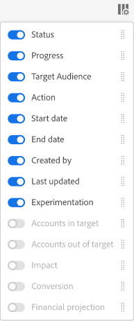

# Aktivitäten {#operations-tab-next-steps}

Sobald Sie die Nutzungsmuster Ihrer Abonnenten und die gemeinsame Nutzung von Passwörtern für ausgewählte Segmente verstanden haben (mithilfe von &quot;Reports and Analytics&quot;in Konto IQ), können Sie gezielte Aktionen durchführen, um die Freigabe von Passwörtern zu verhindern.

Die Funktionalität &quot;Vorgänge&quot;in Konto IQ hilft Ihnen, die Freigabe von Anmeldedaten mithilfe von fokussierten Verfahren, so genannten Vorgängen, effektiv anzugehen und zu verwalten. Es bietet Ihnen Optionen, objektive, zielgerichtete Aktionen (basierend auf dem Ziel) für bestimmte Gruppen von Abonnentenkonten zu konzipieren und deren Ausführung für eine zukünftige Dauer zu automatisieren. Über die Funktionalität &quot;Vorgänge&quot;können Sie nicht nur Vorgänge erstellen und ausführen, sondern auch deren Auswirkungen messen. Indem Sie also die Auswirkungen messen, können Sie Ihre Strategie anpassen, um den Effekt zu optimieren, sei es durch die Umwandlung von Kreditnehmern oder die Verringerung der Kreditaufteilung.

Zur Ansicht **Aktivitäten** Seitenauswahl **Aktivitäten** Option unter **Aktionen** in der linken Navigation der Konto-IQ-Anwendung. Auf der Seite &quot;Vorgänge&quot;werden alle Vorgänge aufgelistet, die bereits im Konto-IQ-System vorhanden sind, sowie ihre Details.

*Abbildung: Liste und Details der bestehenden Vorgänge in Konto IQ*

Auf der Seite &quot;Vorgänge&quot;haben Sie folgende Möglichkeiten:

* Liste der bereits in Konto IQ vorhandenen Vorgänge anzeigen

* Zeigen Sie Vorgangsdetails an, z. B.:

   * Status (Geplant, Wird ausgeführt, Beendet, Fehler oder Angehalten)

   * Fortschritt (in % Abschluss)

   * Zielgruppe (Segment zur Ausführung des Vorgangs)

   * Zeitplan (Start- und Enddatum des Betriebs)

   * Erstellungs- und Enddatum des Vorgangs

* [Neuen Vorgang erstellen](/help/AccountIQ/operation-affecting-user-segment.md)

* [Anzeigen von Vorgangsberichten](#operation-reports)

<!--* Search from the list of operations using Search field

* Stop an operation.

* Create a duplicate operation.

* [Configure columns of Operations details page](#configure-columns)-->

## Anzeigen von Vorgangsberichten {#operation-reports}

Sie können die Auswirkungen eines Vorgangs analysieren, indem Sie dessen Bericht anzeigen. So zeigen Sie den Bericht eines Vorgangs an:

1. Wählen Sie auf der Hauptseite Vorgänge den Vorgangsnamen aus.

   Der Bericht wird in Form eines gestapelten Spaltendiagramms angezeigt.

   

   *Abbildung: Betriebsbericht mit den Auswirkungen der Vorgänge*

   Die X-Achse stellt den Bewertungszeitraum dar und die Y-Achse zeigt die Auswirkungen des Vorgangs (in Bezug auf die Anzahl der Konten in einem Segment während des Bewertungszeitraums). Jeder Balken ist in drei Teile unterteilt.

   * Ein Teil stellt die Anzahl der Konten dar, die weiterhin die Kriterien des Vorgangssegments erfüllen.

   * Ein anderer Teil stellt die Anzahl der aktiven Konten für diesen Zeitraum dar, die sich ursprünglich im Segment befanden, aber die Kriterien des Vorgangssegments nicht mehr erfüllen.

   * Der dritte Teil stellt die Konten dar, die in diesem Zeitraum nicht aktiv waren.

   >[!NOTE]
   >
   >Die erste Leiste stellt die Anzahl der Konten dar, die zu Beginn des Bewertungszeitraums die Bedingungen des Vorgangssegments erfüllen.

   Im Laufe der Zeit zeigt das Diagramm die Wirkung Ihrer Aktion (durch den Vorgang) an, indem es die Anzahl der Konten angibt, die ihr Verhalten im Vergleich zu den ursprünglichen Kriterien geändert haben (z. B. mit einer Freigabewahrscheinlichkeit von mehr als 90 und mit mehr als 5 Geräten) oder inaktiv geworden sind.

<!--For example, in the above image the variable on the y-axis is number of accounts. Looking at the graph you can compare the number of accounts that are in the operations' segment versus the number of accounts that are outside the operations segment at a particular time (such as week 2nd of the operations evaluation period). Therefore, you can analyze how over the evaluation period do number of accounts vary within the operation segment and outside the segment.

So, if your operation was to send out warning emails to suspecting accounts, and accounts in operations segment were those with sharing probability more than 90 and using more than 5 devices to stream content, then in the beginning of the evaluation period accounts in segment are more than 17 thousand. This number changes over the evaluation period as shown in the graph, thereby indicating the impact of operation. Based on the evaluation, you can take remedial measures on suspecting accounts, or continue with the operation, or adjust your strategy for better outcomes to curb credential sharing.-->

1. Um den Bericht zu schließen und zur Hauptseite &quot;Vorgänge&quot;zurückzukehren, wählen Sie **Aktivitäten** Option unter **Aktionen** in der linken Navigation.

<!--

*Figure: Operation details*
## Configure columns {#configure-columns}

You can select the icon to **Configure columns** on the top of the operations table.

*Figure: Configure columns of Operations details page*-->