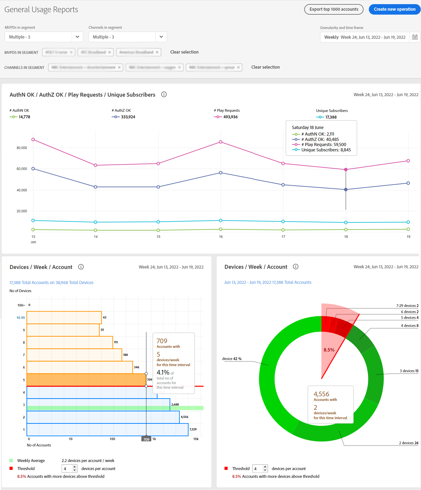

# Anzeigen von Berichten zur Kontofreigabe: für einen bestimmten MVPD <!--and programmer--> {#report-sp-mvpd}

Wenn Sie bei der Account IQ-Anwendung als Kanal angemeldet sind [Programmierer](/help/AccountIQ/product-concepts.md#programmer-def)können Sie dann die Freigabe von Berichten Ihrer Kanal-Viewer für die spezifischen [MVPD](/help/AccountIQ/product-concepts.md#mvpd-def) sie sich angemeldet haben.

So zeigen Sie Berichte in Konto IQ an, sobald Sie sich erfolgreich als Programmierer bei der Anwendung angemeldet haben:

1. Definieren Sie Ihr Abonnentensegment für die Analyse und Anzeige von Berichten mithilfe der Schritte in [So definieren Sie ein Segment](/help/AccountIQ/howto-select-segment-timeframe.md).

   >[!NOTE]
   >
   >Sie können ein, zwei oder mehrere MVPDs oder sogar die Standardauswahl der 10 wichtigsten MVPDs auswählen (durch Freigabe von Bewertungen, Nutzung oder Konten).
   >
   >
   >Sie können jedoch [höchstens 10 MVPDs](/help/AccountIQ/limitations.md) über den MVPD-Selektor in der [Segment- und Zeitrahmen-Bedienfeld](/help/AccountIQ/segments-timeframe.md).

1. Wählen Sie im linken Navigationsbereich eine gewünschte Berichtseite aus:

* [Allgemeine Nutzung](/help/AccountIQ/general-usage-reports.md)

   
* [Freigegebene Konten](/help/AccountIQ/shared-acc-reports.md)

   
* [Nutzungsmuster](/help/AccountIQ/usage-patterns.md)

   

* [Dashboard](/help/AccountIQ/dashboard.md) (Dashboard gibt einen Überblick über die ausgewählten Diagramme aus verschiedenen Seiten in Berichten).

   

Jede dieser Seiten spiegelt die Aktivität wider.

<!--## If you are logged in as an MVPD {#report-sp-programmer}

To view reports in Account IQ, once you have successfully logged in to the application as an MVPD:

1. Select the desired programmer channel(s) from from the **Channels in segment** drop-down option.

   

 1. From the **Granularity and time frame** option, select the time interval to view reports. You can aggregate the time intervals week-wise or month-wise.

1. Select a desired reports page from the left navigation-[General Usage](/help/AccountIQ/general-usage-reports.md), [Shared Accounts](/help/AccountIQ/shared-acc-reports.md), [Usage Patterns](/help/AccountIQ/usage-patterns.md), or even [Dashboard](/help/AccountIQ/dashboard.md) (dashboard gives a glimpse of the selected graphs from different reports pages).

-->