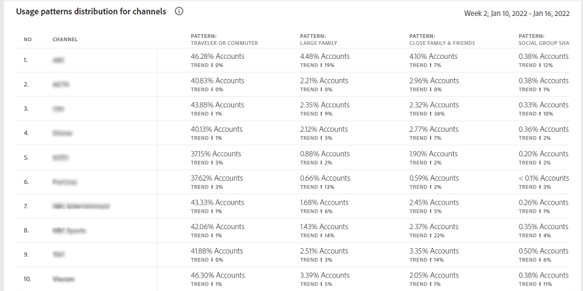

# Nutzungsmuster {#usage-patterns}

Konto IQ klassifiziert Benutzer von Abonnentenkonten in verschiedene Kategorien hinsichtlich ihres sozialen Verhaltens, wie z. B. Reisende oder Pendler, Große Familie und Community-Freigabe. Die **Nutzungsmuster** Seite zeigt mehrere verschiedene Analyse- und Berichtstypen für diese Benutzertypologien. Beispiel: **Verteilung der Nutzungsmuster - Benutzer im Vergleich zur Gesamtsumme** -Bericht vergleicht das Nutzungsverhalten für das aktuelle Segment mit dem für die gesamte Branche.

Wie die anderen Seiten in der App basieren die Analyse und Berichte hier auf dem aktuellen Segment, wie in der [Segmentbereich](/help/AccountIQ/segments-timeframe.md).

## Verteilung der Nutzungsmuster {#usage-pattern-dis}

Balkendiagramm in **Verteilung der Nutzungsmuster - Benutzer im Vergleich zur Gesamtsumme** Zeigt die Anzahl und den Prozentsatz der Abonnenten für jedes soziale Verhalten oder Nutzungsmuster an. Zusätzlich zum Vergleich der einzelnen Nutzungsmuster im aktuellen Segment mit der gesamten Branche werden sie auch mit einem Segment verglichen, das alle Ihre Kanäle enthält.

## Verteilung der Nutzungsmuster im Segment (#usage-pattern-dis-segment)

Die **Verteilung der Nutzungsmuster im Segment** -Bedienfeld enthält die folgenden Informationen für jedes Benutzermuster:

* Teilungswahrscheinlichkeitsbereich, in den die einzelnen Konten fallen
* Anzahl und Prozentsatz der Konten in diesem Muster
* Gesamt- und Prozentanteil der Nutzung durch Abonnenten in dieser Kategorie in Bezug auf Wiedergabeanforderungen

Im obigen Bild beispielsweise:

* Ein regulärer Benutzer (ein bis wenige Personen mit einer begrenzten Anzahl von Geräten an nur einem Ort) im definierten Segment hat die Wahrscheinlichkeit der Kontofreigabe zwischen 0 und 5 %.

* Und 36,8 % (2.201.935) der gesamten Teilnehmerkonten (5.981.648) sind normale Nutzer.

* Und 15,7 % (24.073.311) der gesamten Wiedergabeanforderungen (153.076.350) werden von regulären Benutzern durchgeführt.

## Verteilung der Nutzungsmuster nach Segmentpartner {#usage-pattern-dis-mvpd}

+++Programmer- Verteilung des Nutzungsmusters für Gesamtsegmente und Segmentpartner

Die **Verteilung der Nutzungsmuster** -Tabelle bietet einen Vergleich der Verteilung des Nutzungsmusters für die MVPDs im aktuellen Segment.

+++

+++MVPD - Gebrauchsmuster-Verteilung für Gesamtsegmente und Segmentpartner

Die **Verteilung der Nutzungsmuster** -Tabelle bietet einen Vergleich der Verteilung des Nutzungsmusters für die Programmierkanäle im aktuellen Segment.

+++
