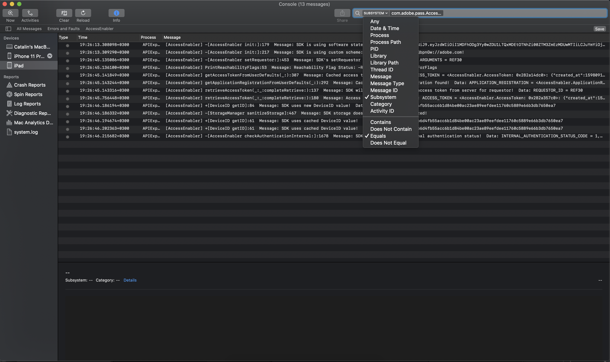

# Debugging des AccessEnabler iOS/tvOS-SDK mithilfe von Konsolen-App-Protokollen {#debugging-the-accessenabler-iostvos-sdk-using-console-app-logs}

>[!NOTE]
>
>Der Inhalt dieser Seite dient nur Informationszwecken. Für die Verwendung dieser API ist eine aktuelle -Lizenz von Adobe erforderlich. Eine unbefugte Anwendung ist nicht zulässig.

## Übersicht

In diesem Dokument wird die Entwicklung des iOS/tvOS SDK-Protokollierungsmechanismus von AccessEnabler zusammen mit einigen nützlichen Details zum Debugging des AccessEnabler-Frameworks mithilfe der Konsolen-App-Protokolle erfasst und dargestellt.

## Status des Protokollierungsmechanismus

Der Protokollierungsmechanismus von AccessEnabler iOS/tvOS dient dazu, nützliche Meldungen zur Fehlerbehebung bei möglichen Problemen zu senden, auf die eine Anwendung mit dem AccessEnabler-Framework stoßen könnte.

### AccessEnabler iOS/tvOS 3.5.0 und höher

Ab AccessEnabler iOS/tvOS 3.5.0 werden mit dem Protokollierungsmechanismus die folgenden Verbesserungen als Änderungen eingeführt:

* AccessEnabler-Framework verwendet die empfohlene Apple [OSLog](https://developer.apple.com/documentation/os/oslog) Implementierung.

* AccessEnabler Framework bietet die Möglichkeit, Konsolen-App-Protokolle basierend auf Subsystem zu filtern: **com.adobe.pass.AccessEnabler**. Alle vom SDK ausgegebenen Nachrichten sind Teil von com.adobe.pass.AccessEnabler.

* AccessEnabler Framework ermöglicht das Filtern von Konsolen-App-Protokollen basierend auf Any (Präfix): **[AccessEnabler]**. Alle vom SDK ausgegebenen Nachrichten erhalten das Präfix [AccessEnabler].

* AccessEnabler Framework bietet die Möglichkeit, Konsolen-App-Protokolle nach Kategorie zu filtern: **debug**, **error** in Verbindung mit einem der beiden oben genannten Kriterien: Subsystem oder Beliebig (Präfix).

## Debugging mithilfe von Konsolen-App-Protokollen

Je nach den untersuchten Problemen können Sie die vom AccessEnabler-Framework ausgegebenen Protokollmeldungen ein- oder ausschließen. Daher finden Sie unten einige nützliche Details, die Ihnen bei Untersuchungen und bei der Verwendung von Konsolen-App-Protokollen helfen können.

### AccessEnabler iOS/tvOS 3.5.0 und höher

#### Einschließlich {#including}

Um eine der Protokollmeldungen des AccessEnabler-Frameworks sehen zu können, müssen Sie zunächst **must** Wählen Sie im Aktionsabschnitt der Konsole-App die Optionen &quot;Informationsmeldungen einschließen&quot;und &quot;Debug-Nachrichten einschließen&quot;aus, wie in der Abbildung unten dargestellt.

Um die Funktionalität des AccessEnabler iOS/tvOS-SDK debuggen zu können und **see** Das AccessEnabler-Framework protokolliert folgende Möglichkeiten:

* In der Konsolen-App suchen mit **Teilsystem** -Option, die dem Wert com.adobe.pass.AccessEnabler wie in der Abbildung unten entspricht.

* In der Konsolen-App suchen mit **Alle** -Option, die die
   [AccessEnabler] -Wert wie in der Abbildung unten dargestellt.

Neben den beiden oben genannten Kriterien können Sie auch die **Kategorie** Option in Verbindung mit **Teilsystem** oder **Beliebig (Präfix)** , um explizit nach **debug** oder **error** Statusmeldungen, die vom AccessEnabler iOS/tvOS SDK ausgegeben werden.

#### Ausschließen

Um die Funktionalität anderer Komponenten besser debuggen zu können und **exclude** Das AccessEnabler-Framework protokolliert folgende Möglichkeiten:

* In der Konsolen-App suchen mit **Teilsystem** Option, die nicht mit dem Wert com.adobe.pass.AccessEnabler übereinstimmt.
* In der Konsolen-App suchen mit **Alle** -Option, die nicht enthält [AccessEnabler] -Wert.

## Melden eines Problems

Beachten Sie beim Melden eines Problems bei der Adobe Primetime-Authentifizierung die folgenden Vorschläge:

* Bitte versuchen Sie, die Reproduktionsschritte anzugeben.
* Bitte versuchen Sie, die Betriebssystemversion(en) und das Gerätemodell/die Geräte anzugeben, bei denen das Problem auftritt.
* Bitte versuchen Sie, die Version des AccessEnabler iOS/tvOS SDK anzugeben, in der das Problem auftritt.
* Versuchen Sie, alle Logging-Meldungen des AccessEnabler iOS/tvOS-SDK mit einer der beiden Optionen zu erfassen und anzuhängen, die im Abschnitt [Einschließlich](#including) Abschnitt.
