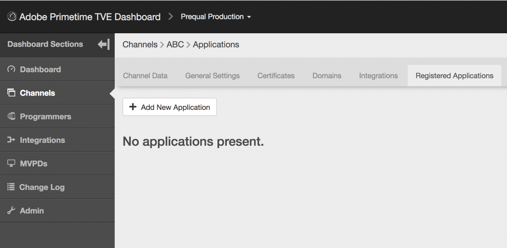

# Dynamisches Client-Registrierungsmanagement {#dynamic-client-registration-management}

>[!NOTE]
>
>Der Inhalt dieser Seite dient nur Informationszwecken. Für die Verwendung dieser API ist eine aktuelle -Lizenz von Adobe erforderlich. Eine unbefugte Anwendung ist nicht zulässig.

## Übersicht {#overview}

Mit der weit verbreiteten Annahme von [Benutzerdefinierte Registerkarten für Android Chrome](https://developer.chrome.com/multidevice/android/customtabs){target_blanck} und [Apple Safari-Controller](https://developer.apple.com/documentation/safariservices/sfsafariviewcontroller){target_blanck} in den Anwendungen unserer Kunden verwenden, wird der Benutzerauthentifizierungsfluss in der Adobe Primetime-Authentifizierung aktualisiert. Genauer gesagt, können wir das Ziel, den Status beizubehalten, nicht mehr erreichen, sodass der Benutzeragentenfluss bei der Authentifizierung eines MVPD-Abonnenten zwischen Umleitungen verfolgt werden kann. Zuvor wurde dies mithilfe von HTTP-Cookies durchgeführt. Diese Einschränkung ist der Treiber für die Migration aller APIs zu OAuth 2.0. [RFC 6749](https://tools.ietf.org/html/rfc6749){target_blanck}.

Mit diesem Update werden Adobe Authentication Clients zu OAuth 2.0-Clients und ein benutzerdefinierter OAuth 2.0-Autorisierungsserver wird bereitgestellt, um die Anforderungen des Adobe Primetime Authentication Service zu erfüllen.

Damit die Client-Anwendungen die OAuth 2.0-Autorisierung verwenden können, muss sich der Server dynamisch registrieren, um bestimmte Informationen (Client-Anmeldeinformationen) zu erhalten und damit mit ihnen interagieren zu können. Im Rahmen des Registrierungsprozesses muss der Client eine Reihe integrierter Metadaten für den Client-Registrierungs-Endpunkt bereitstellen.

Diese Metadaten werden als Softwareanweisung übermittelt, die eine &quot;software_id&quot;enthält, damit unser Autorisierungsserver verschiedene Instanzen einer Anwendung mit derselben Softwareanweisung korrelieren kann.

A **Softwareanweisung** ist ein JSON Web Token (JWT), das Metadatenwerte über die Client-Software als Bundle durchführt. Wenn die Software dem Autorisierungsserver als Teil einer Anfrage zur Clientregistrierung präsentiert wird, muss sie digital signiert oder mit JSON Web Signature (JWS) als MACed signiert werden.

Eine detailliertere Erklärung dazu, was Softwareanweisungen sind und wie sie funktionieren, finden Sie in der offiziellen Dokumentation [RFC 7591](https://tools.ietf.org/html/rfc7591).

Die Softwareanweisung sollte mit der Anwendung auf dem Gerät des Benutzers bereitgestellt werden.

Vor dieser Aktualisierung hatten wir zwei Möglichkeiten, es Anwendungen zu ermöglichen, Aufrufe zur Adobe Primetime-Authentifizierung durchzuführen:

* Browser-basierte Clients sind über erlaubt registriert [Domain-Auflistung](/help/authentication/programmer-overview.md#reg-and-init)
* native Anwendungs-Clients wie iOS- und Android-Anwendungen werden über registriert. **signierter Anforderer** Mechanismus

Mit dem Mechanismus zur Autorisierung der Kundenregistrierung müssen Sie Ihre Anwendungen zum TVE-Dashboard hinzufügen.

Damit ein Kunde mit der Implementierung des neuen Android-SDK und des kommenden iOS SDK beginnen kann, benötigt er eine Softwareanweisung. Eine Softwareanweisung identifiziert eine im TVE-Dashboard erstellte Anwendung.

Führen Sie die Schritte in den folgenden Abschnitten aus, um eine registrierte Anwendung im TVE-Dashboard zu erstellen.

## Registrierte Anwendung erstellen {#create_app}

Es gibt zwei Möglichkeiten, eine registrierte Anwendung im TVE-Dashboard zu erstellen:

* [Programmierebene](#prog-level) - ermöglicht es Ihnen, eine registrierte Anwendung zu erstellen und sie mit einem oder allen Programmierer-Kanälen zu verknüpfen.

* [Kanalebene](#channel-level) - ermöglicht die Erstellung einer registrierten Anwendung, die ausschließlich mit diesem Kanal verknüpft ist.

### Registrierte Anwendung auf Programmebene erstellen {#prog-level}

Navigieren Sie zu **Programmierer** > **Registrierte Anwendungen** Registerkarte.

Klicken Sie auf der Registerkarte Registrierte Anwendungen auf **Neue Anwendung hinzufügen**. Füllen Sie die erforderlichen Felder im neuen Fenster aus.

Wie in der Abbildung unten dargestellt, sollten Sie folgende Felder ausfüllen:

* **Anwendungsname** - Name des Antrags

* **Zugeordneter Kanal** - den Namen Ihres Kanals, tmit dem dieser Antrag verknüpft ist. Die Standardeinstellung in der Dropdown-Maske ist **Alle Kanäle.** In der Benutzeroberfläche können Sie entweder einen Kanal oder alle Kanäle auswählen.

* **Anwendungsversion** - Standardmäßig ist dies auf &quot;1.0.0&quot; gesetzt, wir empfehlen Ihnen jedoch dringend, es mit Ihrer eigenen Anwendungsversion zu ändern. Wenn Sie sich dazu entscheiden, die Version Ihrer Anwendung zu ändern, empfiehlt es sich, sie durch die Erstellung einer neuen registrierten Anwendung widerzuspiegeln.

* **Anwendungsplattformen** - die Plattformen für die Anwendung, mit der verknüpft werden soll. Sie haben die Möglichkeit, alle oder mehrere Werte auszuwählen.

* **Domänennamen** - die Domänen für die Anwendung, mit der verknüpft werden soll. Die Domänen in der Dropdown-Liste sind eine einheitliche Auswahl aller Domänen aus allen Ihren Kanälen. Sie können mehrere Domänen aus der Liste auswählen. Die Bedeutung der Domänen ist die Umleitungs-URLs [RFC 6749](https://tools.ietf.org/html/rfc6749). Bei der Client-Registrierung kann die Client-Anwendung anfordern, eine Umleitungs-URL für die Fertigstellung des Authentifizierungsflusses verwenden zu dürfen. Wenn eine Client-Anwendung eine bestimmte Umleitungs-URL anfordert, wird sie anhand der Domänen validiert, die in dieser registrierten Anwendung auf der Whitelist stehen und mit der Softwareanweisung verknüpft sind.

Nachdem Sie die Felder mit den entsprechenden Werten ausgefüllt haben, müssen Sie auf &quot;Fertig&quot;klicken, damit die Anwendung in der Konfiguration gespeichert wird.

Beachten Sie bitte, dass **keine Option zum Ändern einer bereits erstellten Anwendung**. Sollte festgestellt werden, dass etwas, das erstellt wurde, nicht mehr den Anforderungen entspricht, muss eine neue registrierte Anwendung erstellt und mit der Clientanwendung verwendet werden, deren Anforderungen sie erfüllt.

### Neue Anwendung auf Kanalebene registrieren {#channel-level}

Um eine registrierte Anwendung auf Kanalebene zu erstellen, navigieren Sie zum Menü &quot;Kanäle&quot;und wählen Sie die aus, für die Sie eine Anwendung erstellen möchten. Klicken Sie dann nach dem Navigieren zur Registerkarte &quot;Registrierte Anwendungen&quot;auf die Schaltfläche &quot;Neue Anwendung hinzufügen&quot;.

Wie unten gezeigt, unterscheidet sich hier im Vergleich zur gleichen Aktion, die auf Programmebene durchgeführt wird, etwas von der Dropdown-Liste &quot;Zugewiesene Kanäle&quot;, die nicht aktiviert ist, sodass es keine Option gibt, die registrierte Anwendung an einen anderen als den aktuellen Kanal zu binden.

## Auflisten von Anwendungen {#list-reg-app}

Nach der Erstellung der registrierten Anwendung besteht die Möglichkeit, eine Softwareanweisung zu erhalten, um den Autorisierungsserver als Teil einer Anfrage darzustellen.

Dies kann geschehen, indem Sie entweder zum Programmierer oder Kanal navigieren, für den die registrierten Anwendungen erstellt wurden, wo sie aufgeführt sind. 

Wie unten dargestellt, wird jeder Eintrag in der Liste durch einen Namen, eine Version und Symbole für Plattformen identifiziert, an die er gebunden war.

Sie können für jede dieser Optionen:

* [Ansicht](#view)
* [Software-Anweisung herunterladen](#download-statement)

### Registrierte Anwendung anzeigen {#view}

In der Liste der Anwendungen werden die bei der Erstellung verwendeten Details angezeigt, wenn Sie eine der Anwendungen auswählen und auf die Schaltfläche &quot;Anzeigen&quot; klicken. Wie bereits erwähnt, gibt es keine Möglichkeit, irgendetwas zu ändern.

### Software-Anweisung herunterladen {#download-statement}

Durch Klicken auf die Schaltfläche &quot;Herunterladen&quot;im Listeneintrag, für den eine Softwareanweisung benötigt wird, wird eine Textdatei generiert. Diese Datei enthält etwas Ähnliches wie die folgende Beispielausgabe.

Der Dateiname wird eindeutig identifiziert, indem &quot;software_statement&quot;vorangestellt und der aktuelle Zeitstempel hinzugefügt wird.

Bitte beachten Sie, dass für dieselbe registrierte Anwendung jedes Mal, wenn auf die Download-Schaltfläche geklickt wird, unterschiedliche Softwareanweisungen empfangen werden. Dies macht jedoch die zuvor erhaltenen Softwareanweisungen für diese Anwendung nicht ungültig. Dies geschieht, weil sie pro Aktionsanforderung vor Ort generiert werden.

Es gibt eins **Beschränkung** bezüglich der Download-Aktion. Wenn eine Softwareanweisung durch Klicken auf die Schaltfläche &quot;Herunterladen&quot;kurz nach der Erstellung der registrierten Anwendung angefordert wird und diese noch nicht gespeichert wurde und die Konfigurations-JSON nicht synchronisiert wurde, wird die folgende Fehlermeldung am unteren Rand der Seite angezeigt. 

Dadurch wird ein HTTP 404 Not Found -Fehlercode umschlossen, der vom Core empfangen wurde, da die ID der registrierten Anwendung noch nicht propagiert wurde und der Kern keine Kenntnis davon hat.

Die Lösung besteht darin, nach dem Erstellen der registrierten Anwendung höchstens 2 Minuten zu warten, bis die Konfiguration synchronisiert wird. Danach wird die Fehlermeldung nicht mehr empfangen und die Textdatei mit der Softwareanweisung kann heruntergeladen werden.

Weitere Informationen dazu, wie der Prozess &quot;Ende bis Ende&quot;funktioniert, sowie Einblicke in die Leistung der Anfragen und die zu erwartenden Antworten finden Sie unter dem Link Verwandte Informationen weiter unten neben anderen nützlichen Links.

<!--
## Related Information {#related}

* [Dynamic Client Registration API](/help/authentication/dynamic-client-registration-api.md)
* [TVE Dashboard User Guide](/help/authentication/tve-dashboard-user-guide.md)
-->

## Funktionsdemo {#tutorial}

Bitte schauen Sie nach [dieses Webinar](https://my.adobeconnect.com/pzkp8ujrigg1/) bietet mehr Kontext zu den Funktionen und enthält eine Demo zur Verwaltung der Softwareanweisungen mithilfe des TVE-Dashboards und zum Testen der generierten mithilfe einer Demoanwendung, die von Adobe als Teil des Android-SDK bereitgestellt wird.
