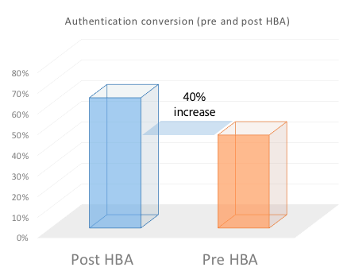

# Hausbasierte Authentifizierung für TV überall

>[!NOTE]
>
>Der Inhalt dieser Seite dient nur Informationszwecken. Für die Verwendung dieser API ist eine aktuelle -Lizenz von Adobe erforderlich. Eine unbefugte Anwendung ist nicht zulässig.

## Was ist Home-basierte Authentifizierung? {#whatis-home-based-authn}

Home-Based Authentication (HBA) ist eine TV-Anywhere-Funktion, mit der Pay-TV-Abonnenten online TV-Inhalte anzeigen können, ohne MVPD-Anmeldeinformationen bei sich zu Hause eingeben zu müssen. Dadurch wird das Benutzererlebnis des Authentifizierungsflusses erheblich verbessert.

Definition der Home-basierten Authentifizierung durch das Open Authentication Technology Committee (OATC): &quot;Die automatische In-Home-Authentifizierung ist der Prozess, bei dem ein MVPD/OVD Merkmale des Heimnetzwerks (oder Identifikatoren, die automatisch zwischen Geräten im Heimnetzwerk zugänglich sind) verwendet, um zu authentifizieren, welches Abonnentenkonto mit diesem Heimnetzwerk verbunden ist, sodass Benutzer bei der Einrichtung einer TVE-Sitzung für den Zugriff auf TVE-geschützte Inhalte keine Anmeldeinformationen manuell eingeben müssen.&quot;

Weitere Informationen zu HBA und den Industriestandards finden Sie im [Anwendungsfälle und Anforderungen für OATC](https://dzf8vqv24eqhg.cloudfront.net/userfiles/258/326/ckfinder/files/Defining%20TVE%20Home-Based%20Authentication%20(HBA)%20%20Use%20Cases%20and%20Requirements%20Recommended%20Practice%20Version%201_0%20FINAL%20DRAFT%20FOR%20BOARD%20APPROVAL.pdf){target=_blank} Dokumentation und **OATC User Experience Guidelines for HBA**.

>[!NOTE]
>
>Einige HBA-Flüsse sind Teil des Premium Workflow-Pakets. Wenden Sie sich an Ihren Primetime-Vertriebsmitarbeiter, wenn Sie diese Funktion nutzen möchten.

## Warum HBA für Sie wichtig ist {#why-hba}

HBA ist wichtig, da es die Anmeldeschranke für die Zuschauer, die zu Hause sind und bereits über ein Kabelabo verfügen, praktisch beseitigt. Darüber hinaus kann die Authentifizierung auf der Startseite die Interaktion Ihrer Betrachter erheblich steigern und ein besseres Benutzererlebnis für Ihre TV-Inhalte in allen Bereichen bieten.

Derzeit ist fast die Hälfte der Anmeldeversuche nicht erfolgreich.

Sobald HBA von einem der 5 wichtigsten MVPDs aktiviert wurde, wird die Authentifizierungsrate konvertiert **um 40 % erhöht** (von 45 % auf 63 %)

Unten sehen Sie außerdem die Anmelde-Konversionsrate für einen Kanal, der in verschiedene MVPDs integriert ist: diejenigen, die HBA dafür aktiviert haben und die nicht über HBA verfügen. Die Konversionsrate für HBA-Kunden ist deutlich höher als die ohne HBA.

Sechs Monate nach der Aktivierung von HBA für die meisten mit diesem MVPD integrierten Kanäle konnten wir einen Anstieg von 82 % bei Unique Users feststellen (die Anzahl der Nutzer, die über diesen MVPD überall auf TV-Kanälen zugreifen, hat sich fast verdoppelt).

2w3Im Gegensatz dazu hatten andere MVPDs, die HBA nicht aktiviert hatten, wie Sie in der unten stehenden Grafik sehen können, in den letzten 6 Monaten nur einen Anstieg der Unique Users um 26 %.

Aus unseren Daten, die 6 Monate vor und 6 Monate nach der Aktivierung von HBA gesammelt wurden, ging hervor, dass die Interaktion der Betrachter für die Kanäle, für die HBA aktiviert war, stark zunahm. Praktisch Benutzer von MVPDs, die HBA aktiviert haben, sehen sich im Durchschnitt 30 % mehr Inhalte an als Benutzer von MVPDs, für die HBA nicht aktiviert ist.

## Unterstützung von Primetime-Authentifizierung-HBA {#auth-hba-support}

In diesem Abschnitt wird die HBA-Unterstützung beschrieben, die von der Primetime-Authentifizierung bereitgestellt wird, das Verhalten von Primetime-Authentifizierungsplattformen in HBA-Flüssen sowie technische Details, die für die Implementierung von HBA nützlich sind.

Primetime-Authentifizierungsfunktionen, die HBA unterstützen

* Möglichkeit, verschiedene Authentifizierungs-TTLs für HBA- und Nicht-HBA-Authentifizierungen festzulegen (auch MVPD-Unterstützung erforderlich)
* Möglichkeit zur automatischen Auswahl eines MVPD (MVPD-Picker überspringen), wenn die Authentifizierung abgelaufen ist. Dies ist insbesondere bei kleinen HBA-TTLs nützlich.
* Möglichkeit, die Programmierer anzuzeigen, wenn die Authentifizierung HBA war oder nicht (erfordert auch MVPD-Unterstützung)

### HBA-Benutzererlebnis auf Primetime-Authentifizierungsplattformen {#hba-user-exp}

Die folgenden Tabellen enthalten Informationen zum Benutzererlebnis für die unterstützten Plattformen, wenn HBA aktiviert ist und HBA nicht aktiviert ist:

| Benutzerfluss - Plattformtyp | swf, iOS, Android |
|---|---|
| Mit HBA aktiviert | Wenn sich Benutzer zu Hause befinden, werden sie automatisch authentifiziert. Nach Ablauf des HBA-AuthN-Tokens werden Benutzer automatisch erneut authentifiziert. |
| Ohne HBA | Benutzer werden aufgefordert, ihren MVPD auszuwählen und ihre Anmeldeinformationen einzugeben, auch wenn sie sich zu Hause befinden. Nach Ablauf des AuthN-Tokens müssen Benutzer ihre Anmeldeinformationen erneut eingeben. |

| Benutzerfluss - Plattformtyp | js, Windows (nativ) |
|---|---|
| Mit HBA aktiviert | Wenn sich Benutzer zu Hause befinden, werden sie automatisch authentifiziert. Nachdem das HBA AuthN-Token abläuft, müssen Benutzer ihr MVPD aus der Auswahl erneut auswählen und werden automatisch authentifiziert. |
| Ohne HBA | Benutzer werden aufgefordert, ihren MVPD auszuwählen und ihre Anmeldeinformationen einzugeben, auch wenn sie sich zu Hause befinden. Nach Ablauf des AuthN-Tokens müssen Benutzer ihre Anmeldeinformationen erneut eingeben. |

| Benutzerfluss - Plattformtyp | Clientlose REST-API (Authentifizierung am zweiten Bildschirm) |
|---|---|
| Mit HBA aktiviert | Wenn sich Benutzer zu Hause befinden und eine clientlose REST-API-App verwenden, werden sie nach Eingabe des Registrierungs-Codes und Auswahl ihres MVPD automatisch auf dem zweiten Bildschirmgerät authentifiziert. Nach Ablauf des HBA-AuthN-Tokens werden Benutzer automatisch erneut authentifiziert (auf dem zweiten Bildschirmgerät). |
| Ohne HBA | Benutzer werden aufgefordert, ihren MVPD auszuwählen und ihre Anmeldeinformationen einzugeben, auch wenn sie sich zu Hause befinden. Nach Ablauf des AuthN-Tokens müssen Benutzer ihre Anmeldeinformationen erneut eingeben. |

### Technische Details zur Umsetzung von HBA {#tech-details-hba}

#### OAuth 2.0-Protokoll {#oauth-2-protocol}

Im HBA-Ablauf für MVPDs, die mit dem OAuth 2.0-Authentifizierungsprotokoll integriert sind, gibt der MVPD ein Aktualisierungstoken aus und die Adobe gibt ein HBA-Authentifizierungstoken aus:

* Das Aktualisierungstoken verfügt über eine TTL, die durch die Geschäftsanforderungen des MVPD bestimmt wird.
* TTL des HBA-Authentifizierungstokens **muss kleiner oder gleich sein** die TTL des Aktualisierungstokens.

*Beschreibung des HBA-Authentifizierungsflusses für das OAuth 2.0-Protokoll*

| Benutzeraktionen | Systemaktionen |
|---|---|
| Der Benutzer navigiert zur Site des Programmierers. Beim Versuch, ein Video abzuspielen, wird die MVPD-Auswahl angezeigt. Der Benutzer wählt seinen MVPD aus und klickt auf &quot;Anmelden&quot;. | Es wird eine Hintergrundprüfung durchgeführt. Der MVPD wendet seine Regelsätze für die Benutzererkennung an (ordnen Sie beispielsweise die IP-Adresse des Benutzers der MAC-Adresse von durch Distributoren bereitgestellten Modems oder Set-Top-Boxen mit Breitbandanschluss zu). |
| Ein Bildschirm, der ca. 3 Sekunden lang anhält, wird angezeigt. Eine Interstitial-Seite kann angezeigt werden, auf der der Benutzer darüber informiert wird, dass er automatisch über sein MVPD-Konto angemeldet wird. | <ol><li>AccessEnabler, der auf der Seite des Programmierers installiert ist, sendet eine Authentifizierungsanfrage (als HTTP-Anfrage) an den Adobe Primetime-Authentifizierungsendpunkt.</li><li>Der Primetime-Authentifizierungsendpunkt leitet die Anfrage an den MVPD-Authentifizierungsendpunkt weiter.  **Hinweis:** Die Anfrage enthält die `hba_flag` -Parameter (Versuch HBA = true), der signalisiert, dass der MVPD die HBA-Authentifizierung versuchen sollte.</li><li>Der MVPD-Authentifizierungsendpunkt sendet einen Autorisierungscode an den Adobe Primetime-Authentifizierungsendpunkt.</li><li>Die Adobe Primetime-Authentifizierung verwendet den Autorisierungscode, um ein Aktualisierungs-Token und ein Zugriffstoken vom Token-Endpunkt des MVPD anzufordern.</li><li>Der MVPD sendet eine Authentifizierungsentscheidung und die `hba_status` (true/false) im Parameter `id_token`.</li><li>Ein Aufruf an den MVPD-Benutzerprofil-Endpunkt wird gesendet, um die [hba_status-Schlüssel in Benutzermetadaten](/help/authentication/user-metadata-feature.md#obtaining).</li><li>Der MVPD setzt die TTL des Aktualisierungstokens auf einen MVPD-vereinbarten Wert und die Adobe setzt die TTL des AuthN-Tokens auf einen Wert, der kleiner oder gleich dem Wert des Aktualisierungstokens ist.</li></ol> |
| Der Benutzer ist authentifiziert und kann jetzt TV-Inhalte durchsuchen, für die er eine Berechtigung besitzt. | Das Authentifizierungstoken wird an den Benutzer übergeben, der jetzt die Website des Programmierers erfolgreich durchsuchen kann. |

#### SAML-Protokoll {#saml-protocol}

Beschreibung des HBA-Authentifizierungsflusses für das SAML-Authentifizierungsprotokoll

| Benutzeraktionen | Systemaktionen |
|---|---|
| Der Benutzer navigiert zur Site des Programmierers. Beim Versuch, ein Video abzuspielen, wird die MVPD-Auswahl angezeigt. Der Benutzer wählt seinen MVPD aus und klickt auf &quot;Anmelden&quot;. | Es wird eine Hintergrundprüfung durchgeführt. Der MVPD wendet seine Regelsätze für die Benutzererkennung an (ordnen Sie beispielsweise die IP-Adresse des Benutzers der MAC-Adresse von durch Distributoren bereitgestellten Modems oder Set-Top-Boxen mit Breitbandanschluss zu). |
| Ein Bildschirm, der ca. 3 Sekunden lang anhält, wird angezeigt. Eine Interstitial-Seite kann angezeigt werden, auf der der Benutzer darüber informiert wird, dass er automatisch über sein MVPD-Konto angemeldet wird. | <ol><li>AccessEnabler, der auf der Seite des Programmierers installiert ist, sendet eine Authentifizierungsanfrage (als HTTP-Anfrage) an den Adobe Primetime-Authentifizierungsendpunkt.</li><li>Der Primetime-Authentifizierungsendpunkt leitet die Anfrage an den MVPD-Authentifizierungsendpunkt weiter.</li><li>Der MVPD sollte eine Authentifizierungsentscheidung in Form einer SAML-Antwort senden, die die HBA-Markierung enthalten sollte: hba_status (true/false).</li><li>Ein Aufruf an den MVPD-Benutzerprofil-Endpunkt wird gesendet, um die [hba_status-Schlüssel in Benutzermetadaten](/help/authentication/user-metadata-feature.md#obtaining).</li></ol> |
| Der Benutzer ist authentifiziert und kann jetzt TV-Inhalte durchsuchen, für die er eine Berechtigung besitzt. | Das Authentifizierungstoken wird an den Benutzer übergeben, der jetzt die Website des Programmierers erfolgreich durchsuchen kann. |

## Aktivieren von HBA {#how-to-activate-hba}

* **OAuth-Protokoll:**
   * Informationen zur Aktivierung von HBA finden Sie unter [Primetime TVE Dashboard-Benutzerhandbuch](/help/authentication/tve-dashboard-user-guide.md)
* **SAML-Protokoll:** Die Home-basierte Authentifizierung wird auf der MVPD-Seite aktiviert. Der Programmierer oder die Adobe ist nicht verpflichtet, Maßnahmen zu ergreifen.
Weitere Informationen zu den MVPDs, die die Home-basierte Authentifizierung unterstützen, finden Sie unter [HBA-Status für MVPDs](/help/authentication/hba-status-mvpds.md).

## FAQs {#faqs}

**Frage:** Warum die Trennung zwischen Home-basierter Authentifizierung mit SAML- und OAuth2-Protokollen?

**Antwort:** Der HBA-Fluss unterscheidet sich bei den beiden Protokollen. Aus Sicht des Programmierers besteht keine Notwendigkeit für Maßnahmen, um sicherzustellen, dass HBA für SAML-MVPDs aktiviert ist, während HBA für OAuth2-MVPDs im Primetime TVE-Dashboard ein- oder ausgeschaltet werden kann.

**Frage:** Müssen Benutzer einen Benutzernamen und ein Kennwort eingeben, wenn sie sich zum ersten Mal authentifizieren, wenn HBA aktiviert ist?

**Antwort:** Nein, Benutzername und Kennwort sind nicht erforderlich.

**Frage:** Wie werden elterliche Kontrollen durchgesetzt?

**Antwort 1:** Adobe kann HBA für Integrationen mit Kanälen deaktivieren, für die eine Genehmigung der elterlichen Kontrolle erforderlich ist.

**Antwort 2:** Adobe arbeitet mit OATC an einem UX-Dokument, in dem empfohlen wird, das HBA-Erlebnis mit elterlichen Kontrollen einzurichten.

**Frage:** Verfügen die HBA-Unterstützer über kürzere TTL-Fenster für HBA und dann über reguläre Authentifizierung?

**Antwort:** Die TTL-Einstellung kann konfiguriert werden. Es wird empfohlen, eine kürzere TTL für HBA-Authentifizierungstoken festzulegen, um Fehlfunktionen zu vermeiden.

## Nützliche Informationen {#useful-info}

* [Sofortiger Zugriff (HBA) Recommendations](http://www.ctamtve.com/instantaccess){target=_blank} - von CTAM
* [Beispielimplementierung von HBA im Programm &quot;Programmierer&quot;](https://dzf8vqv24eqhg.cloudfront.net/userfiles/258/326/ckfinder/files/HBA_Flow_Sample.pdf?dc=201604222139-1346){target=_blank} - nach Adobe
   <!--* [Home Based Authentication User Experience Guidelines for TV Everywhere](http://oatc.us/Standards/DownloadRecommendedPractices.aspx){target=_blank} - by OATC-->
* [Anwendungsfälle und Anforderungen für die Home-basierte Authentifizierung](https://dzf8vqv24eqhg.cloudfront.net/userfiles/258/326/ckfinder/files/Defining%20TVE%20Home-Based%20Authentication%20(HBA)%20%20Use%20Cases%20and%20Requirements%20Recommended%20Practice%20Version%201_0%20FINAL%20DRAFT%20FOR%20BOARD%20APPROVAL.pdf){target=_blank} von OATC
* [Infografik zur Home-basierten Authentifizierung](https://dzf8vqv24eqhg.cloudfront.net/userfiles/258/326/ckfinder/files/AdobeNewsletterHBA.pdf?dc=201604260953-2640){target=_blank} - nach Adobe
* [Authentifizierung mit dem OAuth 2.0-Protokoll](/help/authentication/authn-oauth2-protocol.md)
* [Authentifizierung mit SAML-MVPDs](/help/authentication/authn-usecase.md)
* [Primetime TVE Dashboard-Benutzerhandbuch](/help/authentication/tve-dashboard-user-guide.md)
* [hba_status Benutzermetadaten](/help/authentication/user-metadata-feature.md#obtaining)

