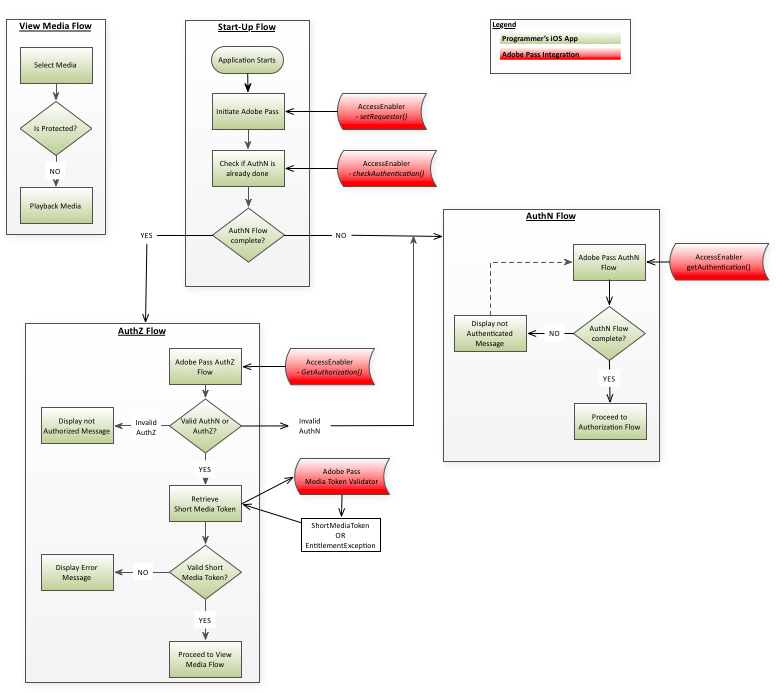

# iOS/tvOS-SDK-Cookbook {#iostvos-sdk-cookbook}

>[!NOTE]
>
>Der Inhalt dieser Seite dient nur Informationszwecken. Für die Verwendung dieser API ist eine aktuelle Lizenz von Adobe erforderlich. Eine unbefugte Anwendung ist nicht zulässig.

## Einführung {#intro}

In diesem Dokument werden die Berechtigungs-Workflows beschrieben, die die Anwendung eines Programmierers auf oberster Ebene über die APIs implementieren kann, die von der iOS/tvOS AccessEnabler-Bibliothek bereitgestellt werden.

Die Adobe Primetime-Authentifizierungsberechtigungslösung für iOS/tvOS ist letztendlich in zwei Domänen unterteilt:

* Die UI-Domäne - dies ist die Anwendungsebene der obersten Ebene, die die Benutzeroberfläche implementiert und die von der AccessEnabler-Bibliothek bereitgestellten Dienste verwendet, um Zugriff auf eingeschränkte Inhalte zu ermöglichen.

* In der AccessEnabler-Domäne werden die Berechtigungs-Workflows in folgender Form implementiert:

   * Netzwerkaufrufe an Adobe-Backend-Server
   * Geschäftslogikregeln für die Authentifizierungs- und Autorisierungs-Workflows
   * Verwaltung verschiedener Ressourcen und Verarbeitung des Workflow-Status (z. B. Token-Cache)

Ziel der AccessEnabler-Domäne ist es, alle Komplexität der Berechtigungs-Workflows auszublenden und der oberen Ebene (über die AccessEnabler-Bibliothek) eine Reihe einfacher Berechtigungs-Primitive bereitzustellen, mit denen Sie die Berechtigungs-Workflows implementieren:

1. Anfragenidentität festlegen
1. Überprüfen und Abrufen der Authentifizierung für einen bestimmten Identitäts-Provider
1. Prüfen und Autorisieren einer bestimmten Ressource
1. Abmelden
1. Apple SSO-Flüsse durch Testen des Apple VSA-Frameworks

Die Netzwerkaktivität von AccessEnabler erfolgt in einem eigenen Thread, sodass der UI-Thread nie blockiert wird. Daher muss der bidirektionale Kommunikationskanal zwischen den beiden Anwendungsdomänen einem vollständig asynchronen Muster folgen:

* Die Anwendungsebene der Benutzeroberfläche sendet Nachrichten über die API-Aufrufe, die von der AccessEnabler-Bibliothek verfügbar gemacht werden, an die AccessEnabler-Domäne.
* Der AccessEnabler antwortet auf die UI-Ebene über die Callback-Methoden, die im AccessEnabler -Protokoll enthalten sind und die die UI-Ebene mit der AccessEnabler -Bibliothek registriert.

## Konfigurieren der Besucher-ID {#visitorIDSetup}

Konfigurieren eines [Marketing Cloud visitorID](https://experienceleague.adobe.com/docs/id-service/using/home.html) -Wert ist aus analytischer Sicht sehr wichtig. Sobald ein visitorID -Wert festgelegt ist, sendet das SDK diese Informationen zusammen mit allen Netzwerkaufrufen und der Adobe Primetime-Authentifizierungsserver erfasst diese Informationen. Zukünftig können Sie die Analysen des Adobe Primetime-Authentifizierungsdienstes mit anderen Analyseberichten korrelieren, die Sie möglicherweise aus anderen Anwendungen oder Websites verwenden. Informationen zum Einrichten der visitorID finden Sie unter [here](#setOptions).

## Berechtigungsflüsse {#entitlement}

A.  [Voraussetzungen](#prereqs)  
B.  [Startup-Fluss](#startup_flow)  
C.  [Authentifizierungsfluss ohne Apple SSO](#authn_flow_wo_applesso)   
D.  [Authentifizierungsfluss mit Apple SSO in iOS](#authn_flow_with_applesso)  
E.  [Authentifizierungsfluss mit Apple SSO auf tvOS](#authn_flow_with_applesso_tvOS)  
F.  [Autorisierungsfluss](#authz_flow)  
G.  [Medienfluss anzeigen](#media_flow)  
H.  [Abmeldefluss ohne Apple SSO](#logout_flow_wo_AppleSSO)  
I.  [Abmeldefluss mit Apple SSO](#logout_flow_with_AppleSSO)  

### A. Voraussetzungen {#prereqs}

1. Erstellen Sie Ihre Callback-Funktionen:
   * `setRequestorComplete()`  
   * Ausgelöst von [setRequestor()](#$setReq), gibt Erfolg oder Fehler zurück.  
   * &quot;Erfolg&quot;bedeutet, dass Sie mit Berechtigungsaufrufen fortfahren können.

   * [`displayProviderDialog(mvpds)`](#$dispProvDialog)  
      * Ausgelöst von [`getAuthentication()`](#$getAuthN) nur dann, wenn der Benutzer keinen Anbieter (MVPD) ausgewählt hat und noch nicht authentifiziert ist.  
      * Die `mvpds` -Parameter ist ein Array von Anbietern, die dem Benutzer zur Verfügung stehen.

   * `setAuthenticationStatus(status, errorcode)`  
      * Ausgelöst von `checkAuthentication()` jedes Mal.  
      * Ausgelöst von [`getAuthentication()`](#$getAuthN) nur dann, wenn der Benutzer bereits authentifiziert ist und einen Provider ausgewählt hat.  
      * Status zurückgegeben ist erfolgreich oder fehlgeschlagen, der Fehlertyp wird im Fehlercode beschrieben.

   * [`navigateToUrl(url)`](#$nav2url)  
      * Ausgelöst von [`getAuthentication()`](#$getAuthN) nachdem der Benutzer einen MVPD ausgewählt hat. Die `url` liefert den Speicherort der Anmeldeseite des MVPD.

   * `sendTrackingData(event, data)`  
      * Ausgelöst von `checkAuthentication()`, [`getAuthentication()`](#$getAuthN), `checkAuthorization()`, [`getAuthorization()`](#$getAuthZ), `setSelectedProvider()`.
      * Die `event` -Parameter gibt an, welches Berechtigungsereignis aufgetreten ist; der `data` -Parameter ist eine Liste von Werten, die sich auf das Ereignis beziehen.

   * `setToken(token, resource)`

      * Ausgelöst von [checkAuthorization()](#checkAuthZ) und [getAuthorization()](#$getAuthZ) nach erfolgreicher Autorisierung zum Anzeigen einer Ressource.
      * Die `token` -Parameter ist das kurzlebige Medien-Token; die `resource` -Parameter ist der Inhalt, den der Benutzer anzeigen darf.

   * `tokenRequestFailed(resource, code, description)`  
      * Ausgelöst von [checkAuthorization()](#checkAuthZ) und [getAuthorization()](#$getAuthZ) nach einer nicht erfolgreichen Autorisierung.
      * Die `resource` -Parameter ist der Inhalt, den der Benutzer anzuzeigen versucht hat; die `code` -Parameter ist der Fehlercode, der angibt, welcher Fehlertyp aufgetreten ist; der `description` -Parameter beschreibt den Fehler, der dem Fehlercode zugeordnet ist.

   * `selectedProvider(mvpd)`  
      * Ausgelöst von [`getSelectedProvider()`](#getSelProv).
      * Die `mvpd` liefert Informationen zum vom Benutzer ausgewählten Provider.

   * `setMetadataStatus(metadata, key, arguments)`
      * Ausgelöst von `getMetadata().`
      * Die `metadata` liefert die spezifischen Daten, die Sie angefordert haben; die `key` -Parameter ist der Schlüssel, der in der Variablen [getMetadata()](#getMeta) und die `arguments` ist dasselbe Wörterbuch, das an [getMetadata()](#getMeta).

   * [`preauthorizedResources(authorizedResources]`](#preauthResources)

      * Ausgelöst von [`checkPreauthorizedResources()`](#checkPreauth).

      * Die `authorizedResources` -Parameter zeigt die Ressourcen an, die der Benutzer anzeigen darf.

   * [`presentTvProviderDialog(viewController)`](#presentTvDialog)

      * Ausgelöst von [getAuthentication()](#getAuthN) wenn der aktuelle Anfragende mindestens MVPD unterstützt, das SSO-Unterstützung hat.
      * Der Parameter viewController ist das Apple SSO-Dialogfeld und muss auf dem Hauptansichtscontroller angezeigt werden.

   * [`dismissTvProviderDialog(viewController)`](#dismissTvDialog)

      * Wird durch eine Benutzeraktion ausgelöst (durch die Auswahl von &quot;Abbrechen&quot;oder &quot;Andere TV-Anbieter&quot;im Dialogfeld &quot;Apple SSO&quot;).
      * Der Parameter viewController ist das Apple SSO-Dialogfeld und muss vom Hauptansichtscontroller verworfen werden.

### B. Startup Flow {#startup_flow}

1. Starten Sie die Anwendung der obersten Ebene. 
1. Adobe Primetime-Authentifizierung initiieren  

   a. Aufruf [`init`](#$init) , um eine Instanz der Adobe Primetime-Authentifizierung AccessEnabler zu erstellen.
   * **Abhängigkeit:** Adobe Primetime-Authentifizierung Native iOS/tvOS-Bibliothek (AccessEnabler)

   b. Aufruf `setRequestor()` die Identität des Programmierers festzustellen; `requestorID` und (optional) ein Array von Adobe Primetime-Authentifizierungsendpunkten. Für tvOS müssen Sie auch den öffentlichen Schlüssel und das Geheimnis angeben. Siehe [Clientlose Dokumentation](#create_dev) für Details.

   * **Abhängigkeit:** Gültige Adobe Primetime-Authentifizierungsanfrage-ID (vereinbaren Sie dies mit Ihrem Adobe Primetime-Authentifizierungskontomanager).

   * **Trigger:**
     [setRequestorComplete()](#$setReqComplete) Callback.

   >[!NOTE]
   >
   >Berechtigungsanfragen können erst abgeschlossen werden, wenn die Identität des Anfragenden vollständig ermittelt wurde. Dies bedeutet effektiv, dass [`setRequestor()`](#$setReq)  weiterhin ausgeführt wird, werden alle nachfolgenden Berechtigungsanfragen ausgeführt. Beispiel: [`checkAuthentication()`](#checkAuthN) blockiert werden.

   Sie haben zwei Implementierungsoptionen: Sobald die Identifizierungsinformationen des Anfragenden an den Backend-Server gesendet wurden, kann die UI-Anwendungsschicht einen der beiden folgenden Ansätze wählen:  

   1. Warten Sie auf die Auslösung der [`setRequestorComplete()`](#setReqComplete) callback (Teil des AccessEnabler -Delegates). Diese Option bietet die größte Sicherheit, dass [`setRequestor()`](#$setReq) abgeschlossen ist, daher wird dies für die meisten Implementierungen empfohlen.

   1. Fahren Sie fort, ohne auf die Aktivierung der [`setRequestorComplete()`](#setReqComplete) zurücksetzen und mit der Ausgabe von Berechtigungsanfragen beginnen. Diese Aufrufe (checkAuthentication, checkAuthorization, getAuthentication, getAuthorization, checkPreauthorizedResource, getMetadata, logout) werden von der AccessEnabler-Bibliothek in die Warteschlange gestellt, die die tatsächlichen Netzwerkaufrufe nach der [`setRequestor()`](#$setReq). Diese Option kann gelegentlich unterbrochen werden, wenn beispielsweise die Netzwerkverbindung instabil ist.

1. Aufruf `checkAuthentication()` um nach einer vorhandenen Authentifizierung zu suchen, ohne den vollständigen Authentifizierungsfluss zu starten.  Wenn dieser Aufruf erfolgreich ist, können Sie direkt zum Autorisierungsfluss übergehen. Ist dies nicht der Fall, fahren Sie mit dem Authentifizierungsfluss fort.

   * **Abhängigkeit:** Ein erfolgreicher Aufruf an [setRequestor()](#$setReq) (Diese Abhängigkeit gilt auch für alle nachfolgenden Aufrufe).

   * **Trigger:** [setAuthenticationStatus()](#$setAuthNStatus) Callback.

### C. Authentifizierungsfluss ohne Apple SSO {#authn_flow_wo_applesso}

1. Aufruf [`getAuthentication()`](#$getAuthN) , um den Authentifizierungsfluss zu initiieren oder um zu bestätigen, dass der Benutzer bereits authentifiziert ist.

   **Trigger:**

   * Die [setAuthenticationStatus()](#$setAuthNStatus) Callback, wenn der Benutzer bereits authentifiziert ist. Gehen Sie in diesem Fall direkt zum [Autorisierungsfluss](#authz_flow).

   * Die [displayProviderDialog()](#$dispProvDialog) Callback, wenn der Benutzer noch nicht authentifiziert ist.

1. Präsentieren Sie den Benutzer mit der Liste der Anbieter, die an gesendet werden
   [`displayProviderDialog()`](#dispProvDialog).

1. Nachdem der Benutzer einen Anbieter ausgewählt hat, rufen Sie die URL des MVPD des Benutzers aus der `navigateToUrl:` oder `navigateToUrl:useSVC:` Callback und Öffnen einer `UIWebView/WKWebView` oder `SFSafariViewController` und leitet diesen Controller zur URL weiter.

1. Durch die `UIWebView/WKWebView` oder `SFSafariViewController` im vorherigen Schritt instanziiert wurde, landet der Benutzer auf der Anmeldeseite des MVPD und gibt Anmeldedaten ein. Mehrere Umleitungsvorgänge finden innerhalb des Controllers statt. 

>[!NOTE]
>
>An dieser Stelle hat der Benutzer die Möglichkeit, den Authentifizierungsfluss abzubrechen. In diesem Fall ist Ihre UI-Schicht dafür verantwortlich, den AccessEnabler über dieses Ereignis zu informieren, indem sie [setSelectedProvider()](#setSelProv) mit `null` als Parameter. Dadurch kann AccessEnabler den internen Status bereinigen und den Authentifizierungsfluss zurücksetzen.

1. Nach erfolgreicher Anmeldung durch den Benutzer erkennt Ihre Anwendungsebene das Laden einer bestimmten benutzerdefinierten URL. Beachten Sie, dass diese spezifische benutzerdefinierte URL tatsächlich ungültig ist und nicht für den Controller vorgesehen ist, sie tatsächlich zu laden. Sie darf nur von Ihrer Anwendung als Signal interpretiert werden, dass der Authentifizierungsvorgang abgeschlossen ist und dass das Schließen der `UIWebView/WKWebView` oder `SFSafariViewController` Controller. Im Fall von `SFSafariViewController`Der Controller muss verwendet werden, wenn die spezifische benutzerdefinierte URL von der **`application's custom scheme`** (z. B.`adbe.u-XFXJeTSDuJiIQs0HVRAg://adobe.com`). Andernfalls wird diese spezifische benutzerdefinierte URL durch die Variable **`ADOBEPASS_REDIRECT_URL`** Konstante (d. h. `adobepass://ios.app`).

1. Schließen Sie den Controller UIWebView/WKWebView oder SFSafariViewController und rufen Sie den `handleExternalURL:url` API-Methode, die den AccessEnabler anweist, das Authentifizierungstoken vom Backend-Server abzurufen.

1. (Optional) Aufruf [`checkPreauthorizedResources(resources)`](#$checkPreauth) , um zu überprüfen, welche Ressourcen der Benutzer anzeigen darf. Die `resources` parameter ist ein Array geschützter Ressourcen, die mit dem Authentifizierungstoken des Benutzers verknüpft sind. Eine Verwendung der Autorisierungsinformationen, die vom MVPD des Benutzers erhalten werden, besteht darin, Ihre Benutzeroberfläche zu dekorieren (z. B. gesperrte/entsperrte Symbole neben geschützten Inhalten).

   * **Trigger:** [`preauthorizedResources()`](#preauthResources) callback
   * **Ausführungspunkt:** Nach Abschluss des Authentifizierungsablaufs

1. Wenn die Authentifizierung erfolgreich war, fahren Sie mit dem Autorisierungsfluss fort.

### D. Authentifizierungsfluss mit Apple SSO auf iOS {#authn_flow_with_applesso}

1. Aufruf [`getAuthentication()`](#$getAuthN) , um den Authentifizierungsfluss zu initiieren oder um zu bestätigen, dass der Benutzer bereits authentifiziert ist.
   **Trigger:**

   * Die [presentTvProviderDialog()](#presentTvDialog) Callback, wenn der Benutzer nicht authentifiziert ist und der aktuelle Anforderer mindestens über MVPD verfügt, der SSO unterstützt. Wenn keine MVPDs SSO unterstützen, wird der klassische Authentifizierungsfluss verwendet.

1. Nachdem der Benutzer einen Anbieter ausgewählt hat, ruft die AccessEnabler-Bibliothek ein Authentifizierungstoken mit den Informationen ab, die vom VSA-Framework von Apple bereitgestellt werden.

1. Die [setAuthenticationsStatus()](#setAuthNStatus) Callback wird ausgelöst. An dieser Stelle sollte der Benutzer bei Apple SSO authentifiziert werden.

1. [Optional] Aufruf [`checkPreauthorizedResources(resources)`](#$checkPreauth) , um zu überprüfen, welche Ressourcen der Benutzer anzeigen darf. Die `resources` parameter ist ein Array geschützter Ressourcen, die mit dem Authentifizierungstoken des Benutzers verknüpft sind. Eine Verwendung der Autorisierungsinformationen, die vom MVPD des Benutzers erhalten werden, besteht darin, Ihre Benutzeroberfläche zu dekorieren (z. B. gesperrte/entsperrte Symbole neben geschützten Inhalten).

   * **Trigger:** [`preauthorizedResources()`](#preauthResources) callback
   * **Ausführungspunkt:** Nach Abschluss des Authentifizierungsablaufs

1. Wenn die Authentifizierung erfolgreich war, fahren Sie mit dem Autorisierungsfluss fort.

### E. Authentifizierungsfluss mit Apple SSO auf tvOS {#authn_flow_with_applesso_tvOS}

1. Aufruf [`getAuthentication()`](#$getAuthN) , um den Authentifizierungsfluss zu initiieren oder um zu bestätigen, dass der Benutzer bereits authentifiziert ist.
   **Trigger:**
   * Die [`presentTvProviderDialog()`](#presentTvDialog) Callback, wenn der Benutzer nicht authentifiziert ist und der aktuelle Anforderer mindestens über MVPD verfügt, der SSO unterstützt. Wenn keine MVPDs SSO unterstützen, wird der klassische Authentifizierungsfluss verwendet.

1. Nachdem der Benutzer einen Anbieter ausgewählt hat, wird der [`status()`](#status_callback_implementation) Callback wird aufgerufen. Es wird ein Registrierungs-Code bereitgestellt und die AccessEnabler-Bibliothek beginnt mit der Abfrage des Servers auf eine erfolgreiche Zweitbildschirmauthentifizierung.

1. Wenn der angegebene Registrierungs-Code für die erfolgreiche Authentifizierung auf dem zweiten Bildschirm verwendet wurde, wird die [`setAuthenticatiosStatus()`](#setAuthNStatus) Callback wird ausgelöst. An dieser Stelle sollte der Benutzer bei Apple SSO authentifiziert werden.
1. [Optional] Aufruf [`checkPreauthorizedResources(resources)`](#$checkPreauth) , um zu überprüfen, welche Ressourcen der Benutzer anzeigen darf. Die `resources` parameter ist ein Array geschützter Ressourcen, die mit dem Authentifizierungstoken des Benutzers verknüpft sind. Eine Verwendung der Autorisierungsinformationen, die vom MVPD des Benutzers erhalten werden, besteht darin, Ihre Benutzeroberfläche zu dekorieren (z. B. gesperrte/entsperrte Symbole neben geschützten Inhalten).

   * **Trigger:** [`preauthorizedResources()`](#preauthResources) callback

   * **Ausführungspunkt:** Nach Abschluss des Authentifizierungsablaufs
1. Wenn die Authentifizierung erfolgreich war, fahren Sie mit dem Autorisierungsfluss fort.

### F. Genehmigungsprozess {#authz_flow}

1. Aufruf [getAuthorization()](#$getAuthZ) , um den Genehmigungsprozess einzuleiten.

   * **Abhängigkeit:** Gültige ResourceID(s), die mit den MVPD(s) vereinbart wurde.
   * Die Ressourcen-IDs sollten mit denen auf anderen Geräten oder Plattformen übereinstimmen und sind über MVPDs hinweg identisch. Informationen zu Ressourcen-IDs finden Sie unter [Ermitteln geschützter Ressourcen](/help/authentication/identify-protected-resources.md)

1. Validieren Sie Authentifizierung und Autorisierung.

   * Wenn die Variable [getAuthorization()](#$getAuthZ) Aufruf erfolgreich: Der Benutzer verfügt über gültige AuthN- und AuthZ-Token (der Benutzer ist authentifiziert und berechtigt, die angeforderten Medien zu sehen).

   * Wenn [getAuthorization()](#$getAuthZ) schlägt fehl: Untersuchen Sie die ausgelöste Ausnahme, um ihren Typ zu bestimmen (AuthN, AuthZ oder etwas Anderes):
      * Wenn es sich um einen Authentifizierungsfehler (AuthN) handelte, starten Sie den Authentifizierungsfluss neu.
      * Wenn es sich um einen Autorisierungsfehler (AuthZ) handelt, ist der Benutzer nicht berechtigt, das angeforderte Medium zu sehen und dem Benutzer sollte eine Fehlermeldung angezeigt werden.
      * Wenn ein anderer Fehlertyp aufgetreten ist (Verbindungsfehler, Netzwerkfehler usw.) zeigen Sie dem Benutzer eine entsprechende Fehlermeldung an.

1. Validieren Sie das Token für kurze Medien.\
   Verwenden Sie die Adobe Primetime Authentication Media Token Verifier-Bibliothek, um das von der [getAuthorization()](#$getAuthZ) Aufruf oben:

   * Wenn die Validierung erfolgreich ist: Wiedergabe des angeforderten Mediums für den Benutzer.
   * Wenn die Validierung fehlschlägt: Das AuthZ-Token war ungültig, die Medienanforderung sollte abgelehnt werden und dem Benutzer sollte eine Fehlermeldung angezeigt werden.

1. Kehren Sie zu Ihrem normalen Anwendungsfluss zurück.

### G. Medienfluss anzeigen {#media_flow}

1. Der Benutzer wählt das Medium aus, das angezeigt werden soll.
1. Sind die Medien geschützt? Ihre Anwendung prüft, ob die ausgewählten Medien geschützt sind:

   * Wenn das ausgewählte Medium geschützt ist, startet Ihre Anwendung die [Autorisierungsfluss](#authz_flow) höher.

   * Wenn das ausgewählte Medium nicht geschützt ist, geben Sie das Medium für den Benutzer wieder.

### H. Abmeldefluss ohne Apple SSO {#logout_flow_wo_AppleSSO}

1. Aufruf [`logout()`](#$logout) , um den Benutzer abzumelden. AccessEnabler löscht alle zwischengespeicherten Werte und Token. Nachdem der Cache gelöscht wurde, führt der AccessEnabler einen Server-Aufruf durch, um die Server-seitigen Sitzungen zu bereinigen. Da der Server-Aufruf zu einer SAML-Umleitung zum IdP führen kann (dies ermöglicht die Sitzungsbereinigung auf der IdP-Seite), muss dieser Aufruf allen Umleitungen folgen. Aus diesem Grund muss dieser Aufruf innerhalb eines UIWebView/WKWebView- oder SFSafariViewController-Controllers verarbeitet werden.

   a. Entsprechend dem gleichen Muster wie der Authentifizierungs-Workflow sendet die AccessEnabler-Domäne über die `navigateToUrl:` oder `navigateToUrl:useSVC:` Callback, um einen UIWebView/WKWebView- oder SFSafariViewController-Controller zu erstellen und diesen anzuweisen, die im Callback bereitgestellte URL zu laden `url` -Parameter. Dies ist die URL des Abmelde-Endpunkts auf dem Backend-Server.

   b. Ihre Anwendung muss die Aktivität der `UIWebView/WKWebView or SFSafariViewController` steuern und den Moment erkennen, in dem eine bestimmte benutzerdefinierte URL geladen wird, da sie mehrere Umleitungen durchläuft. Beachten Sie, dass diese spezifische benutzerdefinierte URL tatsächlich ungültig ist und nicht für den Controller vorgesehen ist, sie tatsächlich zu laden. Sie darf von Ihrer Anwendung nur als Signal interpretiert werden, dass der Abmeldefluss abgeschlossen ist und dass es sicher ist, die `UIWebView/WKWebView` oder `SFSafariViewController` Controller. Wenn der Controller diese spezifische benutzerdefinierte URL lädt, muss Ihre Anwendung die `UIWebView/WKWebView or SFSafariViewController` Controller und Aufruf von AccessEnabler `handleExternalURL:url`API-Methode. Im Fall von `SFSafariViewController`Der Controller muss verwendet werden, wenn die spezifische benutzerdefinierte URL von der **`application's custom scheme`** (zum Beispiel: `adbe.u-XFXJeTSDuJiIQs0HVRAg://adobe.com`). Andernfalls wird diese spezifische benutzerdefinierte URL durch die Variable **`ADOBEPASS_REDIRECT_URL`**  Konstante (d. h. `adobepass://ios.app`).

   >[!NOTE]
   >
   >Der Abmeldefluss unterscheidet sich vom Authentifizierungsfluss insofern, als der Benutzer in keiner Weise mit dem UIWebView/WKWebView oder SFSafariViewController interagieren muss. Die UI-Anwendungsebene verwendet einen UIWebView/WKWebView- oder SFSafariViewController, um sicherzustellen, dass alle Umleitungen befolgt werden. Daher ist es möglich (und empfohlen), den Controller während des Abmeldevorgangs unsichtbar (d. h. ausgeblendet) zu machen.

### I. Abmeldefluss mit Apple SSO {#logout_flow_with_AppleSSO}

1. Aufruf [`logout()`](#$logout) , um den Benutzer abzumelden.
1. Die [status()](#status_callback_implementation) callback wird mit id VSA203 aufgerufen.
1. Der Benutzer sollte angewiesen werden, sich auch über die Systemeinstellungen anzumelden. Andernfalls wird eine erneute Authentifizierung durchgeführt, wenn die Anwendung neu gestartet wird.

<!--
### Related Information {#related}

- [iOS API Reference](#)

- [iOS Technical Overview](#)

- [Generating Digital Certificates](#)

- [Identifying Protected Resources](#)

- [Handling MVPDs with 'Not Trusted Certificates' in Adobe Primetime
  authentication native SDK (Tech Note)](#)

- [iOS Authentication error - adobepass.ios.app cannot be found (Tech
  Note)](#)
-->
