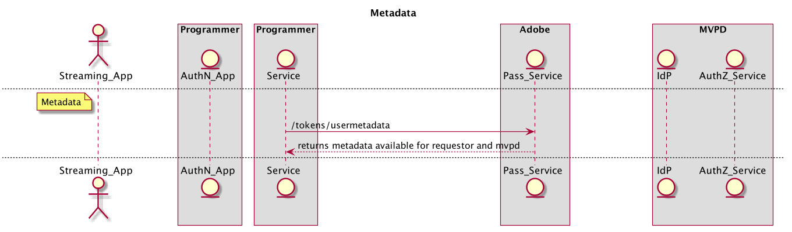

# REST API-Cookbook (Server-zu-Server) {#rest-api-cookbook-server-to-server}

>[!NOTE]
>
>Der Inhalt dieser Seite dient nur Informationszwecken. Für die Verwendung dieser API ist eine aktuelle -Lizenz von Adobe erforderlich. Eine unbefugte Anwendung ist nicht zulässig.

## Übersicht {#overview}

In diesem Cookbook-Dokument werden Best Practices für die Implementierung der Adobe Primetime-Authentifizierung unter Verwendung der Server-zu-Server-Architekturen beschrieben.  Es bietet grundlegende Anforderungen, eine schrittweise Flussimplementierung und allgemeine Überlegungen für Produktionsumgebungen und -vorgänge.

 

## Komponenten {#components}

In einer funktionierenden Server-zu-Server-Lösung sind die folgenden Komponenten involviert:

 
| Typ | Komponente | Beschreibung | | — | — | — | | Streaming-Gerät | Streaming-App | Die Programmeranwendung, die sich auf dem Streaming-Gerät des Benutzers befindet und authentifizierte Videos wiedergibt. | | | \[Optional\] AuthN-Modul | Wenn das Streaming-Gerät über einen Benutzeragenten (d. h. einen Webbrowser) verfügt, ist das AuthN-Modul für die Authentifizierung des Benutzers auf dem MVPD IdP verantwortlich. | | \[Optional\] AuthN-Gerät | AuthN App | Wenn das Streaming-Gerät über keinen Benutzeragenten (d. h. einen Webbrowser) verfügt, ist die AuthN-Anwendung eine Programmierer-Webanwendung, auf die über einen Webbrowser von einem Gerät eines anderen Benutzers aus zugegriffen wird. | | Programmierungs-Infrastruktur | Programmiererdienst | Ein Dienst, der das Streaming-Gerät mit dem Adobe Pass-Dienst verknüpft, um Authentifizierungs- und Autorisierungsentscheidungen zu erhalten. | | Adobe | Adobe Pass-Dienst | Ein Dienst, der in den MVPD IdP- und AuthZ-Dienst integriert und Authentifizierungs- und Autorisierungsentscheidungen trifft. | | MVPD-Infrastruktur | MVPD IdP | Ein MVPD-Endpunkt, der einen auf Anmeldedaten basierenden Authentifizierungsdienst bereitstellt, um die Identität des Benutzers zu überprüfen. | | | MVPD AuthZ-Dienst | Ein MVPD-Endpunkt, der Autorisierungsentscheidungen basierend auf den Abonnements des Benutzers, elterlichen Kontrollen usw. bereitstellt. |

Weitere im Fluss verwendete Begriffe werden im Abschnitt
[Glossar](/help/authentication/glossary.md).

## Flüsse {#flows}

### Dynamische Kundenregistrierung (DCR)

Adobe Pass verwendet DCR, um die Client-Kommunikation zwischen einer Programmieranwendung oder einem Server und den Adobe Pass-Diensten zu sichern. Der DCR-Fluss ist ein separater, abhängiger und erforderlicher Fluss und kann in [Dynamische Kundenregistrierung](/help/authentication/dynamic-client-registration.md).

### Authentifizierung (authN)

Der Authentifizierungsfluss wird verwendet, um einem Benutzer die Möglichkeit zu geben, sich mit seinem MVPD zu identifizieren, um festzustellen, ob der Benutzer über ein gültiges Konto verfügt. 

1. Der Benutzer startet die Streaming-Geräte-App und versucht, sich anzumelden oder geschützten Inhalt anzuzeigen.
2. Die Streaming-Geräte-App fordert den Programmierer-Dienst an, um zu ermitteln, ob das Gerät bereits authentifiziert ist.
3. Der Programmiererdienst registriert die App mit DCR.
4. Der Programmiererdienst prüft den Status des Streaming-Geräts authN durch Aufruf des Adobe Pass-Dienstes **checkauthin** API.
5. Für den Fall, dass die Variable **checkauthin** -Aufruf gibt den Status zurück, dass das Benutzergerät authentifiziert ist. Anschließend kann die App mit dem Autorisierungsfluss fortfahren.
6. Für den Fall, dass die Variable **checkauthin** -Aufruf gibt den Status zurück, dass das Benutzergerät NICHT authentifiziert ist. Anschließend sollte die App warten, bis sich eine Benutzeranforderung anmeldet.
7. Wenn der Benutzer eine direkte Anmeldung anfordert (z. B. Anmelde-Schaltfläche auswählt) oder sich indirekt anmeldet (z. B. geschützten Inhalt auswählt, wenn er noch nicht authentifiziert ist), sendet die Streaming-Geräte-App eine Anfrage an den Programmierer-Service, um die Benutzerauthentifizierung zu initiieren. Der Programmierer-Dienst fordert einen eindeutigen Registrierungs-Code (regcode) an und erhält diesen durch Aufruf des Adobe Pass-Dienstes. **regcode** API.
8. Der Programmiererdienst ruft auch die Liste der aktuellen MVPDs und Attribute ab, indem er den Adobe Pass-Dienst aufruft **config** API. Hinweis: Diese API kann auch früher im Fluss aufgerufen und zwischengespeichert werden.
9. Der Programmiererdienst gibt den Regcode an die Streaming-Geräte-App zurück und die verarbeitete MVPD-Liste, die in Schritt \#7 angefordert wurde. Hinweis: Das verarbeitete MVPD-Listenformat wird vom Programmierer angegeben und kann gefiltert werden, um bestimmte MVPDs explizit zuzulassen oder zu blockieren (d. h. Zulassungs- oder Blockierungslisten).
10. Wenn sich die Variable vom AuthN-Gerät unterscheidet (d. h. &quot;zweiter Bildschirm&quot;), entweder nach Wahl oder aus Notwendigkeit (d. h. das Streaming-Gerät unterstützt keinen Benutzeragenten), sollte das Streaming-Gerät den Regcode und einen URI anzeigen, damit der Benutzer auf die AuthN-Anwendung zugreifen kann. Der Benutzer gibt den URI in den Benutzeragenten auf dem AuthN-Gerät ein, um die AuthN-Anwendung zu starten, und gibt dann den Regcode in diese Anwendung ein. Wenn das Streaming-Gerät mit dem AuthN-Gerät identisch ist, kann der Regcode programmgesteuert an das AuthN-Modul übergeben werden.
11. Das AuthN-Modul initiiert die Benutzerauthentifizierung mit dem MVPD, indem es einen MVPD-Picker anzeigt. Nachdem der Benutzer den MVPD ausgewählt hat, ruft das AuthN-Modul auf **authentifizieren** mit dem Regcode, der den Benutzeragenten an den MVPD IdP weiterleitet. Wenn der Benutzer sich erfolgreich bei MVPD authentifiziert, wird der Benutzeragent über den Adobe Pass-Dienst zurückgeleitet, wo die erfolgreiche Authentifizierung mit dem Regcode aufgezeichnet wird, und dann zurück zum AuthN-Modul weitergeleitet.
12. Wenn sich das Streaming-Gerät vom AuthN-Gerät unterscheidet, sollte das AuthN-Gerät eine erfolgreiche Authentifizierungsmeldung für den Benutzer anzeigen und Schritte zum Fortfahren (z. B. &quot;Erfolg\! Sie können jetzt zu Ihrer Spielkonsole zurückkehren, um \[...\]&quot;). Wenn das Streaming-Gerät mit dem AuthN-Gerät identisch ist, kann das Streaming-Gerät den Authentifizierungsabschluss programmgesteuert erkennen.

 

Das folgende Diagramm zeigt den Authentifizierungsfluss:

### Autorisierung (authZ)

Mit dem Autorisierungsfluss wird bestimmt, ob ein Benutzer berechtigt ist, auf den angeforderten Inhalt zuzugreifen.

1. Jedes Mal, wenn der Benutzer versucht, geschützte Inhalte in der Streaming-Geräte-App anzuzeigen, ruft die Streaming-Gerät-App den Programmierer-Dienst auf, der den Inhalt identifiziert und die zum Starten des Streams erforderlichen Berechtigungen und Informationen anfordert.
1. Der Programmiererdienst ruft die Adobe Pass auf **autorisieren** API, die die Ressourcen-ID zusammen mit anderen erforderlichen Parametern übergibt. Der Adobe-Dienst ruft den MVPD AuthZ-Dienst mit der Ressourcen-ID auf und erhält und die Autorisierungsentscheidung, die dann an den Programmierer-Dienst zurückgegeben wird. Diese Autorisierungsentscheidung wird vom Adobe Pass-Dienst für einen konfigurierbaren Zeitraum zwischengespeichert. Bei nachfolgenden **autorisieren** -Aufrufe vom Programmiererdienst an den Adobe Pass-Dienst gesendet, wird der zwischengespeicherte Wert zurückgegeben, solange er gültig ist.
1. Wenn die Autorisierung erteilt wird, sollte der Programmiererdienst die Adobe Pass aufrufen **/tokens/media** API, die ein signiertes Medien-Token zurückgibt. Der Programmiererdienst sollte das Medien-Token mithilfe der Media Token Verifier-Bibliothek (JAR) überprüfen. Falls gültig, sollte der Programmiererdienst die Berechtigung und die zum Starten des Streams erforderlichen (z. B. Stream-URL) zurückgeben, die in Schritt \#1 angefordert wurden.
1. Wird die Genehmigung verweigert, wird die **autorisieren** -Aufruf gibt einen Fehlercode und eine Beschreibung an den Programmierer-Dienst zurück. Der Programmiererdienst sollte den Fehlercode und die Beschreibung (oder eine vom Programmierer geänderte Nachricht) an die Anfrage in Schritt \#1 zurückgeben.

Das folgende Diagramm zeigt den Autorisierungsfluss:

### Abmelden

Mit dem Abmeldefluss kann ein Benutzer die Identität entfernen, die derzeit mit der Anwendung verknüpft ist.

1. Wenn der Benutzer eine Abmeldung anfordert (d. h. das aktuelle MVPD-Konto, das mit der Anwendung verknüpft ist, vom Gerät entfernen), ruft die Streaming-Gerät-App den Programmierer-Dienst auf, der ihn auffordert, das Gerät abzumelden.
1. Der Programmiererdienst sollte die Adobe Pass aufrufen **Abmelden** API.

Das folgende Diagramm zeigt den Abmeldefluss:

### \[Optional\] Vorabgenehmigung (auch Vorflug genannt)

Mit einer Vorabautorisierung können Sie aus einer Reihe von Ressourcen schnell ermitteln, auf welche Benutzer Zugriff haben.  Das Ergebnis dieses Aufrufs wird normalerweise verwendet, um die Benutzeroberfläche für einen einzelnen Benutzer anzupassen.

1. Sobald der Benutzer authentifiziert ist, kann das Streaming-Gerät den Programmierer-Dienst aufrufen, um den Inhalt anzufordern, an den der Benutzer streamen darf.

1. Der Programmiererdienst sollte die Adobe Pass aufrufen **preauthorize** API mit einer Liste von Ressourcen-IDs, bei denen es sich um eine einfache Zeichenfolge handelt, die normalerweise einen Kanal darstellt, den ein Benutzer streamen darf. *Hinweis: Derzeit wird die* ***preauthorize*** *-Aufruf so konfiguriert ist, dass die Liste auf fünf (5) Ressourcen-IDs beschränkt wird. Wenn mehr als fünf Ressourcen benötigt werden, werden mehrere* ***preauthorize*** *-Aufrufe durchgeführt werden können oder der -Aufruf so konfiguriert werden, dass mit einer Vereinbarung der MVPDs mehr als fünf Ressourcen akzeptiert werden. Implementoren sollten die Kosten eines* ***preauthorize*** *Rufen Sie sowohl MVPD-Ressourcen als auch die Antwortzeit an den Programmierer auf und strukturieren Sie die Nutzung des Aufrufs umsichtig.*

1. Die **preauthorize** -Aufruf antwortet mit einem JSON-Objekt, das für jede Ressourcen-ID in der Anfrage einen TRUE- oder FALSE-Wert enthält, der angibt, ob der Benutzer über eine Berechtigung für den zugehörigen Kanal verfügt oder nicht. *Hinweis: Wenn ein MVPD keine Antwort für eine bestimmte Ressourcen-ID bereitstellt (z. B. aufgrund von Netzwerkfehlern oder Zeitüberschreitungen), wird der Wert standardmäßig auf FALSE gesetzt.*

1. Der Programmiererdienst sollte die **preauthorize** Aufrufantwort , um eine vom Programmierer definierte benutzerdefinierte Antwort auf das Streaming-Gerät zu erstellen, in der Regel um die Präsentation für den Benutzer basierend auf seinen Berechtigungen zu personalisieren.

Die folgende Abbildung zeigt den Ablauf der Vorabautorisierung:

### \[Optional\] Metadaten

Metadaten können zum Abrufen von Benutzerinformationen verwendet werden, die vom MVPD freigegeben werden.
 Beispiele hierfür sind die Benutzer-ID, Postleitzahl usw.

1. Sobald der Benutzer authentifiziert ist, kann der Programmiererdienst die Adobe Pass aufrufen **usermetadata** API zum Anfordern von Informationen zum authentifizierten Benutzer.

1. Die Antwort enthält alle für den jeweiligen Benutzer verfügbaren Metadaten. Die spezifischen Felder werden für jede Programmierer-/MVPD-Integration separat konfiguriert.

Die folgende Abbildung zeigt den Ablauf der Vorabautorisierung:

 

 

## Umgebungen und funktionale Anforderungen{#environments}

 

Ein Programmierer sollte mindestens zwei Umgebungen erstellen: eine für die Produktion und eine oder mehrere für die Staging-Umgebung.

### Produktion

Die Produktionsumgebung sollte in hohem Maße verfügbar sein und für große oder unerwartete Spitzen (z. B. Live-Sport, aktuelle Nachrichten) entsprechend skaliert werden.

 

Der Adobe Pass-Dienst wird auf mehreren Rechenzentren ausgeführt, die geografisch in den USA verteilt sind.  Um die beste Reaktionszeit (d. h. die niedrigste Latenz) für den Adobe Pass-Dienst zu erreichen, sollte der Programmierer auch eine ähnliche geografisch verteilte Dienstinfrastruktur erstellen. 

Der Programmiererdienst sollte den DNS-Cache auf maximal 30 Sekunden begrenzen, falls die Adobe Traffic neu ausgeben muss. Dies kann vorkommen, wenn ein Rechenzentrum nicht mehr verfügbar ist.\
 

Der Programmierer sollte den öffentlichen IP-Bereich der Produktionsumgebung bereitstellen. Diese werden in eine Zulassungsliste von IPs in der Adobe Pass-Infrastruktur eingetragen, die durch die Fair API-Nutzungsrichtlinien der Adobe aufgerufen und verwaltet werden.

### Staging

Die Staging-Umgebung kann minimal sein, sollte jedoch alle Systemkomponenten und Geschäftslogik enthalten. Sie sollte ähnlich wie die Produktion funktionieren und Testversionen außerhalb der Produktion ermöglichen. Idealerweise kann die Staging-Umgebung mit den Adobe Pass-Testumgebungen verbunden werden, die vom Programmierer und bei Bedarf von der Adobe verwendet werden können, damit wir bei Tests und Fehlerbehebung helfen können.

### Funktionale Anforderungen

Der Programmierer-Dienst muss genaue Geräteridentifizierungsinformationen für das Gerät übermitteln, für das er die Datenflüsse ausführt. Darüber hinaus muss der Programmiererdienst die IP des Geräts, für das er die Flüsse ausführt (in einem x-forwarded-for-Header) zusammen mit dem Verbindungsquellenanschluss (im Feld für Geräteinformationen) übergeben:

    **X-Forwarded-For : \&lt;client _ip=&quot;&quot;>** 
    
    where&lt;client _ip=&quot;&quot;> ist die öffentliche Client-IP-Adresse
    
     
    
    Die Kopfzeile muss bei **regcode**- und **authorize**-Aufrufen hinzugefügt werden
    
    Beispiele :
    
    POST /reggie/v1/{req\_id}/regcode HTTP/1.1
    
    X-Forwarded-For:203.45.101.20
    
     
    
    GET /api/v1/authorize HTTP/1.1
    
    X-Forwarded-For:203.45.101.20

 

Der Programmiererdienst sollte Daten und Formate senden, die von einzelnen MVPDs oder integrierten Apps benötigt werden (z. B. Geräte-IP, Quellport, Geräteinformationen, MRSS, optionale Daten wie ECID). <!--Please see the documentation for [Passing Device and Connection Information Cookbook](http://tve.helpdocsonline.com/passing-device-information-cookbook)-->.

Der Programmiererdienst muss die authN- und authZ-TTLs beim Zwischenspeichern beachten und die authN- oder authZ-Sitzungen bei der Benachrichtigung ungültig machen.

Der Programmierer muss Zertifikate verwalten, die für Adobe freigegeben sind.

<!--
## Related Information {#related}

* [REST API Reference](/help/authentication/rest-api-reference.md)
* [Glossary of Terms](/help/authentication/adobe-pass-glossary.md)
-->