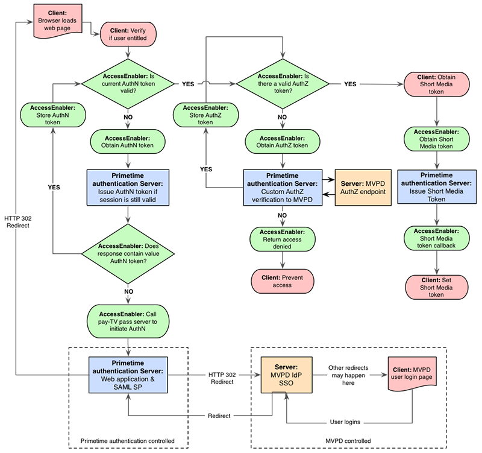

# Über Adobe Primetime-Authentifizierung und TV überall {#about-auth-tve}

>[!NOTE]
>
>Der Inhalt dieser Seite dient nur Informationszwecken. Für die Verwendung dieser API ist eine aktuelle Lizenz von Adobe erforderlich. Eine unbefugte Anwendung ist nicht zulässig.

## Über Fernsehen überall {#about-tve}

Die heutigen Fernsehzuschauer können jederzeit online gehen und erwarten, dass sie mit ihnen auf Pay TV-Inhalte zugreifen können. Darüber hinaus zeigen Zielgruppen Inhalte mithilfe einer ständig wachsenden Palette internetfähiger Geräte an, darunter:

* Laptops
* Tabletten
* Smartphones
* Websites
* Federated Apps
* Spielekonsolen
* Set-Top-Box
* Smart-TV

TV Überall ist die Branche, die es Pay-TV-Abonnenten ermöglicht, auf verschiedenen Geräten, sowohl in ihrem Zuhause als auch außerhalb, auf dieselben Inhalte zuzugreifen, für die sie bereits bezahlt haben. Während der Großteil der Fernsehwiedergabe noch im herkömmlichen linearen Fernsehen stattfindet, wächst der Verbrauch in zeitverlagerten Inhalten, Online-Videos und alternativen Bildschirmen. Infolgedessen befindet sich der Videoverteilungsmarkt heute in einem Zustand der Störung, und TV Anywhere hat sich als Lösung erwiesen, die die Interessen von Programmierern, Pay-TV-Anbietern und Pay-TV-Abonnenten miteinander in Einklang bringt.

Das technische Ziel von TV Anywhere besteht darin, Pay TV-Kunden den Zugriff auf Inhalte zu ermöglichen, die sie bereits auf allen Geräten und Plattformen abonniert haben.

Die Geschäftsziele von TV Überall sind:

* **Vorhandene Kundenbeziehungen beibehalten und neue ermöglichen**
* Ermöglicht es Programmierern und Inhaltsinhabern, die breiteste Zielgruppe zu erreichen und aus Premium-Inhalten mehr Wert zu erfassen
* Erweitern von Marken durch direkte Online-Interaktion mit Viewern

## Überall im Fernsehen {#tve-challenges}

Zusammen mit den Möglichkeiten des Fernsehens überall kommen Herausforderungen. Im Kern dieser Rechte steht die Berechtigung. Bevor ein Betrachter auf Abonnementinhalte zugreift, muss er feststellen, ob er berechtigt ist, auf diesen Zugriff zuzugreifen.

Hat der Benutzer ein Abonnement bei einem Pay TV-Anbieter? Wenn ja, enthält dieses Abonnement den angeforderten Inhalt? Die Berechtigung ist für Programmierer und Inhaltseigentümer besonders schwierig zu bestimmen, da es die Pay TV-Betreiber sind, die die Identifizierungsdaten für ihre Kunden sowie die Zugriffsberechtigungen ihrer Kunden haben.

Neben der Berechtigung gibt es eine Reihe damit verbundener technischer und integrativer Herausforderungen, darunter:

* Entwicklung und Umsetzung einer umfassenden Strategie für mehrere Geräte
* Koordination der unzähligen Beziehungen zwischen Programmierern und Pay TV-Anbietern
* Verhinderung des betrügerischen Zugangs oder Missbrauchs von Nutzungsbedingungen
* Bereitstellung einer konsistenten und frustrierfreien Authentifizierungserfahrung für Benutzer über Websites und Apps hinweg
* Schnelle Markteinführungszeiten für Affiliate-Geschäfte
* Verwaltung der mit mehreren Integrationen verbundenen Kosten

Diese Herausforderungen machen die Durchführung und Pflege komplexer, direkter Integrationen zwischen Programmierern und den Authentifizierungssystemen mehrerer Pay TV-Anbieter äußerst ressourcenintensiv und erfordern Zeit und technische Weiterentwicklung.

Die Lösung? **Adobe® Primetime-Authentifizierung**.

## Einführung in die Adobe Primetime-Authentifizierung {#authentication-intro}

Mit Adobe Primetime-Authentifizierung müssen Programmierer und Pay-TV-Anbieter nur mithilfe von Adobe Primetime-Authentifizierungs-APIs eine einfache Integration durchführen, um Zugriff auf das gesamte Ökosystem zu erhalten, einschließlich:

* Programmierer wie Turner Broadcasting (TBS, TNT, CNN), Fox Broadcast Networks und Hulu

* Alle führenden Pay-TV-Anbieter in den USA, auf die über 90 % aller Pay-TV-Haushalte in den USA entfallen

Darüber hinaus bietet die Adobe Primetime-Authentifizierung das Framework, das die Benutzerauthentifizierung und -autorisierung vereinfacht und sicher macht.

*Abbildung 1: Nur einige Programmierer und Pay TV-Anbieter, die über Adobe Primetime-Authentifizierung eine Verbindung herstellen...*

Adobe Pass ermöglicht eine sichere Vermittlung von Berechtigungstransaktionen zwischen Programmierern und Pay TV-Anbietern, wodurch der Zugriff der Zuschauer auf Abonnementinhalte erleichtert wird. Oder anders gesagt...

**Die Adobe Primetime-Authentifizierung erleichtert und erleichtert den richtigen Kunden den Zugriff auf die richtigen Inhalte.**

**Für wen ist die Adobe Primetime-Authentifizierung vorgesehen?**

* **Programmierer** , die einfach mit Pay TV-Anbietern integriert werden möchten (auch &quot;MVPDs&quot; oder &quot;Multichannel Video Programming Distributors&quot; genannt), um die breiteste Zielgruppe zu erreichen, um einen optimalen Umsatz zu erzielen. Mit der Adobe Primetime-Authentifizierung können Programmierer Viewer bei allen wichtigen Anbietern authentifizieren, unabhängig von der Clientplattform.

* **Pay-TV-Anbieter/MVPDs** die eine schmerzlose Verbindung mit mehreren Programmierern und eine höhere Kundenzufriedenheit anstreben, indem sie den Zugriff auf Abonnementinhalte online erleichtern.

* **Pay TV-Kunden** die einen einfachen Zugang zu Inhalten wünschen, die sie bereits abonnieren, unabhängig davon, wo sie sich befinden, ohne zusätzliche Gebühr. Single Sign-on bietet eine sichere Viewer-Authentifizierung im Web oder über mobile Apps hinweg, ohne dass Client-Downloads oder wiederholte Anmeldungen erforderlich sind. Außerdem bietet Single Sign-on eine gute Benutzererfahrung.

Für **Programmierer**, bietet die Adobe Primetime-Authentifizierung:

* Einfache Integration und sofortige Konnektivität mit Top-Pay-TV-Anbietern, ohne den Schmerz mehrerer, direkter Integrationen
* Optimierung von Anmelde- (Lizenzierungs-) und Werbeeinnahmen durch Unterstützung möglichst breiter Zielgruppen für Inhalte
* Sichere Authentifizierung mit Zugriff auf Premium-Inhalte, die nur autorisierten Benutzern/Geräten gewährt werden
* Ein offenes und flexibles Framework, das sowohl Player- als auch DRM-Plattformunabhängig ist. Die Wiedergabe kann auf einer Vielzahl von Plattformen erfolgen, einschließlich iOS, Android, Windows 8, Spielekonsolen, Set-Top-Boxen und mehr.
* Kompatibilität mit jeder DRM-Technologie, z. B. Adobe Flash Access® oder Play Ready®.
* Unterstützung für Authentifizierung und Autorisierung mit Single-Sign-On (SSO), sodass sich Abonnenten nach ihrer ersten Authentifizierung auf ihrem eigenen System nicht erneut anmelden müssen.

Für **Pay-TV-Anbieter/MVPDs**, bietet die Adobe Primetime-Authentifizierung:

* Einfache Integration mit Inhabern von Inhalten, sofortige Konnektivität mit mehreren Programmierern über eine einzige Integration
* Verbesserte Kundeninteraktion durch Unterstützung eines reibungslosen Markenerlebnisses bei der Anzeige von Inhalten auf mehreren Plattformen und Geräten
* Sichere Authentifizierung, die sicherstellt, dass nur autorisierte Benutzer/Geräte Zugriff auf Premium-Inhalte erhalten, und (optional) die Anzahl der Geräte und gleichzeitigen Streams begrenzt, die pro Haushaltskonto eine Verbindung herstellen können.

Für **Pay TV-Kunden**, bietet die Adobe Primetime-Authentifizierung:

* **Überall fernsehen!**

Der Rest dieses Dokuments bietet eine technische Einführung in die Adobe Primetime-Authentifizierung.  Während ein Großteil der folgenden Aktivitäten auf die Programmintegration ausgerichtet ist, gibt es sowohl allgemeine als auch spezifische Informationen, die auch für Pay TV-Anbieter gelten. In diesem Dokument wird auch die Sicherheit und Integrität der Adobe Primetime-Authentifizierung als Lösung für TV-überall hervorgehoben. Weitere Informationen erhalten Sie von Ihrem Adobe-Support-Mitarbeiter oder füllen Sie das Informationsformular aus. [here](https://www.adobe.com/).

## Bausteine {#arch-building-blocks}

 Im Folgenden werden die zentralen Berechtigungstransaktionen der Authentifizierung und Autorisierung erläutert. Bei der Authentifizierung wird mit einem Pay TV-Anbieter bestätigt, dass ein bestimmter Benutzer ein bekannter Kunde ist. Autorisierung ist der Prozess, bei dem ein Pay TV-Anbieter bestätigt, dass ein authentifizierter Benutzer über ein gültiges Abonnement für eine bestimmte Ressource verfügt.
Die Adobe Primetime-Authentifizierung besteht aus den folgenden grundlegenden Komponenten:

* Client-Komponente (eine der folgenden):

   * Access Enabler - Eine plattformspezifische Bibliothek; stellt benutzerfreundliche APIs und Codebeispiele für die Implementierung der Berechtigungsflüsse bereit
   * Die clientlose API - RESTful-Webdienste; stellt Endpunkte für Berechtigungsflüsse für Plattformen ohne Web-Seiten-Rendering-Funktionen bereit (wie Spielekonsolen, Set-Top-Boxen usw.)

* Adobe-gehostete Backend-Server
* Der Medien-Token-Verifikator
* Ein sicheres, zentrales Exchange-Medium (Token)

Auf einer grundlegenden Ebene besteht die Adobe Primetime-Authentifizierung aus drei Komponenten (Access Enabler, von Adobe gehostete Backend-Server und Media Token Verifier) und einem zentralen Austauschelement (Token).

### Client-Komponenten {#client-components}

* Access Enabler
* Clientlose API

#### Access Enabler {#access-enabler}

Auf vollständig unterstützten Plattformen (einschließlich Web, iOS, Android, Windows 8) interagieren Programmierer mit der Adobe Primetime-Authentifizierung über die Client-Komponente Access Enabler . Diese Komponente erleichtert alle Authentifizierungs- und Autorisierungsinteraktionen mit dem Kunden.  Der Access Enabler wird lokal auf seinem System ausgeführt. Wenn ein Benutzer auf eine Programmierer-Site oder -Anwendung zugreift und Inhalte anfordert, wird die von Adobe gehostete/gewartete Access Enabler-Komponente still im Hintergrund geladen.

Der Access Enabler verarbeitet die tatsächlichen Berechtigungs-Workflows, während der Programmierer die Verantwortung für die übergeordnete Web-Seite oder Player-Anwendung behält, die die Benutzeroberfläche implementiert und mit dem Access Enabler interagiert. Diese Interaktionen erfolgen über ein asynchrones System von Funktionen und Callbacks, das von der Access Enabler API definiert wird.

Dies sind die grundlegenden Berechtigungsflüsse, die einfach mit der Access Enabler-API implementiert werden können:

* Festlegen der Identität des Anforderers (Programmierers)
* Überprüfung/Erhalt der Benutzerauthentifizierung für einen bestimmten Pay TV-Betreiber (den &quot;Identitätsanbieter&quot;)
* Überprüfen/Abrufen der Benutzerautorisierung für eine bestimmte Ressource
* Benutzer abmelden

Der Access Enabler bietet außerdem die folgenden Dienste:

* Er validiert Abfragen vom Programmierer, einschließlich des Registrierungsstatus bestimmter Clients, ihrer Domains und ihrer Ressourcen/Kanäle.
* Es stellt die Daten bereit, die die Liste der Pay TV-Betreiber erstellen, von denen der Benutzer seinen Provider auswählt. Diese Liste wird ebenfalls validiert und entsprechend für den Programmierer definiert, aus dem die Anforderung stammt.
* Es initiiert Workflows für die Authentifizierung und Autorisierung von Pay TV-Betreibern.
* Es speichert die erfolgreichen Autorisierungsantworten pro Programmer-Ressource/Kanal zwischen, um unnötigen Anforderungs-Traffic zu minimieren.
* Es kann für vordefinierte Workflows konfiguriert werden, die für jeden Pay TV-Benutzer spezifisch sind, z. B. die explizite Geräteregistrierung.

Je nach Website oder Player-Anwendung kann der Access Enabler die folgenden Formulare ausführen:

* Eine SWF-Datei, die zur Flash Player-Laufzeit ausgeführt werden kann
* Eine JS-Datei, die direkt vom Browser ausgeführt wird
* Nativer Access Enabler für unterstützte Plattformen (einschließlich iOS, Android und Windows 8)

#### Clientlose API {#clientless-api}

Der clientlose API-Ansatz richtet sich an &quot;intelligente Geräte&quot;(Spielekonsolen, Set-Top-Boxen und Smart-TVs), die keine Webbrowser unterstützen (erforderlich für die Authentifizierung mit MVPDs).  Beim Client-losen Ansatz kommunizieren intelligente Geräte-Apps für alle Funktionen - außer Authentifizierung, die auf einer zweiten Bildschirm (Browser)-App durchgeführt wird - direkt mit der Adobe Primetime-Authentifizierung über RESTful-Web-Services-APIs. Anders ausgedrückt: Die clientseitige Bibliothek Access Enabler wird nicht verwendet. Stattdessen nutzen Entwickler von intelligenten Geräteanwendungen die Adobe Primetime-Authentifizierungs-Webservices-APIs direkt, um die Berechtigungsflüsse zu implementieren.

### Adobe-gehostete Backend-Server {#adobe-backend-servers}

Die von Adobe gehosteten Adobe Primetime-Authentifizierungs-Backend-Server:

* Stellen Sie die Authentifizierungs- und Autorisierungs-Workflows den Pay TV-Anbietern zur Verfügung, die eine Server-zu-Server-Kommunikation zwischen Adobe Primetime-Authentifizierung und dem Benutzer erfordern.
* Wartung der Konfiguration für Programmierer-Sites und -Anwendungen.
* Hosten Sie die herunterladbaren Komponentendateien Access Enabler .
* Stellen Sie die RESTful-Webdienst-Endpunkte für die clientlose API-Integration bereit.
* Authentifizierungs- und Autorisierungstoken generieren (und in einigen Fällen speichern).

### Token und der Media Token Verifier {#tokens-media-token-verifier}

Die Adobe Primetime-Authentifizierungsberechtigungslösung konzentriert sich auf die Generierung bestimmter Datenteile, die nach erfolgreichem Abschluss von Authentifizierungs-/Autorisierungs-Workflows abgerufen werden. Diese Daten werden als Token bezeichnet. Sie haben eine begrenzte Lebensdauer und werden sicher gespeichert, entweder an plattformabhängigen Standorten auf dem Client oder auf Adobe-Servern im Fall der Client-losen API-Lösung. Nach Ablauf der Gültigkeit müssen Token erneut ausgestellt werden, indem die Authentifizierungs- und/oder Autorisierungs-Workflows neu gestartet werden.

Es gibt drei Arten von Token, die bei der Authentifizierung in Adobe Primetime während der Authentifizierungs-/Autorisierungs-Workflows auftreten. Zwei davon sind &quot;langlebig&quot;, was Kontinuität im Anzeigeerlebnis des Benutzers gewährleistet. Das dritte, ein kurzlebiges Token, bietet Unterstützung für Best Practices der Industrie zur Eindämmung von Betrug (bei dem Betrug Exploits wie Stream Ripping umfasst). Die TTL-Werte (Time-to-Live) werden auf der Grundlage von Vereinbarungen zwischen Programmierern und Pay TV-Anbietern festgelegt, die sich auf einen Wert einigen, der allen Beteiligten am besten dient.

#### Authentifizierungstoken (lang gespeichert) {#long-lived-auth-token}

Der Authentifizierungserfolg tritt auf, wenn sich ein Kunde mit Adobe Primetime-Authentifizierung erfolgreich bei seinem Pay TV-Konto anmeldet. Die Adobe Primetime-Authentifizierung erzeugt dann ein langlebiges Authentifizierungs-Token (AuthN), das an das anfordernde Gerät gebunden ist, und (je nach Pay TV-Anbieter) eine global eindeutige Kennung (&quot;GUID&quot;), die den Benutzer anonym identifiziert.

* Die Adobe Primetime-Authentifizierung speichert das AuthN-Token sicher an einem Speicherort, an dem es für alle Anwendungen verfügbar ist, die die Adobe Primetime-Authentifizierung verwenden. Bei Access Enabler-Integrationen werden Token sicher auf der Clientseite gespeichert.  Die Adobe Primetime-Authentifizierung verwendet das AuthN-Token, um nachfolgende Autorisierungsabfragen im Namen des Benutzers durchzuführen.
* Zu jedem Zeitpunkt wird nur ein AuthN-Token gespeichert. Wenn ein neues AuthN-Token ausgegeben wird und bereits ein altes vorhanden ist, überschreibt das neue Token den vorhandenen gespeicherten Wert.

#### (Long Lived) Autorisierungstoken {#long-lived-authriz-token}

Nach erfolgreicher Autorisierung erstellt die Adobe Primetime-Authentifizierung ein langlebiges Autorisierungs-Token (&quot;AuthZ&quot;). Dieses Token ist nicht portabel, da es an das anfordernde Gerät und eine bestimmte geschützte Ressource (z. B. einen Kanal, eine Reihe oder eine Folge) gebunden ist.

* Die Adobe Primetime-Authentifizierung speichert das AuthZ-Token zusammen mit anderen Autorisierungstoken für andere Ressourcen sicher.  Wie bei den AuthN-Token wird auf Plattformen, die den Access Enabler verwenden, das Token lokal auf dem Client gespeichert. Auf Plattformen, die die Client-lose API verwenden, werden Token auf den Adobe Primetime-Authentifizierungsservern gespeichert.
* Die Time-to-Live (TTL) des langlebigen AuthZ-Tokens wird in der Regel im Bereich von Tagen bis Wochen definiert, je nach Vereinbarung zwischen dem Pay TV-Anbieter und dem Programmierer.
* Zu jedem Zeitpunkt wird nur ein AuthZ-Token pro Ressource gespeichert. Es können mehrere Autorisierungstoken gespeichert werden, sofern sie mit verschiedenen Ressourcen verknüpft sind. Wenn ein neues Autorisierungstoken ausgegeben wird und bereits ein altes für dieselbe Ressource existiert, überschreibt das neue Token den vorhandenen zwischengespeicherten Wert.
* Die Adobe Primetime-Authentifizierung verwendet das dauerhaft genutzte AuthZ-Token, um die kurzlebigen Medien-Token zu erstellen, die für den tatsächlichen Anzeigezugriff verwendet werden.

#### Kurzlebige Medien-Token {#short-lived-media-token}

Nachdem die Adobe Primetime-Authentifizierung das AuthZ-Token generiert hat, wird dieses Token verwendet, um ein einzelnes, kurzlebiges Medien-Token zu generieren, das von Adobe signiert und verschlüsselt wird, um Manipulationen beim Austausch zu vermeiden:

* Die TTL des Tokens mit kurzer Lebensdauer (Standard: 5 Minuten) ist so eingestellt, dass es Probleme mit der Uhrensynchronisierung zwischen dem Server, der das Token generiert, und dem Server, der das Token validiert, gibt.
* Das Token mit kurzer Lebensdauer wird der eingebetteten Site bereitgestellt, bevor der Zugriff auf die geschützte Ressource gewährt wird. Daher muss der Programmierer das Token mithilfe der Media Token Verifier for Access Enabler-Integrationen oder des Token Verifier-Dienstes im Fall von clientless-API-Integrationen validieren.

#### Media Token Verifier {#media-token-verifier}

Programmierer sind für die Integration der Media Token Verifier Library in ihren bestehenden Anwendungsserver verantwortlich, sodass der Verifikator die endgültigen Benutzervalidierungen durchführen kann, bevor ein Video-Stream tatsächlich gestartet wird. Die Media Token Verifier-Bibliothek definiert:

* Eine Token-Verifizierungs-API, die Informationen vom Token abruft, z. B. ob es gültig ist, wann das Token ausgegeben wurde und andere relevante Daten
* Der öffentliche Adobe-Schlüssel, mit dem überprüft wird, ob das Token tatsächlich von Adobe stammt
* Eine Referenzimplementierung, die zeigt, wie die Verifier-API verwendet wird und wie der in der Bibliothek enthaltene öffentliche Adobe-Schlüssel zur Überprüfung der Herkunft verwendet wird

*Abbildung 2: Allgemeine Architektur des Adobe Primetime-Authentifizierungs-Ökosystems in einer Access Enabler-Integration*

## Integration mit Adobe Primetime-Authentifizierung {#integrate-auth}

Ob Sie Pay TV-Anbieter oder Programmierer sind, die Integration in die Adobe Primetime-Authentifizierung erfordert eine gewisse aktive Beteiligung. Jeder dieser Prozesse wird nachfolgend beschrieben.

### Prozess des Pay TV-Anbieters

Die Hauptverantwortung des Pay TV-Anbieters für die Adobe Primetime-Authentifizierung besteht darin, zu überprüfen, ob ein anfragender Benutzer tatsächlich ein bekannter Abonnent ist, der berechtigt ist, auf die Inhalte des Programmierers zuzugreifen. Auf hoher Ebene erfordert der Adobe Primetime-Authentifizierungsprozess zur Integration in einen neuen Pay TV-Anbieter die folgenden Schritte:

1. Der Provider unterzeichnet den Adobe Primetime Authentication Non-Publishing Agreement (NDA).
1. Der Provider stellt Adobe mit Spezifikationen für ihr Authentifizierungs- und Autorisierungssystem zur Verfügung. Für die einfachste Integration wird empfohlen, dass Pay TV-Benutzer über einen SAML-basierten Identitäts-Provider (IdP) für die Authentifizierung und die Möglichkeit verfügen, über das SOAP-Zugriffsprotokoll zur Autorisierung zu kommunizieren.
1. Der Provider stellt die Verbindung zwischen seinen Servern und den Adobe Primetime-Authentifizierungsservern her. Dazu gehören die Bereitstellung von Endpunkten und die Auflistung von IPs.
1. Vorqualifikationsversion und QE.
1. Produktionsversion und QE.

Während die Adobe Primetime-Authentifizierung bestehende Integrationen für Programmierer ersetzen kann, ist dies für Pay TV-Anbieter normalerweise nicht erforderlich. Adobe arbeitet mit dem technischen Team des Providers zusammen, um die Adobe Primetime-Authentifizierung so zu konfigurieren, dass die Anforderungen vorhandener Integrationen erfüllt werden. Die Integration von Pay TV-Anbietern ist kostenlos, vorausgesetzt, die Integration erfolgt standardmäßig auf einer &quot;Standard&quot;-Basis und die Mindestanforderungen an die Unterstützung (Dokumentation und Basis-E-Mail-Unterstützung) sind minimal. Wenn ein Provider umfangreiche Unterstützung oder eine eskalierte Planung benötigt, kann eine Supportgebühr erhoben werden oder der Provider möchte mit einem Dritten zusammenarbeiten, der mit unserer Lösung wie Synacor vertraut ist.

Die Adobe Primetime-Authentifizierung unterstützt auch die effiziente Handhabung der Geschäftslogik von Pay TV-Anbietern wie folgt:

* Für eine eigenständige Geschäftslogik, die beim Erhalt einer Autorisierungsanfrage vom Benutzer angewendet werden kann, stellt Adobe die erforderlichen Daten bereit, um die Durchsetzung der Geschäftslogik zu unterstützen, wenn der Benutzer eine Autorisierungsanfrage erhält. Diese Daten können die eindeutige Geräte-ID des anfragenden Benutzers und die IP-Adresse des Geräts enthalten, dürfen jedoch nicht darauf beschränkt sein.
* Für Geschäftslogik, die Benutzereingriff und/oder eine spezifische Handhabung durch die Adobe erfordert, kann Adobe einige benutzerdefinierte Eigenschaften für jeden Pay TV-Anbieter verwalten. Diese benutzerspezifischen Konfigurationen/Richtlinien umfassen die Aktivierung vordefinierter Workflows, die an bestimmten Punkten des Arbeitsablaufs auf der obersten Ebene gestartet werden können. Weitere Informationen zur Unterstützung von benutzerdefinierten Properties erhalten Sie von Ihrem Adobe-Support-Mitarbeiter.

Adobe bietet auch betrugsbegrenzende Dienste an. Weitere Informationen erhalten Sie von Ihrem Adobe-Support-Mitarbeiter.

### Programmierungsprozess {#programmer-process}

Um die Adobe Primetime-Authentifizierung erfolgreich zu integrieren, müssen Programmierer ihre Medienplayer-Anwendung oder -Webseite einrichten, damit sie bei der Verarbeitung der Hauptberechtigungsprozesse - Authentifizierung, Autorisierung und Abmeldung - mit der Adobe Primetime-Authentifizierung zusammenarbeiten können.

Bevor Sie mit der Integration in die Adobe Primetime-Authentifizierung beginnen, sollten Programmierer über Folgendes verfügen:

* Eine vorhandene Online-Videoplattform, einschließlich eines Medienplayers, entweder als Teil einer Website oder als eigenständige Anwendung
* Ein Content Management System
* Ein Bereitstellungsmechanismus, der möglicherweise ein Drittanbieter-Netzwerk zur Inhaltsbereitstellung (Content Delivery Network, CDN) umfasst

Programmierer sollten erwarten, dass sie einige Integrationsaufgaben im Rahmen der Bereitstellung von TV Anywhere-Diensten mit Adobe Primetime-Authentifizierung ausführen. Zu diesen Aufgaben gehören:

* Integrieren der Access Enabler-Bibliothek der Adobe Primetime-Authentifizierung in Ihre Web-Seite oder den Medienplayer oder Implementieren der Integration mithilfe des Clientless-Konzepts für &quot;intelligente Geräte&quot;, die nicht webfähig sind
* Serverseitige Arbeit zur Integration der Komponente für die Verifizierung des Adobe Primetime-Authentifizierungstokens in Ihren Video-Streaming-Workflow
* Erstellen einer Benutzeroberfläche für den Zugriff-Workflow auf Ihre Website oder App (einige Elemente wie der tatsächliche Anmeldeprozess werden vom Pay TV-Operator bereitgestellt und einige Elemente sind optional als Teil der Adobe Primetime-Authentifizierung verfügbar)

Dieses Dokument bietet einen Überblick über den Programmierungsprozess und Adobe bietet zusätzliche Anleitungen bei der formalen Einleitung der Integration.

#### Einrichten des Anforderers (Programmierers) {#requester-prog-setup}

##### Registrieren bei Adobe {#registering}

Als ersten Schritt müssen sich Programmierer bei Adobe oder einem Adobe-autorisierten Partner registrieren und die Domänen angeben, die sie mit der Adobe Primetime-Authentifizierung verwenden möchten. Programmierer erhalten dann eine eindeutige Anforderungs-ID, die der Adobe Primetime-Authentifizierung für jede Sitzung zur Verfügung gestellt wird, in der der Programmierer mit dem Access Enabler interagiert.

##### Einrichtung für die Integration von Initial Access Enabler {#access-enabler-int-setup}

Vor allen Kunden, die Zugriff auf Inhalte anfordern, müssen Programmierer die Adobe Primetime-Authentifizierungs-Client-Komponente - den Access Enabler - in ihre bestehende Medienplayer-App oder Webseite integrieren. Es gibt verschiedene Möglichkeiten, wie Sie dies durchführen können:

* Sie können die Flash-Version AccessEnabler.swf in einen Flash-basierten Videoplayer auf einer Webseite oder direkt in HTML einbetten. Sie können mit der SWF in ActionScript oder JavaScript kommunizieren. Die Basis-API ist ActionScript, es ist jedoch eine vollständige JavaScript-Wrapper-Bibliothek verfügbar.
* Bei Nicht-Flash-Geräten haben Sie folgende Möglichkeiten:
   * Verwenden Sie die HTML5/JavaScript-Version AccessEnabler.js und kommunizieren Sie mit ihr über die JavaScript-API oder
   * Verwenden einer nativen Access Enabler-Bibliothek, z. B. für iOS, Android oder Windows 8

##### Einrichtung für die anfängliche clientlose API-Integration {#clientless-api-int-setup}

Vor allen Kunden, die Zugriff auf Inhalte anfordern, müssen Programmierer die RESTful-Webdienstaufrufe mithilfe der ClientLess-API in ihre Medienplayer-App implementieren und eine &quot;Second-Screen&quot;-Anwendung einrichten, um die Anmeldung des Benutzers bei seinem Pay TV-Anbieter über das Internet zu verarbeiten.

#### Umgang mit Authentifizierung und Autorisierung {#auth-authr-handling}

Wenn ein Kunde zum ersten Mal eine geschützte Ressource von einem Programmierer anfordert, stellt der Programmierer dem Kunden eine Liste von Pay TV-Anbietern zur Verfügung, von denen er wählen kann. Wenn der Provider ausgewählt ist, wird der Benutzer zur anfänglichen Benutzerauthentifizierung an diesen Benutzer weitergeleitet. Sobald die Authentifizierung erfolgreich war, kommuniziert die Adobe Primetime-Authentifizierung mit dem ausgewählten Pay TV-Anbieter, um den Zugriff auf die angegebene Ressource zu autorisieren. Details zu diesen Prozessen folgen.

*Abbildung 3: Beispiel einer Benutzeroberfläche für die Anbieterauswahl*

>[!NOTE]
>
>* Die Authentifizierung erfolgt als SAML-Austausch zwischen der Adobe Primetime-Authentifizierung als Service Provider (oder &quot;SP&quot;) und einem Pay TV-Anbieter als Identitäts-Provider (oder &quot;IdP&quot;).
>* Die Autorisierung verwendet einen Webdienstaustausch zwischen Adobe Primetime-Authentifizierung (der SP) und einem Pay TV-Anbieter (dem IdP) über einen Back-Channel (Server-zu-Server).

##### Programmierungskommunikation mit dem Access Enabler

Der bidirektionale Kommunikationskanal zwischen dem Access Enabler und der Web- oder Player-App des Programmierers folgt einem vollständig asynchronen Muster. Der Programmierer sendet Nachrichten an den Access Enabler über die Methoden, die von der Access Enabler API verfügbar gemacht werden. Der Access Enabler antwortet über Callbacks, die bei der Access Enabler-Bibliothek registriert sind.

* Bei jeder Autorisierungsanfrage wird zunächst automatisch die Authentifizierung angefordert, wenn kein Authentifizierungstoken auf dem lokalen System gefunden wird. Wenn die Authentifizierung erfolgreich ist, wird das Token des Kunden lokal gespeichert, sodass er sich für einen bestimmten Zeitraum nicht erneut anmelden muss. Wenn sie sich erfolgreich über die Adobe Primetime-Authentifizierungsberechtigungslösung in einem anderen Kontext authentifiziert haben (z. B. über die Website des Pay TV-Anbieters oder einen anderen Programmierer), hat der Access Enabler Zugriff auf das lokale Token und erfordert keine zusätzliche Authentifizierung.
* Wenn ein Kunde eine bestimmte Ressource anfordert, fordert der Programmierer die Autorisierung vom Pay TV-Anbieter über den Access Enabler an. Nach der Überprüfung (oder Initiierung) der Authentifizierung kontaktiert der Access Enabler den Pay TV-Anbieter (über Adobe Primetime-Authentifizierung), um festzustellen, ob der Kunde berechtigt ist, die Ressource anzuzeigen. Die Adobe Primetime-Authentifizierung verarbeitet die Kommunikation mit dem Pay TV-Anbieter, um eine Autorisierung zu erhalten. Der Programmierer muss die Anfrage nur an den Access Enabler senden und die Antwort verarbeiten (Erfolg oder Fehler der Autorisierung). Wenn die Autorisierung erfolgreich ist, wird ein Autorisierungstoken auf dem Client-System gespeichert und der Callback erhält ein kurzlebiges Medien-Token.

##### Programmierungskommunikation mit der ClientLess-API {#progr-comm-clientless-api}

Die Kommunikation zwischen der App des Programmierers und der Adobe Primetime-Authentifizierung erfolgt über RESTful-Webdienste.  Es gibt Sicherheitsprotokolle für alle API-Aufrufe an die Adobe Primetime-Authentifizierungsendpunkte.  Die Sicherheitsanforderungen werden in der Dokumentation zur ClientLess-API beschrieben.

##### Beispielarbeitsablauf mit SAML-Webbrowser SSO-basierter Authentifizierung {#sample-wf}

1. Betrachter Navigiert zu einer Site (dummy1.com) und versucht, auf berechtigte Inhalte zuzugreifen.
1. Videoseite/Player lädt den Access Enabler von adobe.com und fordert bei Aufforderung durch den Benutzer die Autorisierung des angeforderten Inhalts an.
1. Access Enabler führt den Anforderer und die Anfrage aus und validiert sie.
1. Access Enabler sucht im lokalen Store nach einem gültigen Autorisierungstoken. Wenn eine gültige Autorisierung gefunden wird, erzeugt der Access Enabler ein kurzlebiges Medien-Token (siehe Schritt 14).
1. Wenn keine gültige Autorisierung für die angefragte Ressource gefunden wird, aber ein gültiges Authentifizierungstoken vorhanden ist, initiiert der Access Enabler eine Autorisierungsanfrage beim Pay TV-Anbieter, bei der der Benutzer authentifiziert wird. Der Adobe-Server stellt den Autorisierungsanfrage-/Antwortaustausch mit dem Pay TV-Anbieter bereit.
1. Wenn kein gültiges Authentifizierungstoken gefunden wird, fordert der Access Enabler den Benutzer zur Eingabe seines Pay TV-Anbieters auf. (Durch Auswahl eines Anbieters, der den SSO-basierten SAML-Webbrowser unterstützt, wird ein SAML-basierter Authentifizierungs-Workflow gestartet. Bei Nicht-SAML-Anbietern verarbeitet Adobe einen ähnlichen benutzerdefinierten Workflow.)
1. Access Enabler navigiert im Browser zum Dienst Adobe SAML SP (Service Provider) und übergibt ihm alle entsprechenden Parameter.
1. Die SAML-SP ruft die entsprechende SAML IdP (Identity Provider) beim Pay TV-Anbieter des Benutzers auf und verwendet dabei das SAML-Webbrowserprofil, wie in den IdP-Metadaten angegeben. Dadurch wird der Benutzer effektiv zur Site des IdP (Pay TV-Anbieters) weitergeleitet, wo er sich authentifiziert.
1. Nach erfolgreicher Authentifizierung wird der Benutzer zurück zum Adobe SAML SP geleitet und erhält eine Authentifizierungs-GUID in der SAML-Antwort.
1. Adobe SAML SP erstellt eine Sitzung auf dem Server, in der die Authentifizierungs-GUID gespeichert ist, und leitet den Benutzer zurück zur ursprünglichen Programmier-Seite. (Die Serversitzung wird beim Abrufen des &quot;Access Enabler&quot;-Tokens gelöscht.)
1. Access Enabler ruft die Authentifizierungs-GUID vom Adobe-Server ab, um sie mit einer Geräte-ID, die von der Adobe Primetime-Authentifizierung verwaltet wird, in das Token aufzunehmen. Wenn sich Flash DRM auf dem Gerät befindet, erfolgt dies über Flash Access-APIs (DRM-Flash Player-Komponente), die die Bindung der GUID an die Geräte-ID aktivieren und ein Authentifizierungstoken zurückgeben. Andernfalls erfolgt dies über JS-APIs über HTTPS mithilfe von HTML5-basiertem Speicher oder über bestimmte native Komponenten.
1. Das Authentifizierungstoken wird von Access Enabler verwendet, um Autorisierungsanfragen an den Pay TV-Anbieter zu richten. Auf Geräten mit aktiviertem Flash Access werden die Anfragen immer über Flash Access-APIs durchgeführt, sodass das resultierende Autorisierungstoken an das Gerät gebunden ist. Auf Nicht-Flash Access-Geräten wird HTTPS für die sichere Kommunikation von Client zu Server verwendet.
1. Nach erfolgreicher Autorisierung erstellt die Adobe Primetime-Authentifizierung ein langlebiges Autorisierungs-Token (&quot;authZ&quot;) und übergibt es an den Access Enabler, der es auf dem lokalen System speichert.
1. Der Access Enabler verwendet das authZ-Token, um kurzlebige Medien-Token zu erstellen, die für den tatsächlichen Anzeigezugriff verwendet werden. Aus Sicherheitsgründen müssen diese Token mit kurzer Lebensdauer von einer anderen Adobe Primetime-Authentifizierungskomponente, dem Media Token Verifier, validiert werden.

*Abbildung 4: Workflow &quot;Authentifizierung und Autorisierung - Zugriff aktivieren&quot;*

##### Bereitstellen einer Entitäts-Benutzeroberfläche {#entitlement-ui}

Programmierer müssen eine eigene Benutzeroberfläche für den Zugriffs-Workflow in ihrer Website oder App erstellen. Einige Elemente, wie der eigentliche Anmeldeprozess, werden vom Pay TV-Anbieter bereitgestellt und einige Elemente sind optional als Teil der Adobe Primetime-Authentifizierung verfügbar. Der Programmierer führt mindestens Folgendes aus:

* **Implementiert eine Anbieterauswahlschnittstelle** , sodass ein neuer Benutzer seinen Pay TV-Anbieter identifizieren und sich zum ersten Mal anmelden kann. Für die Entwicklung bietet der Access Enabler eine einfache Benutzeroberfläche, über die der Kunde Pay TV-Anbieter auswählen und den Anmeldeprozess starten kann. In einer Produktionsumgebung müssen Programmierer ihr eigenes Dialogfeld für die Anbieterauswahl implementieren. Einige Pay TV-Anbieter leiten zur Anmeldung zu ihrer eigenen Site um, und einige verlangen, dass ihre Anmeldeseiten in einem iframe angezeigt werden. Programmierer müssen den Callback implementieren, der diesen iframe erstellt, falls der Kunde einen dieser Anbieter auswählt.
* **Identifiziert geschützte Ressourcen.** Geschützte Ressourcen sind solche, die eine Zugriffsberechtigung erfordern. Bei der Bereitstellung dieser Ressourcen sollte in der Programmiererschnittstelle angegeben werden, ob eine Genehmigung erforderlich ist, bevor sie angezeigt wird. Nach erfolgreicher Autorisierung sollte die Benutzeroberfläche zeigen, dass die Ressource jetzt autorisiert ist.
* **Erstellung und Führung einer Liste von Pay TV-Anbietern** , um den Benutzerzugriff nur auf die von Ihnen angegebenen Provider zu steuern.
* **Zeigt an, dass ein Benutzer authentifiziert ist.** Der Programmierer sollte den Authentifizierungsstatus des Kunden als Teil der Mittel angeben, die zur Identifizierung geschützter Ressourcen verwendet werden. Programmierer können den Access Enabler abfragen, um festzustellen, ob ein Kunde bereits authentifiziert wurde.

#### Unterstützende einmalige Abmeldung {#single-logout-support}

In den meisten Fällen ist der Programmierer für die Handhabung von Benutzeranmeldungen über einen einfachen API-Aufruf verantwortlich. Der Aufruf logout() weist die Primetime-Authentifizierung an, den aktuellen Benutzer wie folgt abzumelden:

* Löschen aller AuthN- und AuthZ-Token
* Löschen aller Authentifizierungs- und Autorisierungsinformationen für diesen Benutzer
* Starten eines anbieterspezifischen Pay TV-Workflows zum Löschen der Authentifizierungssitzung des Benutzers mit dem Provider (wenn die Authentifizierung beispielsweise mit dem SAML-Authentifizierungsanfrageprotokoll durchgeführt wurde, kann die Abmeldung mit dem SAML-Protokoll für die einmalige Anmeldung erfolgen).

Wenn der Benutzer seinen Computer so lange untätig lässt, dass seine Token ablaufen, kann er dennoch zu seiner Sitzung zurückkehren und die Abmeldung erfolgreich starten. Die Adobe Primetime-Authentifizierung stellt sicher, dass alle Token gelöscht werden, und benachrichtigt den Pay TV-Anbieter darüber, dass er auch seine Sitzung löscht.

Wenn die Abmeldung von einer Site aus initiiert wird, die nicht mit der Adobe Primetime-Authentifizierung integriert ist, kann der Pay TV-Anbieter den Adobe Primetime-Authentifizierungs-Single-Logout-Dienst über eine Browser-Umleitung aufrufen.

## Über die grundlegenden Berechtigungsflüsse hinaus - Zusätzliche Funktionen {#beyond-basics}

Die grundlegenden Berechtigungsflüsse sind Start-up, Authentifizierung, Autorisierung und Abmeldung.  Mit zunehmender Entwicklung der Adobe Primetime-Authentifizierung wurden und werden den grundlegenden Datenflüssen eine Reihe zusätzlicher Funktionen hinzugefügt.  Dazu gehören:

* **Benutzermetadaten** - Abhängig von Vereinbarungen zwischen MVPDs und Programmierern können MVPDs Metadaten wie Postleitzahl, maximale Bewertung, Kanal-ID und mehr sicher austauschen. Metadaten ermöglichen verschiedene Anwendungsfälle, darunter elterliche Kontrollen, regionale Einfrierzeiträume für Sportveranstaltungen usw.
* **Vorübergehender freier Zugriff** - Lets Programmierer bieten temporären freien Zugang zu ihren geschützten Inhalten (z.B. kurze Beispiele für tägliche Programmierung oder kostenlose Präsentation eines großen Events).
* **Proxy-MVPD** - Ein MVPD kann seine eigene Integration mit der Adobe Primetime-Authentifizierung verwalten und den Berechtigungsprozess auch im Namen einer Gruppe verbundener &quot;ProxiedMVPDs&quot;verwalten.

## Sicherheit {#security}

In diesem Abschnitt werden die Sicherheit und Integrität der Adobe Primetime-Authentifizierungsinfrastruktur hervorgehoben.

### Token-Sicherheit {#token-security}

Eines der Hauptziele der Adobe Primetime-Authentifizierung besteht darin, sicherzustellen, dass das System Angriffen eines Schurkenbenutzers oder Inhaltsaggregators auf die Inhaltsberechtigungsdaten standhalten kann. Daher wird der Datenzugriff auf verschiedenen Ebenen des Workflows gesichert, wobei die Generierung und Verwendung der Autorisierungstoken-Daten von höchster Bedeutung sind. Die Adobe Primetime-Authentifizierungsarchitektur soll sicherstellen, dass Tokeninhalte sicher gepflegt werden und das Token auf dem Gerät verbleibt, auf dem es ausgestellt wurde.

* **Sicherheit des AuthN- und AuthZ-Tokens mit langer Lebensdauer** - Alle langlebigen Token werden digital vom Adobe Primetime-Authentifizierungsserver signiert. Die digitale Signatur unterscheidet sich jedoch von Plattform zu Plattform insofern, als sie eine Geräte-ID verwendet, die sich von der Art der Generierung, des Schutzes und der Validierung unterscheidet. In allen Fällen stellt eine clientseitige Validierung sicher, dass die digitale Signatur intakt ist und dass die Integrität des Tokens erhalten bleibt. Der Access Enabler speichert die validierten Token sicher an Orten, die spezifisch für die Umgebung sind, in der er ausgeführt wird. Wenn die Überprüfung der Geräte-ID fehlschlägt, wird die Authentifizierungssitzung ungültig gemacht, Token werden zurückgesetzt und der Benutzer wird aufgefordert, sich erneut anzumelden.
* **Sicherheit des Medien-Tokens mit kurzer Lebensdauer** - Kurzlebige Medien-Token, die im letzten Schritt vor dem Zugriff auf Inhalte erstellt werden, werden durch Adobe signiert und verschlüsselt, um Manipulationen beim Austausch zu vermeiden. Kurzlebige Medien-Token erfordern auch einen zusätzlichen Validierungsschritt durch eine zusätzliche Adobe Primetime-Authentifizierungskomponente, den Media Token Verifier. Die TTL des Tokens mit kurzer Lebensdauer wird auf den Standardwert von 5 Minuten festgelegt und kann bei Bedarf kürzer werden. Das kurzlebige Medien-Token wird nie zwischengespeichert. Jedes Mal, wenn eine Autorisierungs-API aufgerufen wird, wird ein neues Token vom Server abgerufen.

### Plattformspezifische Gerätesicherheit {#platform-sp-security}

Die Sicherheitsmaßnahmen, die von der Adobe Primetime-Authentifizierung verwendet werden, sind je nach Plattform unterschiedlich, aber alle sind stabil und auf dem neuesten Stand.

* **Flash-fähige Geräte** - Wenn sich Flash Player 10.1+ oder AIR 2.5+ auf dem Gerät befindet, verwendet die Adobe Primetime-Authentifizierung die Flash Player DRM-Funktion zum Schutz, auch Flash Access genannt. Flash bietet einen zusätzlichen Schutz; die starke Garantie der Gerätebindung für Flash-basierte Token bedeutet, dass die Time-to-Live in den meisten Fällen länger sein kann, der Anwender sich nicht so oft anmelden muss und das Benutzererlebnis im Allgemeinen reibungsloser ist.
* **Browserinterne Erlebnisse auf HTML5-fähigen Geräten**- Bei Nicht-Flash-Geräten, die HTML5-Browserfunktionen enthalten, bietet die Adobe Primetime-Authentifizierung eine alternative Möglichkeit, browserbasierte Integrationen nur eingeschränkt zu schützen. Da die Gerätebindung für HTML5 jedoch nicht so stark ist, ist die Time-to-Live (TTL) für Token auf HTML5-Plattformen in der Regel kürzer.
* **Native App-Unterstützung für In- und Out-of-Home-Geräte** - Adobe bietet native SDKs pro Betriebssystem (iOS, Android, Windows 8 usw.) die eine höhere Sicherheit gegenüber der HTML5-Lösung bieten. Diese SDKs verwenden native APIs, um eine Geräte-ID abzurufen und sicher an den Adobe Primetime-Authentifizierungsserver zu übergeben.
* **Clientless** - Die Adobe Primetime-Authentifizierung verwendet das HTTPS-Protokoll für sichere Kommunikation. Darüber hinaus müssen alle Aufrufe von einem intelligenten Gerät digital signiert werden.

## FAQs {#faqs}

**Was ist Fernsehen überall?**
Die als TV Anywhere bekannte Marktbewegung ermöglicht Pay-TV-Kunden den Zugang zu den Premium-Inhalten, die sie bereits auf einer Vielzahl von mit dem Internet verbundenen Geräten abonnieren, darunter PCs, Tablets, Smartphones, Spielkonsolen, Set-Top-Boxen und &quot;Smart&quot;-TVs. Die Herausforderung dieser Initiative besteht darin, den Authentifizierungsprozess so einfach und schmerzlos wie möglich zu gestalten, damit Kunden problemlos auf ihren Abonnementinhalt zugreifen können, ohne dass es zu untragbaren Hindernissen und mehreren Anmeldungen kommt.

**Was ist Adobe Primetime-Authentifizierung und wie steht sie mit dem Fernsehen überall?**
Die Adobe Primetime-Authentifizierung ermöglicht das Fernsehen überall von der Konzeption bis zur Realität, indem die Berechtigung eines Benutzers auf Inhalte auf einfache und sichere Weise überprüft wird. Die Adobe Primetime-Authentifizierung ist ein gehosteter Dienst, der eine schnelle Backend-Integration ermöglicht, die auf den Geschäftsregeln basiert, die sowohl von Programmierern als auch von Pay TV-Anbietern benötigt werden. Dies bedeutet eine schnelle Markteinführung für alle Parteien, ein sichereres Umfeld zur Betrugsbekämpfung und eine bessere Kundenerfahrung, bei der mehr TV-Inhalte für mehr Menschen auf mehr Plattformen verfügbar sind.

**Wie wird die Adobe Primetime-Authentifizierung angeboten/bereitgestellt?**
Die Adobe Primetime-Authentifizierung erfolgt über das SaaS-Modell (Software as a Service). Dies ermöglicht eine sicherere Kommunikation zwischen Endbenutzern, Programmierern und Pay TV-Anbietern, um die Berechtigung für Inhalte zu überprüfen. Zu den Kernkomponenten des Dienstes gehören der clientseitige Access Enabler (oder die clientlose API für einige Geräte) und der gehostete Adobe Primetime-Authentifizierungsserver. Der Access Enabler ist eine kleine Datei, die in die Web-Seite oder Player-Anwendung eines Programmierers geladen wird. Es kommuniziert mit den Adobe Primetime-Authentifizierungsservern, die wiederum über in die Authentifizierungssysteme verschiedener Pay TV-Anbieter integrierte Verbindungen verfügen. Die Adobe Primetime-Authentifizierung bietet außerdem einen clientlosen API-Ansatz für die Integration von einigen &quot;intelligenten Geräten&quot;, die nicht webfähig sind (Smart TVs, Set-Top-Boxen, Spielekonsolen usw.). Der Clientless-Ansatz bietet RESTful-Webdienste, mit denen Entwickler die Adobe Primetime-Authentifizierungsberechtigungsflüsse auf diesen Geräten implementieren können.

**Inwiefern unterscheidet sich die Adobe Primetime-Authentifizierung von anderen TV-Lösungen überall?**
Die Adobe Primetime-Authentifizierung bietet deutliche Vorteile gegenüber alternativen TV-Lösungen überall. Direkte Integrationen mit einzelnen Anbietern bieten nicht die Flexibilität einer einzigen, dauerhaften Anmeldung (SSO), da Benutzer über das Internet von Site zu Site wechseln. Adobe Primetime-Authentifizierung hat auch eine bemerkenswerte Marktdurchdringung. Sobald ein Programmierer in die Adobe Primetime-Authentifizierung integriert ist, ist er sofort mit Pay TV-Anbietern verbunden, die über 90 % der Haushalte in den USA versorgen. Darüber hinaus nutzt die Adobe Primetime-Authentifizierung einzigartige Sicherheitsfunktionen, die in die Flash-Laufzeit integriert sind (sofern verfügbar), um Betrügereien zu vermeiden und gleichzeitig SDKs bereitzustellen, sodass Programmierer überall dieselbe TV-Funktionalität nutzen können, die in native Apps für mobile oder interne Geräte integriert ist, auf denen Flash nicht verfügbar ist. Auch wenn Adobe Primetime-Authentifizierung als eigenständiger Dienst verfügbar ist, bieten wir die Möglichkeit einer engen Integration mit anderen Adobe-Produkten und -Diensten (einschließlich Primetime und Adobe Analytics), die mit der Bereitstellung, dem Schutz und der Monetarisierung von TV-Inhalten in allen Bereichen in Zusammenhang stehen.

**Wie sicher ist die Adobe Primetime-Authentifizierung?**
Die oberste Priorität der Adobe Primetime-Authentifizierungsarchitektur besteht darin sicherzustellen, dass nur autorisierte Viewer authentifiziert werden und Zugriff auf Premium-Inhalte erhalten. Die Adobe Primetime-Authentifizierung bindet den Zugriff eng an das Anzeigegerät und kann dazu beitragen, Streams, Sitzungen und/oder Geräte für einen bestimmten Haushalt zu begrenzen.

**Ist Flash Player erforderlich?**
Für die strengste Gerätebindungssicherheit ist Adobe Flash Player 11.x oder höher erforderlich. Die Adobe Primetime-Authentifizierung für TV Anywhere ist jedoch Player- und plattformunabhängig und wird mit allen Wiedergabeanwendungen, einschließlich Silverlight und HTML5, integriert. Darüber hinaus bietet die Adobe Primetime-Authentifizierung native Unterstützung für Geräte wie iOS, Android und Xbox, auf denen Flash Player nicht verfügbar ist.  Schließlich bietet die Adobe Primetime-Authentifizierung einen Client-losen Ansatz für Geräte, die keine Web-Seite rendern können (Spielekonsolen, Smart-TVs, Set-Top-Boxen).

**Welche Geräte unterstützt die Adobe Primetime-Authentifizierung?**
Die Adobe Primetime-Authentifizierung wird von praktisch jedem Gerät mit dem HTML5-Webkit für die Anzeige im Browser unterstützt. Darüber hinaus werden bei der Adobe Primetime-Authentifizierung weiterhin native Software Development Kits (SDKs) für verschiedene gerätespezifische Plattformen eingeführt, darunter iOS, Android™ und Windows 8. Die Adobe Primetime-Authentifizierung unterstützt einige nicht webfähige Geräte (Smart TV, Set-Top-Boxen, Spielekonsolen usw.) über die RESTful-Web-Services-APIs.

**Unterstützt die Adobe Primetime-Authentifizierung die neuen Standards für Fernsehen überall?**
Die Adobe Primetime-Authentifizierung entspricht dem **CableLabs OLCA (Online Content Access)** [Spezifikation](https://www.cablelabs.com/specifications), die technische Anforderungen und Architektur für die Bereitstellung von Videos von Online-Quellen an einen Pay TV-Kunden bietet. Adobe nahm im Juni 2011 am gemeinsamen CableLabs-Interopt-Test-Projekt teil und hat den Testprozess für eine Service Provider-Implementierung bestanden. Die Adobe Primetime-Authentifizierung wird anhand der OLCA-Spezifikationen für die Authentifizierung überprüft (abgeschlossen und getestet). Die Autorisierungskomponente ist abgeschlossen, aber die Testprüfung wartet auf die Veröffentlichung der CableLabs-Testumgebung (ETA Nov. 2011).

Adobe ist auch ein aktives Mitglied der **OATC (Open Authentication Technical Consortium)** und nimmt an mehreren Projekten der Fachausschüsse teil, die in diesem Gremium ausgearbeitet werden.

**Wie behandelt die Adobe Primetime-Authentifizierung Federated Identity Management/Single Sign-on (SSO)?**
Mit der Adobe Primetime-Authentifizierung können Sie Kunden eine SSO-Authentifizierung (Single Sign-on) und -Autorisierung bereitstellen, indem Sie eine Back-Channel-Kommunikation (Server-zu-Server) zwischen der Adobe Primetime-Authentifizierung und den teilnehmenden Pay TV-Anbietern nutzen. Mit der Adobe Primetime-Authentifizierung müssen sich Abonnenten also nach ihrer ersten Authentifizierung nicht erneut anmelden, solange diese Authentifizierung durch den Pay TV-Operator bestehen bleibt. In der Regel beträgt diese Beschränkung 30 Tage. Dazu bietet die Adobe Primetime-Authentifizierung eine gemeinsame Domäne für Authentifizierungstoken für unsere Kunden. Diese Authentifizierungsstatusinformationen stehen allen teilnehmenden Sites zur Verfügung, die mit einem bestimmten Pay TV-Betreiber integriert sind.

Derzeit verwenden die meisten Adobe Primetime-Authentifizierungsintegrationen mit Pay TV-Operatoren das SAML-Protokoll, eines der primären Authentifizierungsstandards. Die Adobe Primetime-Authentifizierung fungiert in der SAML-Architektur als Proxy Service Provider und behält die SAML-Authentifizierungsantwort als sicheres Token in der gemeinsamen Adobe-Domäne bei. Die Adobe Primetime-Authentifizierung ist SAML 2.0-kompatibel.

Während die Adobe Primetime-Authentifizierung derzeit in der Regel mit SAML SSO-Lösungen verwendet wird, entfernt die Adobe Primetime-Authentifizierungsarchitektur alle Protokollspezifikationen aus der Programmierer-Integration. Daher kann die Unterstützung für neue Protokolle - wie beispielsweise Protokolle, die auf OAuth 2.0 oder benutzerdefinierten Protokollen basieren - im Laufe der Zeit hinzugefügt werden.

**Wie viel kostet die Adobe Primetime-Authentifizierung für TV Anywhere für Endbenutzer?**
Für die Verwendung der Adobe Primetime-Authentifizierung durch Endbenutzer fallen keine zusätzlichen Kosten an.

>[!NOTE]
>
>**Nächste Schritte:** Weitere Informationen erhalten Sie von Ihrem Adobe-Support-Mitarbeiter oder füllen Sie das Informationsformular aus [here](https://www.adobe.com/cfusion/mmform/index.cfm?name=adobepass_rfi).
>
