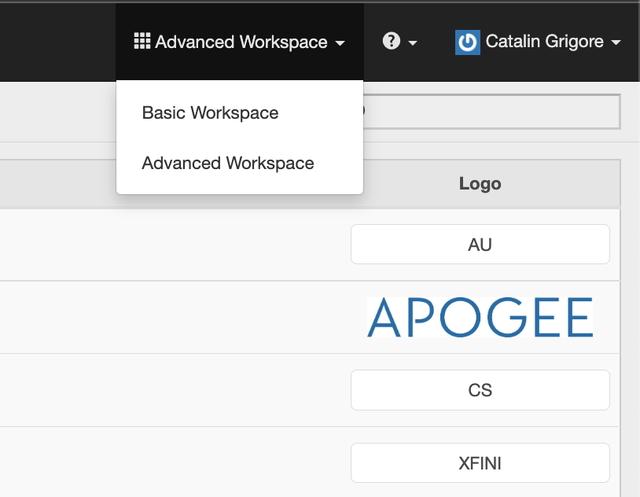
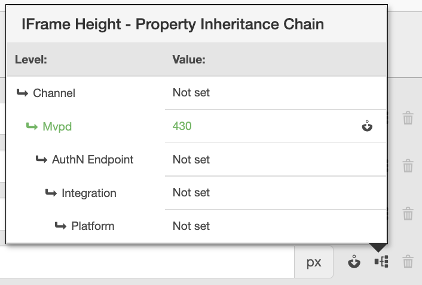
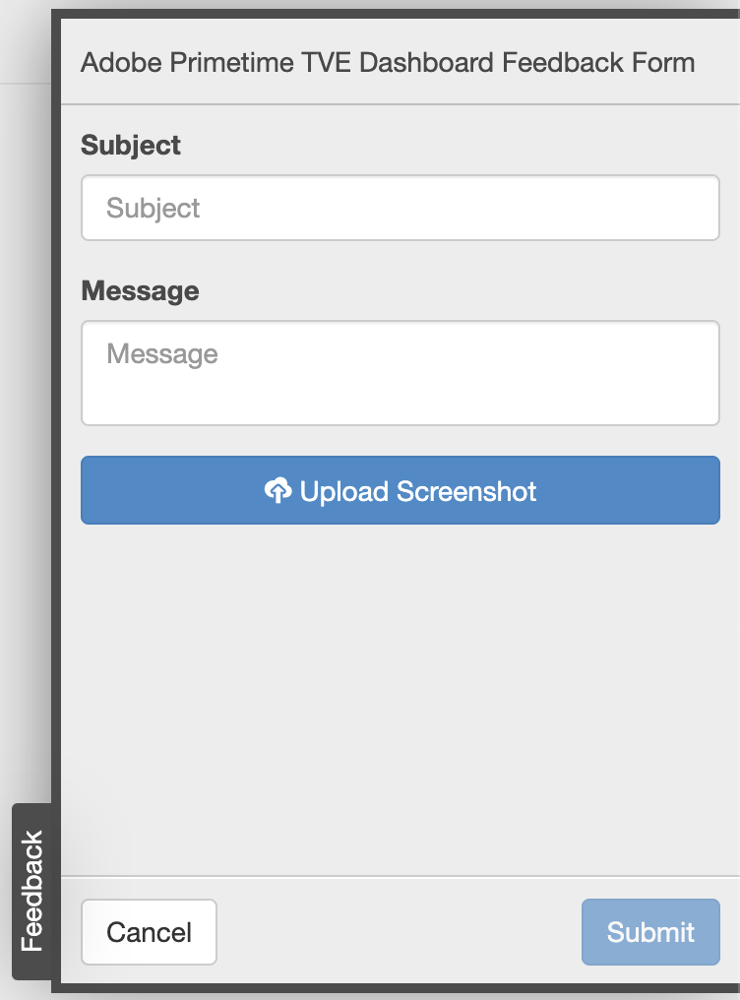

# Primetime TVE Dashboard-Benutzerhandbuch {#tve-db-user-guide}

>[!NOTE]
>
>Der Inhalt dieser Seite dient nur Informationszwecken. Für die Verwendung dieser API ist eine aktuelle -Lizenz von Adobe erforderlich. Eine unbefugte Anwendung ist nicht zulässig.

## Einführung {#tve-db-intro}

[[!DNL Adobe] TVE Dashboard (TVE Dashboard)](https://console.auth.adobe.com/) ist ein Self-Service-Dashboard für Benutzer, die für Medienunternehmen (Programmierer) arbeiten, die eine Geschäftsbeziehung mit dem Adobe Primetime Authentication-Produktteam unterhalten.

Wenden Sie sich an Ihren technischen Kundenbetreuer (TAM), um Zugriff zu erhalten. Um Zugriff zu erhalten, müssen Sie zwei neue Benutzergruppen in Ihrer Adobe Marketing Cloud-Organisation konfigurieren:

* TVE Dashboard Lese-Schreib - die Mitglieder dieser Gruppe haben volle Rechte für alle bearbeitbaren Bereiche des Dashboards
* TVE Dashboard Schreibgeschützt - die Mitglieder dieser Gruppe haben nur Anzeigerechte für das gesamte Dashboard

Bevor Sie sich mit diesem Benutzerhandbuch näher befassen, sollten Sie die folgenden Ressourcen durchlesen, um ein gutes Verständnis der vom Adobe Primetime-Authentifizierungs-Produktteam bereitgestellten Flüsse und Funktionen zu erhalten und sich mit den in diesem Dokument verwendeten Begriffen vertraut zu machen:

* [TVE Technisches Papier](/help/authentication/technical-paper.md)
* [Handbuch für Programmstart-Schnellstart](/help/authentication/programmer-kickstart-guide.md)
* [Berechtigungsfluss](/help/authentication/entitlement-flow.md)
* [Glossar](/help/authentication/glossary.md)

In den nächsten Abschnitten dieses Benutzerhandbuchs erfahren Sie, wie Sie verschiedene Einstellungen für die Kanäle, Programmierer oder die Integrationen zwischen Kanälen und MVPDs (Multichannel Video Program Distributors) Ihres Unternehmens verwalten können.

>[!IMPORTANT]
>Das TVE Dashboard bietet die Möglichkeit, zwischen einem einfachen und einem erweiterten Arbeitsbereich zu wechseln. Klicken Sie hierzu auf das Symbol oben rechts. Der erweiterte Arbeitsbereich richtet sich an Benutzer mit fundiertem technischem Wissen sowie erweitertem Wissen über die Funktionen, die vom Adobe Primetime Authentication-Produktteam bereitgestellt werden.

*Abbildung 1: Dropdown-Liste des Adobe Primetime TVE-Dashboards &quot;Grundlegender/erweiterter Arbeitsbereich&quot;*

## Umgebungen {#authn-environments}

Abhängig von den Aufgaben, die ein Benutzer möglicherweise ausführen muss, muss er möglicherweise zwischen Adobe Primetime-Authentifizierungsumgebungen wechseln. Ausführliche Informationen zu den Adobe Primetime-Authentifizierungsumgebungen finden Sie im folgenden Dokument: [Grundlagen zu den Authentifizierungsumgebungen von Adobe Primetime](/help/authentication/understanding-the-adobe-environments.md).

Das TVE-Dashboard bietet zwei Umgebungen mit dem Namen Prequal (Vorqualifizierung) und Release, von denen jede über zwei Profile namens Staging und Produktion verfügt, wie unten dargestellt:

* [Prequal Staging](https://console-prequal.auth-staging.adobe.com/)
* [Prequal Production](https://console-prequal.auth.adobe.com/)
* [Release-Staging](https://console.auth-staging.adobe.com/)
* [Versionsproduktion](https://console.auth.adobe.com/)

Um zwischen Umgebungen zu wechseln, kann der Benutzer auf die gewünschte Umgebung klicken, die durch den Eintrag aus dem unten abgebildeten Dropdown-Element repräsentiert wird:

*Abbildung 2: Dropdown-Liste Adobe Primetime TVE Dashboard-Umgebungen*

>[!IMPORTANT]
>Es ist sehr wichtig zu beachten, dass wir Ihnen bei administrativen Änderungen an Ihrer Adobe Primetime-Authentifizierungskonfiguration über das TVE-Dashboard dringend empfehlen, die unten stehende Reihenfolge zu befolgen, um eine ordnungsgemäße Funktion sicherzustellen.

So nehmen Sie über das TVE-Dashboard Verwaltungsänderungen an Ihrer Adobe Primetime-Authentifizierungskonfiguration vor:

* Führen Sie die Änderungen unter [Staging freigeben und validieren](http://sp.auth-staging.adobe.com/apitest/api.html).
* Führen Sie die Änderungen unter [Prequal Production und Validieren](http://sp.auth-staging.adobe.com/apitest/api.html).
* Führen Sie die Änderungen unter [Versionsverwaltung und Validierung](http://sp.auth-staging.adobe.com/apitest/api.html).

>[!IMPORTANT]
>Damit die Verwaltungsänderungen in Kraft treten können, müssen Benutzer zum Abschnitt &quot;Änderungen überprüfen und push-Benachrichtigungen&quot;navigieren, indem sie die Schaltfläche auswählen, die unten links in der Seitenleiste angezeigt wird. Damit sie die Änderungen überprüfen können, fügen Sie eine Beschreibung für die neu erstellten Änderungen hinzu und bestätigen Sie die Konfigurationsaktualisierung durch Auswahl der Option &quot;Push-Konfiguration&quot;.

*Abbildung 3: Benachrichtigung über Adobe Primetime TVE Dashboard-Überprüfung und Push-Änderungen*

## Abschnitte {#sections}

Benutzer, die für Medienunternehmen (Programmierer) arbeiten, können über die Seitenleiste auf die folgenden Abschnitte des TVE-Dashboards zugreifen:

* **Kanäle** - Enthält Einstellungen für Inhaltsanbieter
* **Programmierer** - Enthält Einstellungen, die sich auf eine übergeordnete Organisation beziehen, die ein oder mehrere **Kanäle**
* **Integrationen** - Enthält Einstellungen für die Integration zwischen **Kanäle** und **MVPDs**
* **MVPDs** - Enthält Einstellungen für die verfügbaren **MVPDs**
* **Berichte** - Enthält aggregierte Daten für drei Berichtstypen: AuthN TTL, AuthZ TTL, SSO
* **Änderungsprotokoll** - Enthält die neuesten Änderungen, die auf die TVE Dashboard-Konfiguration angewendet wurden

*Abbildung 4: Abschnitte des Adobe Primetime TVE-Dashboards*

### Kanäle {#tve-db-channels-section}

In diesem Abschnitt können Sie Einstellungen für verfügbare Kanäle anzeigen und bearbeiten oder einen neuen erstellen. Wenn Sie auf einen der verfügbaren Kanäle klicken, wird ein Bildschirm mit den folgenden Registerkarten zurückgegeben:

* **Kanaldaten**
   * **Kanal-ID** - Die eindeutige Kennung des Kanals, die in unserem System verwendet wird und auch als &quot;Anforderer-ID&quot;bezeichnet wird.
   * **Anzeigename** - Der kommerzielle Name des Kanals.
* **Allgemeine Einstellungen**
   * **Analytics-Konfiguration** - Konfigurieren von Adobe Primetime-Authentifizierungsereignissen für die Weiterleitung an Adobe Analytics. Weitere Informationen dazu, wie die Report Suite-ID (RSID) konfiguriert werden muss, bevor Sie diese Funktion aktivieren, erhalten Sie von der Adobe.
* **Zertifikate**

   Enthält die Liste der im Authentifizierungsvorgang verwendeten Zertifikate zusammen mit ihrer ausstellenden Organisation, das Ausstellungsdatum und das Ablaufdatum. Diese Zertifikate dienen als private/öffentliche Schlüssel und werden zu Validierungszwecken verwendet.
* **Domänen**

   Enthält die Liste der Domänen, von denen der jeweilige Kanal mit der Adobe Primetime-Authentifizierung kommuniziert.
* **Integrationen**

   Enthält die Liste der Integrationen mit verfügbaren MVPDs zusammen mit dem Status jeder Integration, die möglicherweise aktiviert ist oder nicht. Um zur Seite Integration zu navigieren, klicken Sie auf einen bestimmten Eintrag.
* **Registrierte Anwendungen**

   Enthält die Liste der Registrierungen von Anwendungen. Weitere Informationen finden Sie im Dokument . [Dynamisches Client-Registrierungsmanagement](/help/authentication/dynamic-client-registration-management.md).

* **Benutzerdefinierte Schemata**

   Enthält die Liste der benutzerdefinierten Schemas. Weitere Informationen finden Sie unter [Registrierung der iOS/tvOS-Anwendung](/help/authentication/iostvos-application-registration.md) und [Dynamisches Client-Registrierungsmanagement](/help/authentication/dynamic-client-registration-management.md)

#### Domänen hinzufügen/löschen {#add-delete-domains}

Um eine neue Domäne für den ausgewählten Kanal hinzuzufügen, müssen Sie auf die Schaltfläche &quot;Neue Domäne hinzufügen&quot;unter der Liste &quot;Domänen&quot;klicken. Dadurch wird ein neuer Domäneneintrag erstellt, in dem Sie den Domänennamen angeben können. Wenn bereits eine generischere Domäne in der Domänenliste vorhanden ist, sollten Sie keine neue Subdomain hinzufügen.

*Abbildung: Registerkarte &quot;Domänen&quot;in Kanälen*

### Programmierer {#tve-db-programmers-section}

Dieser Abschnitt ermöglicht die Anzeige und Bearbeitung von Einstellungen für verfügbare Programmierer oder die Erstellung eines neuen. Wenn Sie auf einen der verfügbaren Programmierer klicken, wird ein Bildschirm mit den folgenden Registerkarten zurückgegeben:

* **Programmierungsdaten**
   * **Programmierer-ID** - Die eindeutige Kennung des Programmierers, die in unserem System verwendet wird.
   * **Anzeigename** - Der kommerzielle Name des Programmierers.
   * **Logo-URL** - Der Uniform Resource Locator (URL) des kommerziellen Logos des Programmierers.
   * **Logo-Vorschau** - Die kommerzielle Logvorschau des Programmierers, indem er sie vom obigen Uniform Resource Locator (URL) herunterlädt.

* **Zertifikate**

   Enthält die Liste der im Authentifizierungsvorgang verwendeten Zertifikate zusammen mit ihrer ausstellenden Organisation, das Ausstellungsdatum und das Ablaufdatum. Diese Zertifikate dienen als private/öffentliche Schlüssel und werden zu Validierungszwecken verwendet.

* **Kanäle**

   Enthält die Liste der Kanäle, die zu diesem spezifischen Programmierer gehören. Um zum Abschnitt Kanäle zu navigieren, klicken Sie auf einen bestimmten Eintrag.

* **Registrierte Anwendungen**

   Enthält die Liste der Registrierungen von Anwendungen. Weitere Informationen finden Sie unter [Dynamisches Client-Registrierungsmanagement](/help/authentication/dynamic-client-registration-management.md).

* **Benutzerdefinierte Schemata**

   Enthält die Liste der benutzerdefinierten Schemas. Weitere Informationen finden Sie unter [Registrierung der iOS/tvOS-Anwendung](/help/authentication/iostvos-application-registration.md) und [Dynamisches Client-Registrierungsmanagement](/help/authentication/dynamic-client-registration-management.md).

### Integrationen {#tve-db-integrations-sec}

In diesem Abschnitt können Sie Einstellungen für Integrationen zwischen Kanälen und verfügbaren MVPDs anzeigen und bearbeiten oder neue erstellen. Wenn Sie auf eine der verfügbaren Integrationen klicken, wird bei Verwendung von Basic Workspace eine einzelne Seite oder ein Bildschirm mit den folgenden Registerkarten bei Verwendung von Advanced Workspace zurückgegeben:

* **Integrationsdaten**
   * **Integrations-ID**- Ergebnis des Anfügens der eindeutigen MVPDs-ID an die eindeutige Kennung des Kanals, getrennt durch das Zeichen &quot;_&quot;.
   * **Anzeigename des Kanals** - Der kommerzielle Name des Kanals.
   * **Kanal-ID** - Die eindeutige Kennung des Kanals, die in unserem System verwendet wird und auch als &quot;Anforderer-ID&quot;bezeichnet wird.
   * **MVPD-Anzeigename** - Der kommerzielle Name des MVPD.
   * **MVPD-ID** - Die in unserem System verwendete eindeutige Kennung des MVPD.
* **Allgemeine Einstellungen**
   * **Schlüssel für Benutzer-Metadaten** - Konfigurieren Sie Metadatenschlüssel, die für die jeweilige Integration verfügbar sind.
   * **Plattformspezifische Einstellungen** - Konfigurieren Sie verschiedene Einstellungen für eine bestimmte Plattform (z. B. TTLs, SSO und IFrames).

* **Authentifizierungseinstellungen**
   * Enthält Einstellungen für die Authentifizierungsfunktion der Adobe Primetime-Authentifizierung.
* **Autorisierungseinstellungen**
   * Enthält Einstellungen für die Adobe Primetime-Authentifizierungsautorisierungsfunktion.
* **Abmeldeeinstellungen**
   * Enthält Einstellungen für die Adobe Primetime-Authentifizierungsabmeldefunktion.

#### Integration erstellen {#create-integration}

Gehen Sie wie folgt vor, um eine neue Integration zu erstellen:

* Klicken Sie auf die Schaltfläche &quot;Neue Integration hinzufügen&quot;
* Suchen und Auswählen eines Kanals
* Suchen und Auswählen eines MVPD
* Warten Sie, bis das TVE-Dashboard die &quot;Integrations-ID&quot;berechnet und die verfügbaren MVPD-Endpunkte anzeigt
* die Endpunkte Authentifizierung, Autorisierung und Abmeldung auswählen oder die Standardwerte verwenden
* Klicken Sie auf die Schaltfläche &quot;Integration erstellen&quot;
* Je nach den MVPD-Einstellungen kann ein Popup angezeigt werden und nach zusätzlichen Eigenschaften fragen, die zuvor vom MVPD bereitgestellt werden sollten. Andernfalls wird eine Umleitung zur neu erstellten Integrationsseite durchgeführt

*Abbildung 5. Das Fenster &quot;Adobe Primetime TVE Dashboard - Neue Integration&quot;*

#### Integration aktualisieren {#update-integration}

Um eine vorhandene Integration zu aktualisieren, klicken Sie im Abschnitt Integrationen oder im Abschnitt Kanäle auf den Tabelleneintrag für diese spezifische Integration, der die Registerkarte Integrationen enthält.

Bei Verwendung des Modus Grundlegender Arbeitsbereich ermöglicht dieser Abschnitt die Anzeige und Bearbeitung der am häufigsten aktualisierten Einstellungen, wie z. B. Authentifizierungs- und Autorisierungstoken-TTLs (Time-to-Live) sowie iFrame-Einstellungen. Beachten Sie, dass TTL-Einstellungen für Integrationen mit MVPDs, die dynamisch definierte Token-Persistenz-TTL unterstützen, möglicherweise fehlen (siehe Eintrag 1.19 von [MVPD-Integrationsanforderungen](/help/authentication/mvpd-integr-features.md)).

Bei Verwendung des Modus Erweiterter Arbeitsbereich ermöglicht dieser Abschnitt die Anzeige und Bearbeitung weniger häufig eingestellter Einstellungen.

Sowohl im Modus Einfach als auch im Modus Erweiterter Arbeitsbereich können diese Einstellungen auf Plattformebene geändert werden (z. B. wählen Sie einen benutzerdefinierten Wert für das TTL-Token für die Autorisierung unter Android aus, der auf jeder anderen Plattform standardmäßig verwendet wird).

>[!IMPORTANT]
>Es ist wichtig, die Vererbungskette der Einstellungen zu verstehen: MVPD -> MVPD-Endpunkt -> Integration -> Plattform, wobei Platform den spezifischsten Wert hat und MVPD der allgemeinste Standard ist.

*Abbildung 6. Die Vererbungskettenkomponente der Adobe Primetime TVE Dashboard-Eigenschaft*

#### Plattformspezifische Einstellungen {#platform-sp-settings}

Dieser Unterabschnitt kann verwendet werden, um die Einstellungen für bestimmte Plattformen zu überschreiben. Die verfügbaren Plattformen sind:

* **Alle Plattformen** - Legen Sie Werte fest, die unabhängig von den Programmer-Implementierungen auf alle Plattformen angewendet werden, falls für eine bestimmte Plattform keine anderen Werte festgelegt sind.
* **Android** - Legen Sie Werte fest, die auf die Programmer-Implementierungen über das Adobe Primetime Authentication Android SDK angewendet werden.
* **Clientlose REST-API** - Legen Sie Werte fest, die über die Adobe Primetime Authentication REST API auf die Programmer-Implementierungen angewendet werden.
* **Fire TV** - Legen Sie Werte fest, die auf die Programmer-Implementierungen über das Adobe Primetime Authentication FireTV SDK angewendet werden.
* **Flash SDK** - Diese Plattform wird nicht mehr unterstützt. **veraltet**
* **JavaScript-SDK** - Legen Sie Werte fest, die auf die Programmer-Implementierungen über das Adobe Primetime Authentication JavaScript SDK angewendet werden.
* **Roku** - Legen Sie Werte fest, die auf die Programmer-Implementierungen über die Adobe Primetime Authentication REST API angewendet werden und &quot;Roku&quot;als Gerätetyp senden. Dies hat im Fall von Roku-Geräten Vorrang vor den Werten, die für die clientlose REST-API-Plattform festgelegt wurden.
* **Natives Xbox-SDK** - Diese Plattform wird nicht mehr unterstützt. **veraltet**
* **Xbox 360 REST API** - Legen Sie Werte fest, die auf die Programmer-Implementierungen über die Adobe Primetime Authentication REST API angewendet werden und &quot;xbox&quot;als Gerätetyp senden. Dies hat bei Xbox 360-Geräten Vorrang vor den Werten, die für die clientlose REST-API-Plattform festgelegt wurden.
* **Xbox One REST API** - Legen Sie Werte fest, die auf die Programmer-Implementierungen über die Adobe Primetime Authentication REST API angewendet werden und &quot;xboxOne&quot;als Gerätetyp senden. Dies hat im Fall von XboxOne-Geräten Vorrang vor den Werten, die für die clientlose REST-API-Plattform festgelegt wurden.
* **iOS** - Legen Sie Werte fest, die auf die Programmer-Implementierungen über das Adobe Primetime Authentication iOS SDK angewendet werden.
* **tvOS** - Legen Sie Werte fest, die auf die Programmer-Implementierungen über das Adobe Primetime Authentication tvOS SDK angewendet werden.

*Abbildung 7. Spezifische Einstellungen für Adobe Primetime TVE Dashboard Platform*

#### Single-Sign-On für Platform aktivieren {#enable-platform-sso}

Führen Sie die folgenden Schritte aus, um Single Sign-On für eine bestimmte Integration und Plattform zu aktivieren/deaktivieren:

* Stellen Sie sicher, dass Sie den Modus Erweiterter Arbeitsbereich verwenden
* zur gewünschten Integration navigieren
* Navigieren Sie zum **Allgemeine Einstellungen** tab
* Wählen Sie die gewünschte Plattform aus, auf der Sie Single Sign-On aktivieren oder deaktivieren möchten.
* umschalten **Single Sign-on aktivieren** Flag zum gewünschten Wert (Ja / Nein)

   >[!IMPORTANT]
   >Es ist wichtig festzustellen, dass die **Single Sign-on aktivieren** -Markierung ist nur für iOS-, tvOS-, Roku- und FireTV-Plattformen und nur für Integrationen mit MVPDs verfügbar, die Single Sign-On für diese Plattformen unterstützen.

* umschalten **Erzwingen der Plattformberechtigungen** Flag zum gewünschten Wert (Ja / Nein)

   >[!IMPORTANT]
   >Es ist wichtig festzustellen, dass die **Erzwingen der Plattformberechtigungen** -Markierung steuert, ob die Entscheidung des Benutzers, den Plattformzugriff auf sein TV-Provider-Abonnement zu erlauben oder zu verweigern, erzwungen wird oder nicht. Wenn Sie das Szenario **Single Sign-on aktivieren** -Markierung auf &quot;Ja&quot;gesetzt ist, **Erzwingen der Plattformberechtigungen** -Markierung ist ebenfalls auf &quot;Ja&quot;gesetzt und der Benutzer wählt die Option Plattformzugriff auf sein TV-Provider-Abonnement verweigern aus. Anschließend kann die entsprechende Anwendung (Kanal) das Adobe Primetime-Authentifizierungstoken, das von einer anderen Anwendung (Kanal) abgerufen wurde, nicht verwenden.

#### Aktivieren der Home-basierten Authentifizierung {#enable-hba}

Führen Sie die folgenden Schritte aus, um die Home-Base-Authentifizierung für **OAuth2** basierte MVPDs:

* Stellen Sie sicher, dass Sie den Modus Erweiterter Arbeitsbereich verwenden
* zur gewünschten Integration navigieren
* navigieren zu **Authentifizierungseinstellungen** tab
* navigieren zu **AuthN Dynamische Regeln** untertab
* umschalten **Attempt HBA** Flag zum gewünschten Wert (Ja / Nein)

>[!IMPORTANT]
>Bitte beachten Sie, dass der Wert &quot;HBA AuthN TTL&quot;niemals überschrieben werden sollte, da andernfalls der Autorisierungsfluss unerwartet fehlschlagen könnte.

Wenden Sie sich an **tve-support@adobe.com** Informationen zur Aktivierung der Home-Base-Authentifizierung für SAML-basierte MVPDs.

### MVPDs {#tve-db-mvpds-sec}

In diesem Abschnitt können Sie Einstellungen für verfügbare MVPDs anzeigen. Wenn Sie auf einen der verfügbaren MVPDs klicken, wird ein Bildschirm mit den folgenden Registerkarten zurückgegeben:

* **MVPD-Daten**
   * **MVPD-ID** - Die in unserem System verwendete eindeutige Kennung des MVPD.
   * **Anzeigename** - Der kommerzielle Name des MVPD, der in der Auswahl des Benutzers verwendet werden kann.
   * **Logo-URL** - Der Uniform Resource Locator (URL) des kommerziellen Logos des MVPD.
   * **Logo-Vorschau** - Die kommerzielle Logobilanz des MVPDs, indem sie vom obigen Uniform Resource Locator (URL) heruntergeladen wird.
* **Allgemeine Einstellungen**
   * **Schlüssel für Benutzer-Metadaten**
      * Für das spezifische MVPD verfügbare Metadatenschlüssel.
   * **Client-Dateneigenschaften**
      * **Auth/Aggregator** - Wenn auf &quot;Ja&quot;gesetzt, wird für jeden neuen Kanal, auf den der Benutzer zugreifen möchte, ein neues Authentifizierungstoken benötigt.
      * **Passive AuthN aktiviert** - Wenn das Flag Auth/Aggregator auf &quot;Ja&quot; gesetzt ist und wenn Passive AuthN Enabled auf &quot;Ja&quot; gesetzt ist, erfolgt der Authentifizierungsprozess mit einem anderen Kanal im Hintergrund, ohne dass eine vollständige Browser-Umleitung erforderlich ist und die Auswahl angezeigt wird.
      * **Auth-/Browser-Sitzung** - Wenn auf &quot;Ja&quot;gesetzt, wird der Benutzer nach dem Schließen des Browsers abgemeldet. Wenn auf &quot;Nein&quot;gesetzt, kann der Benutzer den Browser neu starten und angemeldet bleiben.
      * **IFrame erforderlich** - Wenn auf &quot;Ja&quot;gesetzt, bedeutet dies, dass das MVPD-Anmeldefenster einen iFrame erfordert. Die Felder &quot;iFrame-Breite&quot;und &quot;iFrame-Höhe&quot;entsprechen der Größe, die für das Laden der MVPD-Anmeldeseite durch den iFrame erforderlich ist.
* **Authentifizierungseinstellungen**
   * **Endpunkt auswählen**
      * Dieses Feld gibt die vom MVPD offen gelegten Authentifizierungsendpunkte an. Der Endpunkt kann je nach verwendetem Authentifizierungsprotokoll unterschiedlich sein.
   * **AuthN Allgemeine Einstellungen**
      * Auf dieser Unterregisterkarte werden das vom MVPD verwendete Authentifizierungsprotokoll und protokollbezogene Informationen angezeigt.
   * **AuthN-Zertifikate**
      * In diesem Untertab werden die Zertifikate angezeigt, die der MVPD im Authentifizierungsfluss verwendet, zusammen mit der Organisation des Emittenten, dem Ausstellungsdatum und dem Ablaufdatum. Diese Zertifikate dienen als private/öffentliche Schlüssel und werden zu Validierungszwecken verwendet.
   * **AuthN Dynamische Regeln**
      * Auf dieser Unterregisterkarte werden die Regeln angezeigt, die für den Authentifizierungsprozess gelten. Durch Drücken der Taste &quot;Anfrage&quot;/&quot;Antwort&quot;/&quot;Token&quot;im Diagramm können Sie die Parameter sehen, die auf diesen Teil des Authentifizierungsflusses angewendet werden.
* **Autorisierungseinstellungen**
   * **Endpunkt auswählen**
      * Dieses Feld gibt den vom MVPD offen gelegten Autorisierungsendpunkt an. Der Endpunkt kann je nach verwendetem Autorisierungsprotokoll unterschiedlich ausfallen. Die verfügbaren Autorisierungsprotokolle sind SOAP, REST (für Client-lose Geräte), SAML, XACML und OAUTH.
   * **Allgemeine Einstellungen für AuthZ**
      * In diesem Untertab werden das vom MVPD verwendete Autorisierungsprotokoll und protokollbezogene Informationen angezeigt.
      * **Preflight-Konfiguration**
         * Es beschreibt die Anzahl der Ressourcen, die von einem MVPD in einem einzelnen Aufruf vorautorisiert werden können, das verwendete PreFlight-Modell sowie den Timeout-Schwellenwert. Gelegentlich kann die Anzahl der Ressourcen für eine bestimmte Integration unterschiedlich sein. Dies kann durch Bearbeiten des **Max. Anzahl der Preflight-Ressourcen**&quot;, verfügbar auf der Registerkarte &quot;Allgemeine Einstellungen&quot;. Diese Eigenschaft ist nur für eine bestimmte Integration verfügbar. Wenn sie festgelegt ist, wird sie anstelle des in den Autorisierungseinstellungen -> PreFlight-Konfiguration -> PreFlight Max. Ressourcen definierten Werts verwendet.
      * **DOS-Schutz**
         * Es wird der Schutz vor &quot;Denial-of-Service&quot;am MVPD-Autorisierungsendpunkt beschrieben. Eine genaue Beschreibung der einzelnen Felder finden Sie in den QuickInfos, indem Sie den Mauszeiger über die DOS-Schutzfelder bewegen.
      * Wenn der MVPD ein **TempPass**, dann **Allgemeine Einstellungen für AuthZ** enthält auch Informationen zur Dauer des TempPass.
      * Wenn der MVPD ein **FlexibleTempPass**, dann **Allgemeine Einstellungen für AuthZ** enthält auch Informationen zur Dauer des TempPass , zur maximalen Anzahl von Ressourcen und zum Identifizierungsfeld (siehe Abbildung unten).
   * **AuthZ-Zertifikate**
      * In diesem Untertab werden die Zertifikate angezeigt, die der MVPD im Autorisierungsfluss verwendet, zusammen mit der Organisation des Emittenten, dem Ausstellungsdatum und dem Ablaufdatum. Diese Zertifikate dienen als private/öffentliche Schlüssel und werden zu Validierungszwecken verwendet.
   * **Dynamische Regeln für AuthZ**
      * In diesem Untertab werden die Regeln angezeigt, die für den Autorisierungsprozess gelten. Durch Drücken der **Anfrage/Antwort/Token**, werden die Parameter, die auf diesen Teil des Autorisierungsflusses angewendet werden, hervorgehoben dargestellt.
* **Abmeldeeinstellungen**
   * **Endpunkt auswählen**
      * Dieses Feld gibt den vom MVPD offen gelegten Abmelde-Endpunkt an. Die bereitgestellten Protokolle können entweder SAML oder OAuth2 sein.
      * **Allgemeine Einstellungen zum Abmelden**
         * Auf dieser Unterregisterkarte werden das vom MVPD verwendete Abmeldeprotokoll und protokollbezogene Informationen angezeigt.
         * **Anfordern der signierten Abmeldeantwort** - Wenn auf &quot;Ja&quot;gesetzt, muss die Antwort von einem vertrauenswürdigen Zertifikat signiert werden.
      * **Abmeldezertifikate**
         * In diesem Untertab werden die Zertifikate angezeigt, die der MVPD im Abmeldefluss verwendet, zusammen mit der Organisation des Emittenten, dem Ausstellungsdatum und dem Ablaufdatum. Diese Zertifikate dienen als private/öffentliche Schlüssel und werden zu Validierungszwecken verwendet.
      * **Dynamische Regeln abmelden**
         * In diesem Untertab werden die Regeln angezeigt, die für den Abmeldevorgang gelten. Durch Drücken der **Anfrage/Antwort/Token**, werden die auf diesen Teil des Abmeldeflusses angewendeten Parameter hervorgehoben dargestellt.

### Berichte {#tve-db-reports-sec}

Um zu diesem Abschnitt zu navigieren, klicken Sie auf &quot;Berichte&quot;im[Dashboard-Abschnitte](#sections)&quot;. Dadurch wird zu einem Bildschirm mit drei Registerkarten navigiert, die in den folgenden Unterabschnitten detailliert dargestellt werden: [AuthN TTL-Berichte](#authn-ttl-reports), [AuthZ TTL-Berichte](#authz-ttl-reports), [SSO-Berichte](#sso-reports).

In diesem Abschnitt können Sie aggregierte Daten für verschiedene Berichtstypen für Ihre Kanal-Integration/Ihre Kanäle mit verschiedenen MVPDs über alle Plattformen hinweg anzeigen und exportieren.

#### Plattformen {#report-platforms}

Alle Berichte aggregieren Werte auf den folgenden Plattformen:

**BROWSER**
Zeigt Werte an, die auf die Programmer-Implementierungen über das Adobe Primetime Authentication JavaScript SDK angewendet werden.

**MOBILE: iOS**
Zeigt Werte an, die auf die Programmer-Implementierungen über das Adobe Primetime Authentication iOS SDK angewendet werden.

**MOBILE: ANDROID**
Zeigt Werte an, die auf die Programmer-Implementierungen über das Adobe Primetime Authentication Android SDK angewendet werden.

**MOBILE: ANDERE**
Zeigt Werte an, die auf die Programmer-Implementierungen über die Adobe Primetime Authentication REST API angewendet werden, die für Mobilgeräte entwickelt wurde.

**TVCD: ROKU**
Zeigt Werte an, die auf die Programmer-Implementierungen über die Adobe Primetime Authentication REST API angewendet werden und &quot;Roku&quot;als Gerätetyp senden.

**TVCD: FIRETV**
Zeigt Werte an, die auf die Programmer-Implementierungen über das Adobe Primetime Authentication FireTV SDK angewendet werden.

**TVCD: APPLETV**
Zeigt Werte an, die auf die Programmer-Implementierungen über das Adobe Primetime Authentication tvOS SDK angewendet werden.

**TVCD: ANDERE**
Zeigt Werte an, die auf die Programmer-Implementierungen über die Adobe Primetime Authentication REST API angewendet werden, die für TV-verbundene Geräte entwickelt wurde.

**PLATTFORM: UKNOWN**
Zeigt Werte an, die auf die Programmer-Implementierungen angewendet werden, für die die Adobe Primetime-Authentifizierungsdienste einen unbekannten Gerätetyp erkennen.

Überprüfung des Mechanismus [Übergeben von Client-Informationen](/help/authentication/passing-client-information-device-connection-and-application.md) zu Adobe Primetime Authentication REST APIs oder SDKs , um weitere Informationen zum Senden des gewünschten Gerätetyps (z. B. &quot;Roku&quot;) zu erhalten.

Alle Berichte aggregieren Werte, die auf der für jede Adobe Primetime-Authentifizierungsumgebung spezifischen Konfiguration basieren. Daher können Sie beim Wechsel zwischen verschiedenen TVE-Dashboard-Umgebungen unterschiedliche Berichtsdaten erwarten.

Lesen Sie die [Umgebungen](#authn-environments) für weitere Informationen zu den verfügbaren Umgebungen mit Adobe Primetime-Authentifizierung.

##### Auswählen bestimmter Kanäle/MVPDs {#selecting-specific-channels-mvpds}

Alle Berichte ermöglichen die Verwendung von Filtern, indem sie bestimmte Kanäle auswählen oder bestimmte MVPDs auswählen, die in die resultierenden Berichte aufgenommen werden sollen.

Verwenden Sie zur Auswahl eines oder mehrerer Kanäle die **Dropdown-Liste** nach der Beschriftung &quot;Für Bericht ausgewählte Kanäle&quot;platziert. Siehe Abbildung 8./9./10. Bilder von unten.

Verwenden Sie zur Auswahl eines oder mehrerer MVPDs die **Dropdown-Liste** nach dem Titel &quot;Für Bericht ausgewählte MVPDs&quot; platziert. Siehe Abbildung 8./9./10. Bilder von unten.

Standardmäßig werden die Daten über alle Kanäle Ihres Unternehmens (&quot;Alle Kanäle&quot;) und die MVPDs, mit denen sie integriert sind (&quot;Alle MVPDs&quot;) aggregiert.

Wenn Sie die Auswahl von &quot;Alle Kanäle&quot;oder &quot;Alle MVPDs&quot;aufheben, ohne bestimmte Optionen auszuwählen, wird auf der Benutzeroberfläche ein Platzhalter &quot;Keine Daten verfügbar&quot;angezeigt.

##### Exportbericht {#export-report}

Alle Berichte ermöglichen den Export von Daten in eine Datei im CSV-Format (CSV).

Um Daten zu exportieren, verwenden Sie die Schaltfläche &quot;Bericht exportieren&quot; oben rechts im Fenster. Siehe Abbildung 8./9./10. Bilder von unten.

Eine Datei mit dem Namen **Report.csv** wird automatisch auf Ihren Computer heruntergeladen. Stellen Sie daher sicher, dass die Einstellungen Ihres Browsers das Herunterladen von Dateien zulassen.

Das Ladesymbol &quot;Daten exportieren&quot;wird auf dem Bildschirm angezeigt, während die Datei &quot;Report.csv&quot;berechnet wird, die **nach ein paar Minuten** abhängig von der Datengröße, die Sie exportieren möchten.

#### AuthN TTL-Berichte (#authn-ttl-reports)

Dieser Bericht zeigt die Time-To-Live (TTL) des Authentifizierungstokens an, das für die Integration/die Kanäle mit verschiedenen MVPDs auf allen Plattformen konfiguriert wurde.

Die Time-To-Live des Authentifizierungstokens, die auch als **AuthN TTL**, wird in für Menschen lesbaren Werten angezeigt, z. B.: **Tage, Stunden, Minuten, Sekunden**.

In Bezug auf das Benutzererlebnis können Sie mit den AuthN TTL-Berichten visuell überprüfen, wie lange ein Benutzer unter Berücksichtigung eines bestimmten MVPD und einer bestimmten Plattform authentifiziert wird.

Um zu diesem Berichtstyp zu navigieren, klicken Sie auf die Registerkarte &quot;AuthN TTL Reports&quot; im Abschnitt &quot;Berichte&quot;.

*Abbildung 8: Registerkarte &quot;Adobe Primetime TVE Dashboard AuthN TTL Report&quot;*

Die Tabelle AuthN TTL Reports enthält Seiten und kann je nach Bildschirmgröße horizontal und vertikal gescrollt werden.

Falls Sie eine Änderung an einem AuthN TTL-Wert vornehmen möchten, lesen Sie bitte die [Integrationen](#tve-db-integrations-sec) Abschnitt.

>[!IMPORTANT]
>Die &quot;**Festgelegt durch MVPD**&quot;Platzhalter wird verwendet, wenn der MVPD derjenige ist, der den AuthN TTL-Wert erzwingt, und nicht die Adobe Primetime-Authentifizierungskonfiguration.

#### AuthZ TTL-Berichte {#authz-ttl-reports}

Dieser Bericht zeigt die Time-To-Live (TTL) des Autorisierungstokens an, das für die Integration/die Kanäle mit verschiedenen MVPDs auf allen Plattformen konfiguriert wurde.

Die Time-To-Live des Autorisierungstokens, die auch als **AuthZ TTL**, wird in für Menschen lesbaren Werten angezeigt, z. B.: **Tage, Stunden, Minuten, Sekunden**.

In Bezug auf das Benutzererlebnis können Sie mit den AuthZ TTL-Berichten visuell überprüfen, wie lange ein Benutzer unter Berücksichtigung eines bestimmten MVPD und einer bestimmten Plattform autorisiert wird.

Um zu diesem Berichtstyp zu navigieren, klicken Sie auf die Registerkarte &quot;AuthZ TTL Reports&quot; im Abschnitt &quot;Berichte&quot;.

*Abbildung 9. Registerkarte &quot;Adobe Primetime TVE Dashboard AuthZ TTL Report&quot;*

Die Tabelle &quot;AuthZ TTL Reports&quot;enthält Seiten und kann je nach Bildschirmgröße horizontal und vertikal gescrollt werden.

Wenn Sie eine Änderung an einem AuthZ TTL-Wert vornehmen möchten, lesen Sie den Abschnitt [Integrationen](#tve-db-integrations-sec) Abschnitt.

>[!IMPORTANT]
>Die &quot;**Festgelegt durch MVPD**&quot; Platzhalter wird verwendet, wenn der MVPD derjenige ist, der den AuthZ TTL-Wert erzwingt, und nicht die Adobe Primetime-Authentifizierungskonfiguration.

#### SSO-Berichte {#sso-reports}

Dieser Bericht zeigt den SSO-Status (Single Sign-On) an, der für die Integration/die Kanäle mit verschiedenen MVPDs auf allen Plattformen konfiguriert wurde.

Der Status Single Sign-On , der auch als **SSO-Status**, wird als Tri-Status mit den folgenden möglichen Werten angezeigt: **SSO deaktiviert, SSO aktiviert, SSO nicht sicher**.

In Bezug auf das Benutzererlebnis können Sie mit den SSO-Berichten das erwartete SSO-Erlebnis für die Benutzerauthentifizierung unter Berücksichtigung eines bestimmten MVPD und einer bestimmten Plattform visuell untersuchen.

Um zu diesem Berichtstyp zu navigieren, klicken Sie auf die Schaltfläche **SSO-Berichte**&quot; auf der Registerkarte &quot;**Berichte**&quot;.

*Abbildung 10: Registerkarte Adobe Primetime TVE Dashboard SSO-Berichte*

Die Tabelle &quot;SSO-Berichte&quot;enthält Seiten und kann je nach Bildschirmgröße horizontal und vertikal gescrollt werden.

Falls Sie erwägen, den Status einer einmaligen Anmeldung zu ändern, lesen Sie bitte die [Integrationen](#tve-db-integrations-sec) Abschnitt.

>[!IMPORTANT]
>&quot;**SSO Nicht sicher**&quot; Platzhalter wird verwendet, wenn SSO aktiviert und möglich ist, aber Benutzerplattformeinstellungen/ Benutzerentscheidungen (z. B. Benutzerbrowseroption zum Blockieren von Drittanbieter-Cookies, Benutzer, die den Plattformzugriff auf sein TV Provider-Abonnement verweigern) oder MVPD-Einstellungen (z. B. MVPD, bei dem die Authentifizierung für jeden Kanal angefordert wird) die SSO möglicherweise verhindern.

### Änderungsprotokoll {#tve-db-changelog-sec}

In diesem Abschnitt wird eine Liste aller Änderungen angezeigt, die über das TVE-Dashboard an die Adobe Primetime-Authentifizierungsumgebung und -Konfiguration gesendet werden.

Es gibt Spalten, die das Push-Datum, den Benutzer, der die Änderung vorgenommen hat, und den Status der Push-Benachrichtigung angeben.

Dieser Abschnitt ermöglicht auch den Vergleich von zwei Tabelleneinträgen, um die spezifischen Änderungen, die Sie prüfen möchten, einzugrenzen und den Vergleich sogar als E-Mail-Element freizugeben.

### Feedback {#tve-db-feedback-sec}

In diesem Abschnitt können Benutzer Feedback senden. Führen Sie die Schritte aus, um dem Produktteam für die Adobe Primetime-Authentifizierung Feedback zu geben:

* Klicken Sie auf die Schaltfläche &quot;Feedback&quot; auf der rechten Bildschirmseite.
* Betreff eingeben
* Nachricht eingeben
* Laden Sie bei Bedarf einen Screenshot in die Nachricht hoch, indem Sie auf die Schaltfläche &quot;Screenshot hochladen&quot;klicken.
* Klicken Sie auf die Schaltfläche &quot;Senden&quot;

*Abbildung 11: Feedback zum Adobe Primetime TVE Dashboard*

Anweisungen zum Erfassen von Screenshots finden Sie unter den folgenden Links:

* [So erfassen Sie Screenshots unter Windows](https://support.microsoft.com/en-us/windows/use-snipping-tool-to-capture-screenshots-00246869-1843-655f-f220-97299b865f6b#1TC=windows-7)

* [Screenshots in Mac erfassen](https://support.apple.com/en-us/HT201361)

## Fehlerbehebung {#tve-db-troubleshoot}

### Wartungsmodus {#maintenance-mode}

*Abbildung: TVE App im Wartungsmodus*

Wenn sich das TVE-Dashboard im &quot;Wartungsmodus&quot;befindet, können Benutzer keine neuen Änderungen anzeigen oder vornehmen.

In diesem Fall müssen Sie warten, bis das Adobe Primetime Authentication Engineering-Team die Wartungsarbeiten am TVE-Dashboard abgeschlossen hat.

### Beschädigter Status {#degraded-state}

*Abbildung: TVE-App im beschädigten Zustand*

Wenn das TVE-Dashboard einen &quot;beschädigten Status&quot;aufweist, verfügen Benutzer nicht über Such- und Sortierfunktionen, doch können Benutzer neue Änderungen anzeigen oder vornehmen.

In diesem Fall müssen Sie warten, bis das Adobe Primetime Authentication Engineering-Team die Wartungsarbeiten am TVE-Dashboard abgeschlossen hat.
