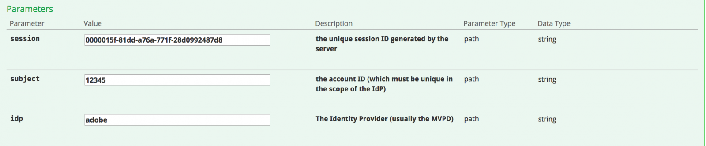

# API-Übersicht {#api-overview}

Anzeigen der [Online-API-Dokumentation](http://docs.adobeptime.io/cm-api-v2/) für weitere Details.

## Zweck und Voraussetzungen {#purpose-prerequisites}

Dieses Dokument unterstützt Anwendungsentwickler bei der Verwendung unserer Swagger-API-Spezifikation bei der Implementierung einer Integration mit der gleichzeitigen Überwachung. Es wird dringend empfohlen, dass der Leser über ein vorheriges Verständnis der vom Dienst definierten Konzepte verfügt, bevor er diese Richtlinie befolgt. Um dieses Verständnis zu erhalten, muss ein Überblick über die [Produktdokumentation](/help/concurrency-monitoring/cm-home.md) und [Swagger-API-Spezifikation](http://docs.adobeptime.io/cm-api-v2/).

## Einführung {#api-overview-intro}

Während des Entwicklungsprozesses stellt die öffentliche Swagger-Dokumentation die Referenzrichtlinie zum Verständnis und Testen der API-Flüsse dar. Dies ist ein guter Ausgangspunkt, um einen praxisorientierten Ansatz zu haben und sich mit der Art und Weise vertraut zu machen, wie sich reale Anwendungen in verschiedenen Szenarien der Benutzerinteraktion verhalten würden.

Einreichen eines Tickets [Zendesk](mailto:tve-support@adobe.com) , um Ihr Unternehmen und Ihre Anwendungen in Concurrency Monitoring zu registrieren. Adobe weist jeder Entität eine Anwendungs-ID zu. In diesem Handbuch werden wir zwei Referenzanwendungen mit IDs verwenden **demo-app** und **demo-app-2** , die unter der MandantenAdobe aufgeführt wird.

## Anwendungsbeispiele {#api-use-case}

Der erste Schritt beim Testen eines Flusses mit Swagger besteht darin, die Anwendungs-ID oben rechts auf der Seite wie folgt einzugeben:

Danach drücken wir **Erkunden** , um die ID festzulegen, die im Autorisierungs-Header für alle Aufrufe der REST-API verwendet wird.  Bei jedem API-Aufruf wird erwartet, dass die Anwendungs-ID über eine einfache HTTP-Authentifizierung übergeben wird. Der Benutzername ist die Anwendungs-ID und das Kennwort ist leer.

### Erste Anwendung {#first-app-use-cases}

Anwendung mit ID **demo-app** wurde vom Adobe-Team eine Richtlinie mit einer Regel zugewiesen, die die Anzahl der gleichzeitigen Streams auf 3 beschränkt. Eine Richtlinie wird einer bestimmten Anwendung basierend auf der in Zendesk gesendeten Anfrage zugewiesen.

#### Abrufen von Metadaten {#retrieve-metadata-use-case}

Der erste Aufruf, den wir durchführen, erfolgt für die Metadatenressource, um die Liste der Metadatenattribute abzurufen, die bei der Sitzungsinitialisierung als Formulardaten übergeben werden müssen. Diese Metadaten werden verwendet, um die für diese Anwendung zugewiesenen Richtlinien zu bewerten.

Nach dem Drücken von &quot;Probieren Sie es aus&quot; für die Anwendung mit ID **demo-app** erhalten wir folgendes Ergebnis:

Wie wir im Antworttextfeld sehen können, ist die Liste der Metadatenattribute leer. Das bedeutet, dass die für das Design erforderlichen Attribute ausreichen, um die dieser Anwendung zugewiesene 3-Streams-Richtlinie zu bewerten. Siehe auch [Dokumentation zu Standard-Metadatenfeldern](/help/concurrency-monitoring/standard-metadata-attributes.md). Nach diesem Aufruf können wir eine neue Sitzung für die Ressource Sitzungs-REST erstellen.

#### Sitzungsinitialisierung {#session-initial}

Der Sitzungsinitialisierungsaufruf wird von einer Anwendung ausgeführt, nachdem alle für die Durchführung erforderlichen Informationen abgerufen wurden.

Es ist nicht erforderlich, beim ersten Aufruf einen Terminierungscode anzugeben, da wir keine anderen aktiven Streams haben. Und kein Metadatenattribut, da keines vom Aufruf &quot;Retrieving Metadata&quot;zurückgegeben wurde.

Die **subject** und **idp** -Parameter erforderlich sind, werden sie als URI-Pfad-Variablen angegeben. Sie können die **subject** und **idp** Parameter, indem Sie für die **mvpd** und **UpstreamUserID** Metadatenfelder aus der Adobe Primetime-Authentifizierung. Siehe auch [Übersicht über Metadaten-APIs](https://experienceleague.adobe.com/docs/primetime/authentication/auth-features/user-metadat/user-metadata-feature.html?lang=en#). In diesem Beispiel geben wir den Wert &quot;12345&quot;als Betreff und &quot;adobe&quot;als idp an.

Rufen Sie die Sitzungsinitialisierung auf. Sie erhalten die folgende Antwort:

Alle benötigten Daten sind in den Antwortheadern enthalten. Die **Standort** -Header stellt die ID der neu erstellten Sitzung dar und die **Datum** und **Läuft ab** -Header stellen die Werte dar, die verwendet werden, um Ihre Anwendung so zu planen, dass sie den nächsten Heartbeat erstellt, damit die Sitzung fortgesetzt wird.

#### Heartbeat {#heartbeat}

Führen Sie einen Heartbeat-Aufruf durch. Stellen Sie die **session id** im Sitzungsinitialisierungsaufruf abgerufen wurde, zusammen mit dem **subject** und **idp** verwendete Parameter.

Wenn die Sitzung weiterhin gültig ist (sie nicht abgelaufen ist oder manuell gelöscht wurde), erhalten Sie ein erfolgreiches Ergebnis:

Wie im ersten Fall werden wir die **Datum** und **Läuft ab** Header, um einen weiteren Heartbeat für diese bestimmte Sitzung zu planen. Wenn die Sitzung nicht mehr gültig ist, schlägt dieser Aufruf mit einem 410 GONE HTTP Status-Code fehl.

Sie können die Option &quot;Stream lebendig halten&quot;in der Swagger-Benutzeroberfläche verwenden, um automatische Heartbeats für eine bestimmte Sitzung auszuführen. So können Sie eine Regel testen, ohne sich Gedanken über die Vorlage machen zu müssen, die für rechtzeitige Sitzungs-Heartbeats erforderlich ist. Diese Schaltfläche befindet sich auf der Registerkarte Swagger Heartbeat neben der Schaltfläche &quot;Testen Sie es aus&quot;. Um einen automatischen Heartbeat für alle erstellten Sitzungen festzulegen, müssen Sie diese für jede Sitzung in einer separaten Swagger-Benutzeroberfläche planen lassen, die in einer Webbrowser-Registerkarte geöffnet wird.

#### Sitzungsende {#session-termination}

Der Geschäftsszenario Ihres Unternehmens erfordert möglicherweise eine gleichzeitige Überwachung, um eine bestimmte Sitzung zu beenden, z. B. wenn ein Benutzer die Wiedergabe eines Videos stoppt. Dies kann durch einen DELETE-Aufruf der Ressource Sitzungen erfolgen.

Verwenden Sie dieselben Parameter für den -Aufruf wie für den Sitzungs-Heartbeat. Die Antwort-HTTP-Status-Codes sind:

* 202 FÜR EINE erfolgreiche Antwort AKZEPTIERT
* 410 FERTIG, wenn die Sitzung bereits beendet war.

#### Die Richtlinie durchbrechen {#breaking-policy-app-first}

Um das Verhalten unserer Anwendung zu simulieren, wenn die ihr zugewiesene 3-Streams-Richtlinie beschädigt ist, müssen wir 3 Aufrufe zur Initialisierung von Sitzungen durchführen. Damit die Richtlinie wirksam wird, müssen die Aufrufe vor Ablauf einer Sitzung erfolgen, da keine Heartbeats vorhanden sind. Wir werden sehen, dass diese Aufrufe alle erfolgreich sind, aber wenn wir einen vierten Aufruf durchführen, schlägt er mit dem folgenden Fehler fehl:

Wir erhalten eine 409 CONFLICT-Antwort zusammen mit einem Auswertungsergebnis-Objekt in der Payload. Eine vollständige Beschreibung des Auswertungsergebnisses finden Sie im [Swagger-API-Spezifikation](http://docs.adobeptime.io/cm-api-v2/#evaluation-result).

Die Anwendung kann die Informationen aus dem Bewertungsergebnis verwenden, um dem Benutzer beim Anhalten des Videos eine bestimmte Nachricht anzuzeigen und bei Bedarf weitere Aktionen durchzuführen. Ein Anwendungsfall kann sein, andere vorhandene Streams zu stoppen, um einen neuen zu starten. Dies geschieht mithilfe der **terminationCode** Wert, der in **Konflikte** -Feld für ein bestimmtes in Konflikt stehendes Attribut. Der Wert wird als HTTP-Header X-Terminate im Aufruf für eine neue Sitzungsinitialisierung bereitgestellt.

Wenn Sie bei der Sitzungsinitialisierung einen oder mehrere Terminierungscodes angeben, wird der Aufruf erfolgreich ausgeführt und eine neue Sitzung generiert. Wenn wir dann versuchen, einen Heartbeat mit einer der Sitzungen durchzuführen, die remote angehalten wurden, erhalten wir eine 410-GONE-Antwort mit einer Payload des Bewertungsergebnisses, die beschreibt, dass die Sitzung remote beendet wurde, wie im Beispiel gezeigt:

### Zweite Anwendung {#second-application}

Die andere Beispielanwendung, die wir verwenden werden, ist die mit ID **demo-app-2**. Diesem wurde eine Richtlinie mit einer Regel zugewiesen, die die Anzahl der für einen Kanal verfügbaren Streams auf maximal 2 begrenzt.   Sie müssen die Kanalvariable angeben, um diese Richtlinie bewerten zu können.

#### Abrufen von Metadaten {#retrieving-metadata}

Legen Sie die neue Anwendungs-ID in der oberen rechten Ecke der Seite fest und rufen Sie die Metadaten-Ressource auf. Sie erhalten die folgende Antwort:

Diesmal ist der Antworttext keine leere Liste mehr, wie im Beispiel der ersten Anwendung. Der Dienst für die Überwachung der Parallelität gibt im Antworttext an, dass die **channel** Metadaten sind bei der Sitzungsinitialisierung erforderlich, um die Richtlinie zu bewerten.

Wenn Sie einen Aufruf vornehmen, ohne einen Wert für die **channel** -Parameter erhalten Sie Folgendes:

* Antwort-Code - 400 BAD-ANFRAGE
* Response Body - eine Payload des Bewertungsergebnisses, die im Abschnitt **Verpflichtungen** in das Feld ein, was in der Anfrage zur Sitzungsinitialisierung erwartet wird, damit der Vorgang erfolgreich ausgeführt werden kann.

#### Sitzungsinitialisierung {#session-init}

Weisen Sie einen Wert für den erforderlichen Metadatenschlüssel zu und legen Sie ihn in der Sitzungsinitialisierungsanforderung als Formularparameter fest, wie unten dargestellt:

Jetzt wird der Aufruf erfolgreich sein und eine neue Sitzung erstellt.

#### Die Richtlinie durchbrechen {#breaking-policy-second-app}

Um die Regel zu beschädigen, die wir in der dieser Anwendung zugewiesenen Richtlinie haben, müssen wir zwei Aufrufe mit demselben Kanalwert durchführen. Wie im ersten Beispiel muss der zweite Aufruf durchgeführt werden, während die erste generierte Sitzung weiterhin gültig ist.

Wenn wir bei jeder Erstellung einer neuen Sitzung unterschiedliche Werte für die Kanalmetadaten verwenden, sind alle Aufrufe erfolgreich, da der Schwellenwert von 2 auf jeden Wert einzeln festgelegt wird.

Wie im ersten Beispiel können wir den Terminierungscode verwenden, um in Konflikt stehende Streams remote zu stoppen, oder wir können warten, bis einer der Streams abläuft, vorausgesetzt, dass kein Heartbeat auf ihnen betrieben wird.

