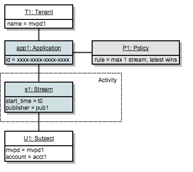

# Entscheidungspunkt für politische Maßnahmen {#policy-desc-pt}

## Domänenmodell {#domain-model}

Diese Seite dient als Referenz für verschiedene Anwendungsfälle und Implementierungen von Richtlinien. Wir empfehlen Ihnen, auch die [Glossar](/help/concurrency-monitoring/cm-glossary.md) Teil der Dokumentation für Begriffsdefinitionen.

A **Mandant** owns **Anwendungen** für die sie durchsetzen möchte **policies**. **Clientanwendungen** muss mit der **application ID** (durch Adobe).

Der Mandant verknüpft dann jede Anwendung mit einer oder mehreren Richtlinien, die er erstellt oder von anderen erstellt und freigegeben hat. Richtlinien können zwischen mehreren Mandanten verknüpft werden.

Die **Betreff** besteht aus allen Streams (unabhängig von der Anwendung), die bei der Überwachung der Parallelität für einen bestimmten Subjekt gemeldet werden.

Wenn ein Stream für einen bestimmten Betreff autorisiert werden soll, prüft das System zunächst alle Richtlinien, die für die Anwendung definiert sind, die den Stream erstellt hat.

Für jede der anwendbaren Richtlinien müssen wir dann alle **relevante Aktivität** wird an die Regel übergeben. Die **relevante Aktivität** für eine Richtlinie P umfasst nur einen Stream S, wenn die folgende Bedingung erfüllt ist:

**Stream &quot;S&quot;wird von einer Anwendung gestartet, die die Richtlinie &quot;P&quot;in ihre Richtlinien aufnimmt.**

## Anwendungsfälle für Trockenausführung {#dry-run-use-cases}

Die folgende exemplarische Vorgehensweise dient der Validierung des Modells anhand einiger Anwendungsfälle. Wir werden dies schrittweise tun, indem wir mit einem grundlegenden Setup beginnen und Komplexität auf verschiedene Arten hinzufügen.

### 1. Ein Mieter. Eine Anwendung. Eine Richtlinie. Ein Stream {#onetenant-oneapp-onepolicy-onestream}

Wir beginnen mit einem einzelnen Mandanten, mit einer einzigen Anwendung und einer einzigen Richtlinie, die verknüpft ist. Nehmen wir einmal an, dass die Richtlinie besagt, dass es für jeden Benutzer maximal einen aktiven Stream geben kann (der neueste Stream darf wiedergegeben werden).

Sobald ein Stream gestartet wurde, besteht die Aktivität nur aus diesem Stream und kann wiedergegeben werden.

### 2. Ein Mieter. Eine Anwendung. Eine Richtlinie. Zwei Streams. {#onetenant-oneapp-onepolicy-twostreams}

Sobald ein zweiter Stream gestartet wird (von demselben Subjekt, der dieselbe Anwendung verwendet), besteht die für die Validierung verwendete Aktivität aus beiden **s1** und **s2**.

Die Beschränkung wird überschritten, da die Richtlinie besagt, dass nur ein Stream wiedergegeben werden darf, sodass nur der neueste Stream (**s2**), um zu spielen.

>[!NOTE]
>
>Die Diagramme stellen die Systemansicht der Benutzeraktivität dar. Bei Stream-Initialisierungsversuchen wird die Zugriffsentscheidung in die Antwort aufgenommen. Bei aktiven Streams wird die Entscheidung in der Heartbeat-Antwort zurückgegeben.

### 3. Zwei Mieter. Zwei Anwendungen. Eine Richtlinie. Zwei Streams. {#twotenant-twoapp-onepolicy-twostreams}

Nehmen wir nun an, dass ein neuer Mandant dieselbe Richtlinie in seinen Anwendungen durchsetzen möchte:

Da die beiden Mandanten durch dieselbe Richtlinie verknüpft sind, gilt hier die in Nutzungsszenario 2 beschriebene Situation und **s3** ist zum Abspielen berechtigt, da es sich um den neuesten Stream handelt.

### 4. Zwei Mieter. Drei Anträge. Zwei Strategien. Zwei Streams. {#twotenants-threeapps-twopolicies-twostreams}

Nehmen wir nun an, dass der zweite Mandant eine neue Anwendung bereitstellt und eine neue Richtlinie definieren möchte, die von **app2** und **app3**.

Derzeit werden die aktiven Streams **s3** und **s4** sind beide erlaubt. Für **s3**, wenn Richtlinie **P1** ausgewertet wird, zählt das System nur **s3** as **relevante Aktivität** (**s4** steht in keiner Weise in Zusammenhang mit der Politik **P1**), sodass keine Verletzung vorliegt.

Politik **P2** wird auf beide Streams angewendet und umfasst beide **s3** und **s4** als relevante Aktivität. Da diese Aktivität innerhalb der Grenzen von zwei Streams liegt, sind beide Streams zulässig.

### 5. Zwei Mieter. Drei Anträge. Zwei Strategien. Drei Ströme. {#twotenants-threeapps-twopolicies-threestreams}

Jetzt vorausgesetzt, dass ein neuer Stream-Initialisierungsversuch mit **app2**:

**s5** darf beginnen mit **P1** (ermöglicht die Übernahme neuer Streams), wird jedoch von **P2**, damit es nicht beginnt.

Dasselbe geschieht, wenn ein Stream mit app3 versucht wird: Dieselbe Richtlinie, die P2 durchführt, verweigert den Zugriff für diesen Stream.

Sehen wir uns nun an, was passieren würde, wenn der Benutzer versucht, einen neuen Stream mit App1 zu erstellen:

Die Anwendung &quot;app1&quot;steht in keiner Weise mit der Richtlinie in Verbindung **P2**, sodass nur die Richtlinie angewendet wird **P1**: ermöglicht den Start des neuen Streams und verweigert den älteren (**s3** in diesem Fall).

