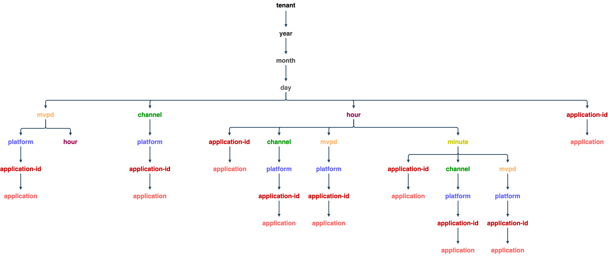

# Context Monitoring-Nutzungs-API {#cmu-api-usage}

>[!NOTE]
>
>Der Inhalt dieser Seite dient nur Informationszwecken. Für die Verwendung dieser API ist eine aktuelle -Lizenz von Adobe erforderlich. Eine unbefugte Anwendung ist nicht zulässig.

## API-Übersicht {#api-overview}

Die Verwendung der Parallelüberwachung (CMU) wird als WOLAP (Web-basiert) implementiert [Online Analytics-Verarbeitung](http://en.wikipedia.org/wiki/Online_analytical_processing)). CMU ist eine generische Web-API für Geschäftsberichte, die von einem Data Warehouse unterstützt wird. Es dient als HTTP-Abfragesprache, die die Ausführung typischer OLAP-Vorgänge in RESTfull ermöglicht.


>[!NOTE]
>
>Die CMU-API ist nicht allgemein verfügbar. Wenden Sie sich bei Fragen zur Verfügbarkeit an Ihren Kundenbetreuer.

Die CMU-API bietet eine hierarchische Ansicht der zugrunde liegenden OLAP-Cubes. Jede Ressource ([Dimension](/help/authentication/entitlement-service-monitoring-overview.md#progr-filter-metrics) in der Dimensionshierarchie, die als URL-Pfadsegment zugeordnet ist) generiert Berichte mit (aggregierter) [Metriken](/help/authentication/entitlement-service-monitoring-overview.md#programmers-can-monitor-the-following-metrics) für die aktuelle Auswahl. Jede Ressource verweist auf ihre übergeordnete Ressource (für Datenaggregationen) und ihre Unterressourcen (für Drilldown). Slicing und Dicing werden über Abfragezeichenfolgenparameter erreicht, die Dimensionen an bestimmte Werte oder Bereiche anhängen.

Die REST-API stellt die verfügbaren Daten innerhalb eines in der Anfrage angegebenen Zeitintervalls bereit (wobei auf die Standardwerte zurückgegriffen wird, wenn keine Werte angegeben sind). Dies hängt vom Dimensionspfad, den bereitgestellten Filtern und ausgewählten Metriken ab. Der Zeitraum wird nicht für Berichte angewendet, die keine Zeitdimensionen enthalten (Jahr, Monat, Tag, Stunde, Minute, Sekunde).

Der Stammpfad der Endpunkt-URL gibt die aggregierten Gesamtmetriken innerhalb eines einzelnen Datensatzes zusammen mit den Links zu den verfügbaren Drilldown-Optionen zurück. Die API-Version wird als nachstehendes Segment des Endpunkt-URI-Pfads zugeordnet. Beispiel: https://mgmt.auth.adobe.com/cmu/*v2* bedeutet, dass die Clients auf WOLAP Version 2 zugreifen.

Die verfügbaren URL-Pfade können über die in der Antwort enthaltenen Links gefunden werden. Gültige URL-Pfade werden gespeichert, um einen Pfad innerhalb der zugrunde liegenden Drilldown-Struktur zuzuordnen, der aggregierte (vorab erstellte) Metriken enthält. Ein Pfad im Formular /dimension1/dimension2/dimension3 spiegelt eine Voraggregation dieser drei Dimensionen wider (entspricht einer SQL-Klausel GROUP BY dimension1, dimension2, dimension3). Wenn eine solche Voraggregation nicht vorhanden ist und das System sie nicht sofort berechnen kann, gibt die API eine Antwort &quot;404 Not Found&quot;zurück.

### Drilldown-Struktur {#drill-down-tree}

Die folgenden Drilldown-Bäume veranschaulichen die in CMU 2.0 verfügbaren Dimensionen (Ressourcen):

**Für CM-Mandanten verfügbare Dimensionen**



A `GET` der `https://mgmt.auth.adobe.com/cmu/v2` Der API-Endpunkt gibt eine Darstellung zurück, die Folgendes enthält:

* Links zu den verfügbaren Root-Drilldown-Pfaden:

  ```html
  <link rel="drill-down" href="/cmu/v2/dimensionA"/>
  <link rel="drill-down" href="/cmu/v2/dimensionB"/>
  ```

* Eine Zusammenfassung (aggregierte Werte) für alle Metriken (im Standardintervall, da keine Abfragezeichenfolgenparameter angegeben sind, siehe unten).

Nach einem Drilldown-Pfad (Schritt für Schritt): /dimensionA/year/month/day/dimensionX ruft die folgende Antwort ab:

* Links zu den Drilldown-Optionen &quot;dimensionY&quot;und &quot;dimensionZ&quot;
* Ein Bericht, der tägliche Aggregate für jeden Dimensionswert enthält.

### **Filter**

Mit Ausnahme der Datums-/Uhrzeitdimensionen kann jede für die aktuelle Projektion (Dimensionspfad) verfügbare Dimension anhand ihres Namens als Abfragezeichenfolgenparameter gefiltert werden.

Die folgenden Filteroptionen sind verfügbar:

* **Gleich** -Filter bereitgestellt werden, indem der Dimensionsname auf einen bestimmten Wert in der Abfragezeichenfolge gesetzt wird.
* **IN** Filter können angegeben werden, indem der Parameter &quot;dimension-name&quot;mehrmals mit verschiedenen Werten hinzugefügt wird: dimension=value1&amp;dimension=value2
* **Ungleich** Filter müssen &#39;!&#39; verwenden Symbol hinter dem Dimensionsnamen, das zu &quot;!&quot;führt.=&#39; &quot;Operator&quot;: Dimension!=value
* **NOT IN** Filter erfordern das &#39;!=&#39; Operator, der mehrmals verwendet wird, einmal für jeden Wert im Satz: Dimension!=value1&amp;dimension!=value2&amp;...


Außerdem werden die Dimensionsnamen in der Abfragezeichenfolge besonders verwendet: Wenn der Dimensionsname als Abfragezeichenfolgenparameter ohne Wert verwendet wird, weist dies die API an, eine Projektion zurückzugeben, die diese Dimension im Bericht enthält.

Beispiel-CMU-Abfragen:

| URL | SQL-Entsprechung |
|:---|:---|
| /dimension1/dimension2/dimension3?dimension1=value1 | SELECT * from projektion WHERE dimension1 = &#39;value1&#39; GROUP BY dimension1, dimension2, dimension3 |
| /dimension1/dimension2/dimension3?dimension1=value1&amp;dimension1=value2 | SELECT * from projektion WHERE dimension1 IN (&#39;value1&#39;, &#39;value2&#39;) GROUP BY dimension1, dimension2, dimension3 |
| /dimension1/dimension2/dimension3?dimension1!=value1 | SELECT * from projektion WHERE dimension1 &lt;> &#39;value1&#39; GROUP BY dimension1, dimension2, dimension3 |
| /dimension1/dimension2/dimension3?dimension1!=value1&amp;dimension2!=value2 | SELECT * from projektion WHERE dimension1 NOT IN (&#39;value1&#39;, &#39;value2&#39;) GROUP BY dimension1, dimension2, dimension3 |
| Angenommen, es gibt keinen direkten Pfad: /dimension1/dimension3, aber es gibt einen Pfad: /dimension1/dimension2/dimension3  </br></br> /dimension1?dimension3 | SELECT * from ProjektionsGRUPPE BY dimension1,dimension3 |

>[!NOTE]
>
>Keine dieser Filtermethoden funktioniert für Datums-/Uhrzeitdimensionen. Die einzige Möglichkeit, Datums-/Uhrzeitdimensionen zu filtern, besteht darin, die Start- und Endabfragezeichenfolgenparameter (unten beschrieben) auf die erforderlichen Werte festzulegen.

Die folgenden Abfragezeichenfolgenparameter haben reservierte Bedeutungen für die API (und können daher nicht als Dimensionsnamen verwendet werden, sonst ist keine Filterung für eine solche Dimension möglich).

Abfragezeichenfolgenparameter, die durch die CMU-API reserviert sind:

| Parameter | Optional | Beschreibung | Standardwert | Beispiel |
|:--------------|:--------|:---------------------------------------------------------------------------------------------------------------------------------------------------------------------------------------------------------------------------------------------------------------------------------------------------|:-------------------------------------------------------------------------------------------------------------------------------|:------------------------------------------|
| access_token | Ja | Wenn der IMS OAuth-Schutz aktiviert ist, kann das IMS-Token entweder als standardmäßiges Authorization-Bearer-Token oder als Abfragezeichenfolgenparameter übergeben werden. | Keines | access_token=XXXXXX |
| dimension-name | Ja | Jeder Dimensionsname - entweder im aktuellen URL-Pfad oder in einem gültigen Unterpfad enthalten; der Wert wird als gleich Filter behandelt. Wenn kein Wert angegeben wird, erzwingt dies, dass die angegebene Dimension in die Ausgabe aufgenommen wird, auch wenn sie nicht enthalten ist oder an den aktuellen Pfad angrenzt | Keines | someDimension=someValue&amp;someOtherDimension |
| end | Ja | Endzeit für den Bericht in Millisekunden | Aktuelle Zeit des Servers | end=2012-07-30 |
| format | Ja | Wird für die Inhaltsverhandlung verwendet (mit demselben Effekt, aber geringerer Priorität als der Pfad &quot;Erweiterung&quot;- siehe unten). | Keine: Bei der Inhaltsverhandlung werden die anderen Strategien getestet | format=json |
| limit | Ja | Maximale Anzahl an zurückzugebenden Zeilen | Der vom Server im Self-Link gemeldete Standardwert, wenn in der Anfrage keine Begrenzung angegeben ist | limit=1500 |
| Metriken | Ja | Kommagetrennte Liste der zurückzugebenden Metriknamen. Diese sollte zum Filtern einer Untergruppe der verfügbaren Metriken (um die Payload-Größe zu reduzieren) und auch zum Erzwingen der API verwendet werden, eine Projektion zurückzugeben, die die angeforderten Metriken enthält (und nicht die standardmäßige optimale Projektion). | Alle für die aktuelle Projektion verfügbaren Metriken werden zurückgegeben, falls dieser Parameter nicht angegeben wird. | metrics=m1,m2 |
| start | Ja | Startzeit für den Bericht als ISO8601; der Server füllt den verbleibenden Teil aus, wenn nur ein Präfix angegeben wird: Beispielsweise führt start=2012 zu start=2012-01-01:00:00:00 | Vom Server in der Selbstverknüpfung gemeldet; der Server versucht, basierend auf der ausgewählten Zeitgranularität angemessene Standardwerte bereitzustellen. | start=2012-07-15 |


Die einzige verfügbare HTTP-Methode ist derzeit GET. In zukünftigen Versionen können OPTIONS-/HEAD-Methoden unterstützt werden.


## CMU-API-Statuscodes {#cmu-api-status-codes}

| Status-Code | Reason Phrase | Beschreibung |
|:-----------|:---------------------|:------------------------------------------------------------------------------------------------------------------------------------------------------------------------------------------------------------------------------------------------------------------------------------------------------------------------------------------------------------------------------------------------------------------------------------------------------------------------------------------------------------|
| 200 | OK | Die Antwort enthält Links für &quot;Datenaggregation&quot;und &quot;Drilldown&quot;(falls zutreffend). Der Bericht wird als Attribut der Ressource gerendert: als verschachteltes Element/Eigenschaft &quot;Bericht&quot;. |
| 400 | Ungültige Anfrage | Der Antworttext enthält eine Textmeldung, die erklärt, was mit der Anfrage nicht stimmt.  Der Status &quot;Bad Request&quot;(400-Ungültige Anfrage) wird von einem erklärenden Text im Antworttext (Nur-/Text-Medientyp) begleitet, der nützliche Informationen zum Client-Fehler liefert. Neben trivialen Szenarien wie ungültigen Datumsformaten oder Filtern, die auf nicht vorhandene Dimensionen angewendet werden, weicht das System auch die Beantwortung von Abfragen ab, bei denen ein massives Datenvolumen sofort zurückgegeben oder aggregiert werden muss. |
| 401 | Unerlaubt | Wird durch eine Anfrage ausgelöst, die nicht die richtigen OAuth-Header enthält, um den Benutzer zu authentifizieren |
| 403 | Verboten | Gibt an, dass die Anfrage im aktuellen Sicherheitskontext nicht zulässig ist. Dies geschieht, wenn der Benutzer authentifiziert ist, aber nicht auf die angeforderten Informationen zugreifen darf |
| 404 | Nicht gefunden | Tritt auf, wenn die Anfrage einen ungültigen URL-Pfad enthält. Dies sollte niemals vorkommen, wenn der Client den Links &quot;Drilldown&quot;/&quot;Rollout&quot; folgt, die mit 200 Antworten bereitgestellt werden |
| 405 | Methode nicht zulässig | Signalisiert, dass in der Anfrage eine nicht unterstützte Methode verwendet wurde. Obwohl derzeit nur die GET-Methode unterstützt wird, können zukünftige Versionen HEAD oder OPTIONS zulassen |
| 406 | Nicht akzeptabel | Signalisiert, dass ein nicht unterstützter Medientyp vom Client angefordert wurde |
| 500 | Interner Server-Fehler | &quot;Das sollte niemals geschehen&quot; |
| 503 | Dienst nicht verfügbar | Signalisiert einen Fehler innerhalb der Anwendung oder deren Abhängigkeiten |

## Datenformate {#data-formats}

Die Daten sind in den folgenden Formaten verfügbar:

* JSON (Standard)
* XML
* CSV
* HTML (zu Demozwecken)


Die folgenden Strategien für die Inhaltsverhandlung können von Kunden verwendet werden (der Vorrang wird durch die Position in der Liste gegeben - das erste Mal):

1. Eine &quot;Dateierweiterung&quot;, die an das letzte Segment des URL-Pfads angehängt wird, z. B. /cmu/v2/tenant/year/month/day.xml. Wenn die URL eine Abfragezeichenfolge enthält, muss die Erweiterung vor dem Fragezeichen stehen: `/cmu/v2/tenant/year/month/day.csv?mvpd=SomeMVPD`
1. Ein Formatabfragezeichenfolgenparameter, z. B. `/cmu/report?format=json`
1. Die standardmäßige HTTP-Accept-Kopfzeile, z. B. `Accept: application/xml`

Sowohl die &quot;Erweiterung&quot;als auch der Abfrageparameter unterstützen die folgenden Werte:

* xml
* json
* csv
* html

Wenn von keiner der Strategien ein Medientyp angegeben wird, erzeugt die API standardmäßig JSON-Inhalte.

## Hypertext Application Language (HAL) {#hypertext-app-lang}

Für JSON und XML wird die Payload als HAL kodiert, wie hier beschrieben: `http://stateless.co/hal_specification.html`.

Der tatsächliche Bericht (ein verschachteltes Tag/eine verschachtelte Eigenschaft namens &quot;Bericht&quot;) besteht aus der tatsächlichen Liste der Datensätze, die alle ausgewählten/anwendbaren Dimensionen und Metriken mit ihren Werten enthalten, die wie folgt kodiert sind:

### JSON {#json}

```js
 "report": [
  {
    "dimension1": "d1",
    ...
    "metric1": "m1",
    ...
  }, {
    ...
  }
]
```

### XML {#xml}

```xml
 <report>
  <record dimension1="d1" ... metric1="m1" ... />
  ...
</report>
```

Bei XML- und JSON-Formaten ist die Reihenfolge der Felder (Dimensionen und Metriken) in einem Datensatz nicht angegeben - aber konsistent (die Reihenfolge ist in allen Datensätzen identisch). Clients sollten sich jedoch nicht auf eine bestimmte Reihenfolge der Felder in einem Datensatz verlassen.

Der Ressourcenlink (das &quot;self&quot;-rel in JSON und das &quot;href&quot;-Ressourcenattribut in XML) enthält den aktuellen Pfad und die Abfragezeichenfolge, die für den Inline-Bericht verwendet werden. Die Abfragezeichenfolge zeigt alle impliziten und expliziten Parameter an, sodass die Payload explizit auf das verwendete Zeitintervall, die impliziten Filter (falls vorhanden) usw. verweist. Der Rest der Links innerhalb der Ressource enthält alle verfügbaren Segmente, die verfolgt werden können, um einen Drilldown in den aktuellen Daten durchzuführen. Es wird auch ein Link für die Datenaggregation bereitgestellt, der auf den übergeordneten Pfad verweist (falls vorhanden). Die `href` -Wert für die Drilldown-/Rollup-Links enthält nur den URL-Pfad (er enthält nicht die Abfragezeichenfolge, daher muss dieser bei Bedarf vom Client angehängt werden). Beachten Sie, dass nicht alle von der aktuellen Ressource verwendeten (oder impliziten) Abfragezeichenfolgenparameter für &quot;Datenaggregations&quot;- oder &quot;Drilldown&quot;-Links gelten (z. B. gelten die Filter nicht für Unter- oder Super-Ressourcen).

Beispiel (vorausgesetzt, wir haben eine einzelne Metrik namens &quot;Clients&quot;und es gibt eine Voraggregation für `year/month/day/...`):

* `https://mgmt.auth.adobe.com/cmu/v2/year/month.xml`

  ```xml
  <resource href="/cmu/v2/year/month?start=2012-07-20T00:00:00&end=2012-08-20T14:35:21">
    <links>
      <link rel="roll-up" href="/cmu/v2/year"/>
      <link rel="drill-down" href="/cmu/v2/year/month/day"/>
    </links>
    <report>
      <record month="6" year="2012" clients="205"/>
      <record month="7" year="2012" clients="466"/>
    </report>
  </resource>
  ```

* `https://mgmt.auth.adobe.com/cmu/v2/year/month.json`

  ```js
  {
    "_links" : {
      "self" : {
        "href" : "/cmu/v2/year/month?start=2012-07-20T00:00:00&end=2012-08-20T14:35:21"
      },
      "roll-up" : {
        "href" : "/cmu/v2/year"
      },
      "drill-down" : {
        "href" : "/cmu/v2/year/month/day"
      }
    },
    "report" : [ {
      "month" : "6",
      "year" : "2012",
      "clients" : "205"
    }, {
      "month" : "7",
      "year" : "2012",
      "clients" : "466"
    } ]
  }
  ```

### CSV {#csv}

Im CSV-Datenformat werden keine Links oder anderen Metadaten (mit Ausnahme der Kopfzeile) inline bereitgestellt. Stattdessen werden die Auswahlmetadaten im Dateinamen bereitgestellt, der diesem Muster folgt:

```html
report__<start-date>_<end-date>_<filter-values,...>.csv
```

Die CSV-Datei enthält eine Kopfzeile und dann die Berichtsdaten als nachfolgende Zeilen. Die Kopfzeile enthält alle Dimensionen, gefolgt von allen Metriken. Die Sortierreihenfolge der Berichtsdaten wird in der Reihenfolge der Dimensionen angezeigt. Wenn Daten nach D1 und dann nach D2 sortiert werden, sieht die CSV-Kopfzeile daher wie folgt aus: `D1, D2, ...metrics....`

Die Reihenfolge der Felder in der Kopfzeile entspricht der Sortierreihenfolge der Tabellendaten.

Beispiel: https://mgmt.auth.adobe.com/cmu/v2/year/month.csv erstellt eine Datei mit dem Namen ```report__2012-07-20_2012-08-20_1000.csv``` mit folgendem Inhalt:

| Jahr | Monat | Kunden |
|:----:|:-----:|:-------:|
| 2012 | 6 | 580 |
| 2012 | 7 | 231 |

## Datenfreude {#data-freshness}

Obwohl die Anforderung eine Kopfzeile vom Typ &quot;Zuletzt geändert&quot;enthält, enthält sie **NICHT** spiegeln den Zeitpunkt wider, zu dem der Bericht im Text zuletzt aktualisiert wurde. Die allgemeinen Berichte werden regelmäßig mit folgenden Regeln berechnet:

* wenn die Zeitgranularität **year** oder **month**&#x200B;ändern, wird der Bericht alle 2 Tage aktualisiert.
* wenn die Zeitgranularität **day**&#x200B;ändern, wird der Bericht alle 3 Stunden aktualisiert.
* wenn die Zeitgranularität **hour** eingeben, wird der Bericht stündlich aktualisiert.
* wenn die Zeitgranularität **minute** und der Bericht jede Minute aktualisiert wird

Die **Aktivitätsstufe** und **Parallelitätsstufe** Berichte werden täglich aktualisiert, unabhängig von der Zeitgranularität.

## GZIP-Komprimierung {#gzip-compression}

Adobe empfiehlt dringend, die gzip-Unterstützung in Clients zu aktivieren, die CMU-Berichte abrufen. Dadurch wird die Größe der Antwort erheblich reduziert, was wiederum Ihre Reaktionszeit reduziert. (Das Komprimierungsverhältnis für CMU-Daten liegt im Bereich von 20-30.)

Um die gzip-Komprimierung in Ihrem Client zu aktivieren, legen Sie die Accept-Encoding: -Kopfzeile wie folgt fest:

```
Accept-Encoding: gzip, deflate
```

## Verwandte Informationen {#related-information}

* [CMU-Übersicht](/help/concurrency-monitoring/cm-usage-reports.md)
