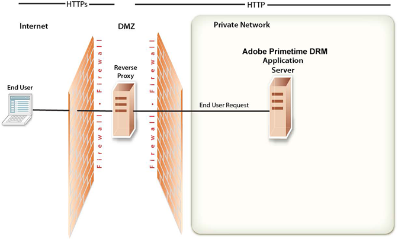

# Übersicht über die Netzwerktopologie {#network-topology-overview}

Nach der erfolgreichen Bereitstellung von Adobe Access ist es wichtig, die Sicherheit Ihrer Umgebung zu gewährleisten. In diesem Abschnitt werden die Aufgaben beschrieben, die erforderlich sind, um die Sicherheit Ihres Adobe Access-Produktionsservers zu gewährleisten.

Verwenden Sie einen *Reverse-Proxy*, um sicherzustellen, dass verschiedene URLs für Adobe Access-Webanwendungen sowohl für externe als auch interne Benutzer verfügbar sind. Diese Konfiguration bietet mehr Sicherheit als die direkte Verbindung zum Anwendungsserver, auf dem Adobe Access ausgeführt wird. Der Reverse-Proxy führt alle HTTP-Anforderungen für den Anwendungsserver aus, auf dem Adobe Access ausgeführt wird. Benutzer haben nur Netzwerkzugriff auf den Reverse-Proxy und können nur die URL-Verbindungen versuchen, die vom Reverse-Proxy unterstützt werden.

<!---->

