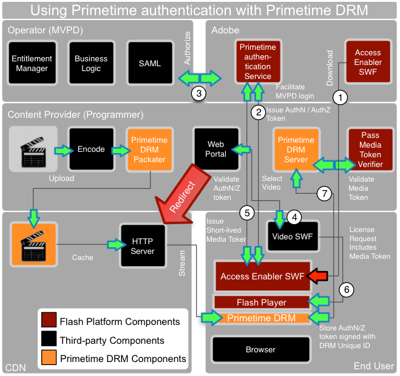

# Adobe Primetime-Authentifizierung und Adobe Primetime DRM {#adobe-primetime-authentication-and-adobe-primetime-drm}

Die Adobe Primetime-Authentifizierung ( [https://www.adobe.com/products/adobepass/](https://www.adobe.com/products/adobepass/)) bietet Benutzer-/Geräteauthentifizierung und Autorisierung für mehrere Content-Provider. Der Benutzer muss über ein gültiges Kabel-TV- oder Satelliten-TV-Abonnement verfügen.

<!---->

Die Adobe Primetime-Authentifizierung kann zusammen mit Adobe Primeitme DRM zum Schutz der Medieninhalte verwendet werden. In diesem Szenario kann der Videoplayer (SWF) eine weitere SWF-Datei mit dem Namen *Access Enabler* laden, die von Adobe Systems gehostet wird. Der *Access Enabler* wird verwendet, um eine Verbindung zum Adobe Primetime-Authentifizierungsdienst herzustellen und die SSO-Integration von SAML mit den Identitäts-Provider-Systemen des MVPD (Multichannel Video Programming Distributor) zu erleichtern. Dazu gehört die kurze Weiterleitung des Browsers des Benutzers zur MVPD-Anmeldeseite, dann die Beibehaltung eines AuthN-Tokens und schließlich die Rückkehr zur Content-Website mit einer zwischengespeicherten AuthN-Sitzung.

Der *Access Enabler* kann dann Backend-Autorisierungen zwischen dem Adobe Primetime-Authentifizierungsdienst und dem MVPD erleichtern. Die MVPD behält die Geschäftslogik bei und bestimmt, auf welche Inhalte der Benutzer Zugriff hat. Die Berechtigung wird in einem zusätzlichen AuthZ-Token für diese Inhaltsressource beibehalten und an den Client zurückgesendet.

Die Authentifizierungs- und Autorisierungstoken werden mit der eindeutigen ID und dem privaten Schlüssel des Primetime DRM-Clients signiert, um Manipulationen oder Spoofing zu vermeiden. Auf dieses Token kann nur über den *Access Enabler* zugegriffen werden.

Der Videoplayer kann den Prozess auslösen, indem er `getAuthorization` den *Access Enabler* aufruft. Wenn gültige AuthN/AuthZ-Token vorhanden sind, gibt der *AccessEnabler* einen Rückruf an den Videoplayer aus, der ein kurzlebiges MedienToken für die Wiedergabe des Videoinhalts enthält.

Die Adobe Primetime-Authentifizierung bietet eine Media Token Validator Java-Bibliothek, die auf einem Server bereitgestellt werden kann. Wenn Sie den Primetime DRM-Server zum Schutz von Inhalten verwenden, können Sie den Validator für MedienToken mit einem Primetime DRM-serverseitigen Plug-In integrieren, um nach erfolgreicher Validierung des MedienTokens automatisch eine generische Lizenz auszustellen. Der Inhalt wird dann vom CDN-Server an den Client gestreamt. Um eine Inhaltslizenz zu erhalten, kann das Token für kurzlebige Medien an den Primetime DRM-Server gesendet werden, auf dem die Gültigkeit des Tokens überprüft wird und eine Lizenz erteilt werden kann.

Das dauerhaft genutzte AuthN-Token wird im Allgemeinen vom *Access Enabler* für alle Inhaltsentwickler verwendet, um das AuthN für diesen MVPD-Abonnenten zu repräsentieren. Darüber hinaus können Primetime DRM Server und Token Verifier vom CDN oder einem Dienstleister im Auftrag des Content Providers betrieben werden.