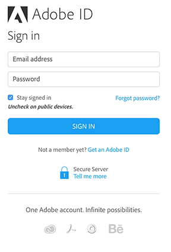

# Get Provisioned (Accounts usw.) {#get-provisioned-accounts-etc}

Für die ersten Schritte mit der Primetime DRM Cloud, powered by ExpressPlay, müssen Sie Adobe Cert- und ExpressPlay-Konten mithilfe Ihres Kundenbetreuers für Adobe einrichten.

1. Wenden Sie sich an Ihren Kundenbetreuer und fordern Sie die Adobe Cert- und ExpressPlay-Konten an, die Sie für die Implementierung von Multi-DRM mit TVSDK benötigen.

       Geben Sie Ihrem Kundenbetreuer die E-Mail-Adresse, die Sie als Kontaktstelle verwenden werden, an. Adobe erstellt dann zwei Konten:
   
   * ***Certificate Portal-Konto***  - ( https://certportal.primetime.adobe.com): Die  ** Adobe Access / Primetime DRM Certificate Enrollment Management Team sendet eine E-Mail an die Adressen, die Sie sie angegeben haben. Die E-Mail enthält die URL für das Zertifikatsportal der Adobe sowie einen Link zur Registrierungsdokumentation der Adobe (die neuesten Dokumente finden Sie hier: [Anleitung zur Zertifikatregistrierung](../../../digital-rights-management/certificate-enrollment-guide/about-certs.md)).

   * ***ExpressPlay-Konto***  - Adobe sendet Ihnen eine E-Mail mit einem Link, den Sie zur Registrierung für Ihr ExpressPlay-Admin-Konto verwenden.

1. Melden Sie sich mit Ihrem Adobe ID beim Adobe-Zertifikat-Portal an (verwenden Sie dieselbe E-Mail-Adresse, die Sie auch Ihrem Kundenbetreuer mitgeteilt haben). Wenn Sie noch kein Adobe ID haben, können Sie schnell eines erstellen, indem Sie den Link *Einen Adobe ID* aus dem ZertifikPortal abrufen befolgen:

   <!---->

   

1. Fordern Sie im Adobe-Zertifikat-Portal ein *Test*-Zertifikat an.

   Für die Multi-DRM-Testversion wird eine einzige Testausgabe alle folgenden Aspekte des Inhaltsschutzes abdecken: Verpackung, Lizenzierung und Transport. Sie müssen Ihre eigene [CSR](../../../digital-rights-management/certificate-enrollment-guide/request-certs/gen-cert-signing-req.md) angeben, um eine Anforderung für ein Zertifikat zu stellen:
   <!---->

   

   Adobe schickt Ihnen eine E-Mail, die Ihnen die Annahme oder Ablehnung Ihres Zertifikatsantrags anzeigt. Sie können den Status Ihrer Zertifiktanforderung(en) auf der Registerkarte *Anforderungsverlauf* im cert-Portal sehen:
   <!---->

   

1. Erstellen Sie Ihr ExpressPlay Admin-Konto.

   Folgen Sie dem Link zu ExpressPlay, die Ihnen diese Adobe bereitgestellt wurde. Dadurch wird die Seite *Konto erstellen* bei ExpressPlay geöffnet. Füllen Sie die erforderlichen Informationen aus und senden Sie das Formular ab. Sie erhalten eine E-Mail von `operations@expressplay.com` mit einem Link zur Aktivierung, der eine Woche lang gültig ist. Richten Sie nach der Aktivierung Ihren ExpressPlay-Dienst ein:
   <!---->

   

   Nachdem Sie Ihren Dienst erstellt haben, wird Ihnen Ihre eigene Admin-Seite angezeigt. Neben einigen Nachverfolgungsfeldern für Aktivitäten sehen Sie Ihre Produktions- und Testauthentifikatoren *und Ihre Produktions- und Test-Dienst-URLs:*

   <!---->

    

1. Wenn Sie FairPlay verwenden, sind weitere Schritte erforderlich (auf der Apple Developer-Website), um ExpressPlay einzurichten. Anweisungen hierzu finden Sie unter [ExpressPlay-Dienst für FairPlay](../../multi-drm-workflows/p-l-and-p/fairplay-workflow.md#enable-expressplay-service-for-fairplay) aktivieren.
