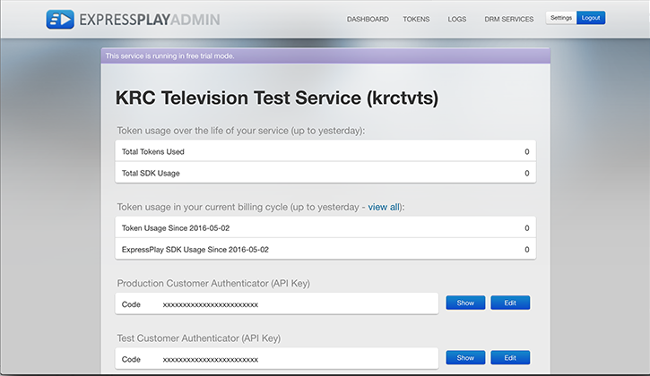

# Schlüssel, IDs und Authentifizierer{#keys-ids-and-authenticators}

Zur Implementierung von DRM benötigen Sie bestimmte Zertifikate und Schlüssel, einschließlich eines Inhaltsverschlüsselungsschlüssels oder eines CEK zur Verschlüsselung Ihrer Inhalte, einen Kundenauthentifizierer zum Schutz der Kommunikation mit den ExpressPlay-Servern und CEKSIDs zum Identifizieren der Verschlüsselungsschlüssel für Inhalte, die in einem wichtigen Management-System gespeichert sind.

Sie benötigen diese Elemente, um Ihre geschützten Inhalte verpacken, lizenzieren und wiedergeben zu können:

## Content Encryption Key {#section_8D16D36BAE3B4D1F92A0C43567D782D0}

Der Content Encryption Key (CEK) ist eine 16-Byte-Zeichenfolge zum Verschlüsseln von Inhalten.

**Was ist das CEK?** - Das CEK ist der Schlüssel, den Ihr Packager zum Verschlüsseln Ihrer Inhalte verwendet. Es handelt sich um eine hexadezimal kodierte Zeichenfolge mit 16 Byte.

**Woher kommt das CEK?** - Sie (der Inhaltsanbieter) erstellen diesen Schlüssel selbst mithilfe eines Tools wie OpenSSL oder Notepad++. Beispiel:

```
openssl rand 16 -hex > cek_hex_file
```

oder (für Adobe Offline Packager):

1. Generieren Sie die hex-kodierte Zeichenfolge mit 16 Byte, wie oben oder mit einem anderen Werkzeug. Es sieht ungefähr so aus:

   ```
   7debe705d938c76bfd886f077b8fa5f7
   ```

1. Öffnen Sie Notepad++ und fügen Sie die 16-Byte-Hex-Zeichenfolge ein.
1. Konvertieren Sie diesen Wert aus Hex ASCII mit Base64-Kodierung des Werts, um Ihren [!DNL keyfile.bin]Wert zu erstellen. (Dies wird unter [](../../multi-drm-workflows/quick-start/package-your-content.md).)

**Gleiche Taste, anderer Name?** - Ja, Sie können die CEK sehen, auf die andere Namen Bezug nehmen, z. B.:

* ** [!DNL [some file].bin]** - Der Adobe Offline Packager bezieht sich auf den CEK als [!DNL [some file].bin]; z.B. * [!DNL Keyfile.bin]* - Dies ist Ihr CEK, wie von Adobe Offline Packager verwendet, in Form einer Datei auf dem Computer, den Sie zum Verpacken von Inhalten verwenden.

   Sie &quot;Base64&quot; Ihre zufällige CEK Hex-Zeichenfolge und speichern Sie sie als Datei (z.B. [!DNL keyfile.bin]), die sich normalerweise im [!DNL creds] Verzeichnis unter [!DNL offlinepkgr/]. In Ihrer Packager-Konfigurationsdatei (z. B. wenn Sie es für das Widevine DRM verpacken) verweisen Sie in Ihrer Konfigurationsdatei auf Ihren CEK wie folgt: [!DNL widevine.xml]

   ```
   <config>  
     <in_path>sample.mp4</in_path>  
     <out_type>dash</out_type>
     <b><key_file_path>keyfile.bin</key_file_path></b> // This is your CEK  
     […] 
   </config> 
   ```

* **Inhaltsschlüssel** - Sie können auch den CEK sehen, der als Inhaltsschlüssel bezeichnet wird, in Aufrufen ( `&contentKey=`), in Fehlermeldungen, in Support-Tickets und in anderen Dokumentationen.

**Wann / wo verwende ich es?**

1. Zuerst müssen Sie das CEK auf dem Computer, auf dem Sie Ihre Verpackung machen, zur Verfügung haben. Ihr Verpackungswerkzeug verwendet Ihr CEK, um Ihre Inhalte zu verschlüsseln.
1. Zweitens müssen Sie das CEK in einer Form von Key Management System (KMS) speichern, wobei jedes CEK mit seinem eigenen [Content Encryption Key](../../multi-drm-workflows/glossary/glossary-cek.md)verknüpft ist. Sie können Ihr eigenes KMS erstellen oder die Key-Datenspeicherung von [ExpressPlay verwenden](https://www.expressplay.com/developer/key-storage/). Auf diese Weise kann Ihr Store (Ihr Berechtigungsserver, der die Bereitstellung für Kundenberechtigungen und LizenzToken verarbeitet) ein Lizenz-Token für den Kunden aus dem KMS abrufen, indem eine Schlüssel-ID anstelle des tatsächlichen CEK verwendet wird (dies ist viel sicherer).

## Datenspeicherung-ID des Inhaltsverschlüsselungsschlüssels {#section_0C94F54970E04BDB82DE3C8A33A62CD4}

Die Content Encryption Key Datenspeicherung ID (CEKSID) identifiziert eindeutig den gespeicherten Schlüssel, der ein verschlüsseltes Videoinhalt entschlüsselt.

**Was ist die CEKSID?** - Die CEKSID ist die eindeutige Kennung für einen Content Encryption Key (CEK). Das CEK ist erforderlich, um den geschützten Inhalt zu entsperren. die CEKSID ist notwendig, um auf das CEK zuzugreifen, von dem aus es gespeichert wird. Wenn Sie Ihre Einrichtung testen, können Sie eine zufällige CEKSID und CEK zur Paketzeit bereitstellen, solange Sie dieselben Informationen für die Lizenzierungs- und Wiedergabeprüfungen verwenden.

**Woher kommt es?** - Sie (der Inhaltsanbieter) können diese ID selbst erstellen oder Sie können einen Dienst wie die Key-Datenspeicherung [von](https://www.expressplay.com/developer/key-storage/) ExpressPlay verwenden, um CEKSIDs für jede Ihrer CEKs zu generieren (und beide zu speichern). Darüber hinaus können Sie zufällig generierte CEKSIDs verwenden oder ein für Ihr Geschäftsmodell geeignetes Schema verwenden. Sie könnten beispielsweise CEKSIDs verwenden, die aussagekräftige Zeichenfolgen anstelle von zufälligen Hex-Zeichenfolgen sind (der ID-Name könnte aus Themen, Daten, Zeiten usw. bestehen).

**Wie nennt man die CEKSID noch?** - Es wird manchmal auch als *Inhalts-ID* bezeichnet.

## Kundenauthentifizierung {#section_F9DDBAA54C544D82A42320CBEEB6CD74}

Der Kundenauthentifizierer ist ein Schlüssel, den Sie von ExpressPlay erhalten, wenn Sie dort ein Administratorkonto einrichten. Der Authentifizierer wird für die Kommunikation mit ExpressPlay-Servern verwendet.

**Was sind die Kundenauthentifizierer?** - Die beiden Kundenauthentifizierer bilden die IDs — eine für die Prüfung, eine für die Produktion — dass sich ExpressPlay für Sie registriert, wenn Sie sich bei ihrem Dienst anmelden. Sie stehen Ihnen jederzeit auf Ihrer ExpressPlay Admin-Seite zur Verfügung:
<!--<a id="fig_c5h_xdl_wv"></a>-->



**Wann benutze ich das?** - Sie nehmen dies bei allen Aufrufen an die ExpressPlay-Server auf — z. B. Lizenzserver, [ExpressPlay-Key-Datenspeicherung](https://www.expressplay.com/developer/key-storage/)und andere Anrufe.
