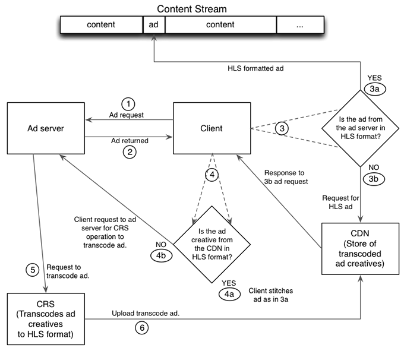

# Detaillierte Workflows für JIT-Neuverpackungen {#detailed-workflows-for-jit-repackaging}

Entweder ein Client-Videoplayer oder der Manifestserver können mit CRS interagieren, um eine JIT-Neuverpackung zu erzielen. Beide verwenden dieselbe Anzeigenauswahllogik.

## JIT-Neuverpackung initiiert vom Manifestserver {#section_1F1C1B7DD146403890C2B43E24FEF0EB}

Der Arbeitsablauf für die JIT-Neuverpackung auf der Manifestserverseite lautet wie folgt:

1. Der Manifestserver sendet eine Anforderung an den Anzeigen-Server.
1. Der Manifestserver empfängt ein Werbekreativelement, das nicht im HLS-Format vorliegt.
1. Der Manifestserver sendet eine Anforderung an den CDN-Server für eine zuvor transkodierte HLS-Version des Werbekreises.

   >[!NOTE]
   >
   >Bei einem Multi-CDN-Setup verwendet der Manifestserver den Parameter `ptcdn` in der Bootstrap-URL, um den CDN-Server zu identifizieren.

1. Der Manifestserver überprüft die Antwort:

   1. Wenn die Anforderung erfolgreich ist, fügt der Manifestserver die zuvor transkodierte HLS-Version des Werbeinhalters in den Inhaltsstream ein.
   1. Wenn die Anforderung fehlschlägt, generiert der Manifestserver einen Protokolleintrag und fordert eine transkodierte Version von CRS an.

1. CRS transkodiert das Werbegeschöpf und lädt die HLS-Version zur zukünftigen Verwendung auf den CDN-Server hoch.

Bei allen nachfolgenden Anforderungen für dieses kreative Element ruft der Manifestserver die HLS-Version aus dem CDN ab und fügt sie in den Inhaltsstream ein.

## JIT-Umverpackung initiiert vom Client {#section_FBC97D40043F4FDD98247A08BB6195B0}

<!---->

Ein Client, der auf TVSDK oder ähnlichen Funktionen basiert, kann wie folgt mit CRS interagieren, um eine JIT-Neuverpackung zu erzielen:

1. Der Client fordert eine Anzeige vom Anzeigen-Server an.
1. Der Anzeigen-Server gibt die Anzeige an den Client zurück.
1. Der Client überprüft das Format der Anzeige vom Anzeigen-Server:

   1. Wenn das Werbekreativ im HLS-Format vorliegt, fügt der Client es in den Inhalt ein (Stiche) und wird ausgeführt.
   1. Wenn das Werbekreativ nicht im HLS-Format vorliegt, fordert der Client einen vom CDN-Server an.

      >[!NOTE]
      >
      >Bei einem Multi-CDN-Setup verwendet der Manifestserver den Parameter `ptcdn` in der Bootstrap-URL, um den CDN-Server zu identifizieren.

1. Der Client überprüft die Antwort vom CDN-Server.

   1. Wenn das CDN eine HLS-Version bereitstellte, fügt der Client sie in den Inhalt ein (näht) und wird ausgeführt.
   1. Wenn der CDN-Server keine HLS-Version bereitstellt, fordert der Client den Anzeigen-Server auf, eine von CRS anzufordern. Der Client fügt die Anzeige nicht in den Inhalt ein.

1. Der Anzeigenserver fordert, dass die Nicht-HLS in HLS transkodiert werden.
1. CRS erstellt eine HLS-Version und lädt sie zur zukünftigen Verwendung auf den CDN-Server hoch.

## Anzeigenformatprioritäten und Zeitschiene {#section_A74DE37A57BF45D7B6D09E3DE40F8E61}

Der Manifestserver und der Client verwenden dieselbe Auswahllogik, um die Prioritäten für die Wiedergabe der verfügbaren Anzeigen festzulegen. HLS-formatierte Anzeigen haben oberste Priorität, gefolgt von MP4, FLV und schließlich WebM.

Für die Verarbeitung von Nicht-HLS-Werbeanzeigen benötigt CRS in der Regel 2-4 Minuten und in der Regel weniger als 3 Minuten.

CRS erzeugt unterschiedliche HLS-Bitraten, sodass die Anzeige mit einer der verfügbaren Verbindungsgeschwindigkeit und Bandbreite entsprechenden Geschwindigkeit abgespielt werden kann. Wenn mehrere verfügbare Bitraten vorhanden sind, wählt CRS die höchste verfügbare Bitrate. Wenn CRS eine Nicht-HLS-Anzeige erhält, wird eine HLS-Version mit der höchsten verfügbaren Auflösung erstellt.