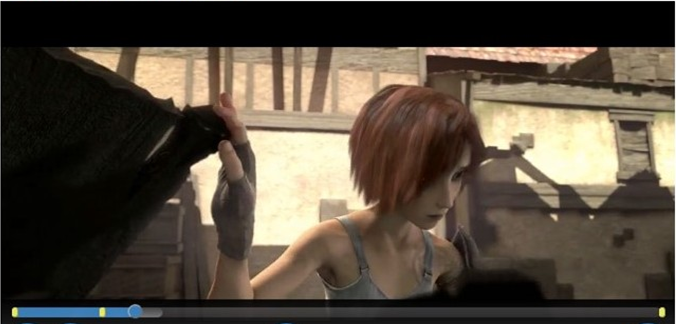

# Inspect der Zeitleiste für die Wiedergabe{#inspect-the-playback-timeline}

Sie können eine Beschreibung der Zeitschiene abrufen, die mit dem aktuell ausgewählten Element verknüpft ist, das von Browser TVSDK wiedergegeben wird. Diese Beschreibung ist nützlich, wenn Ihre Anwendung ein benutzerdefiniertes Scrubbing-Bar-Steuerelement anzeigt, in dem die Inhaltsabschnitte identifiziert werden, die dem Anzeigeninhalt entsprechen.

Hier eine Beispielimplementierung:
<!---->

{width=&quot;676pt&quot;}

